# Architecture Overview

The AI Chat Application is built with a modern, scalable architecture that separates concerns and provides excellent performance, security, and maintainability.

## 🏗️ System Architecture

The application follows a **microservices-inspired** architecture with clear separation between frontend, backend, and external services.

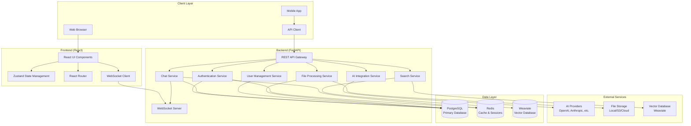

## 🔄 Data Flow

### Authentication Flow

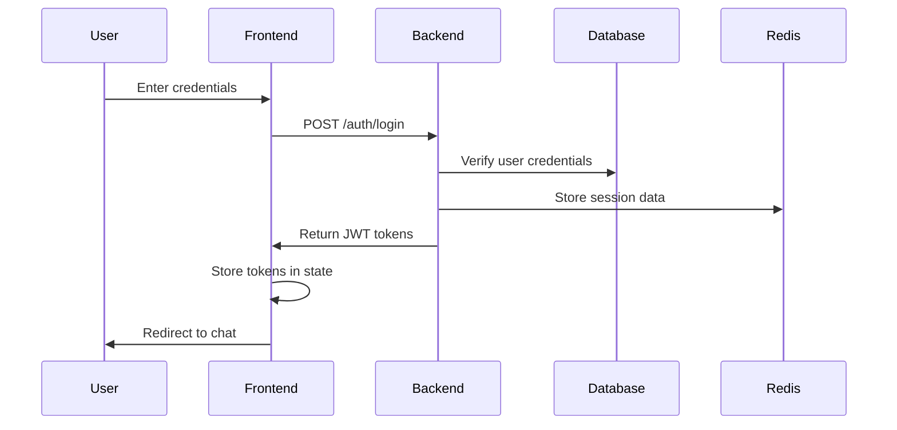

### Chat Message Flow

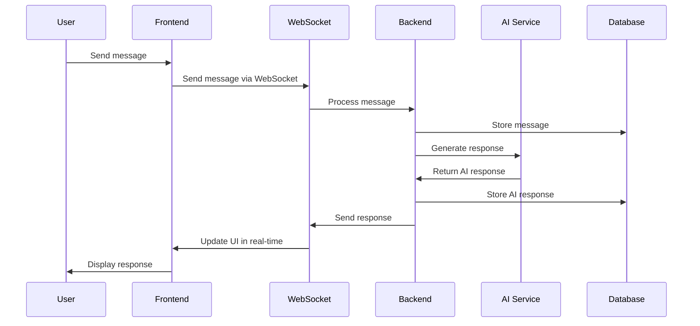

### File Upload Flow

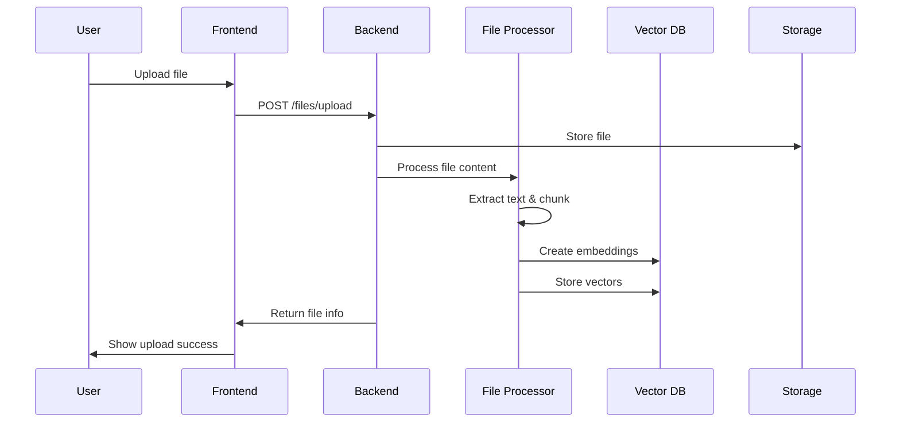

## 🏛️ Component Architecture

### Backend Components

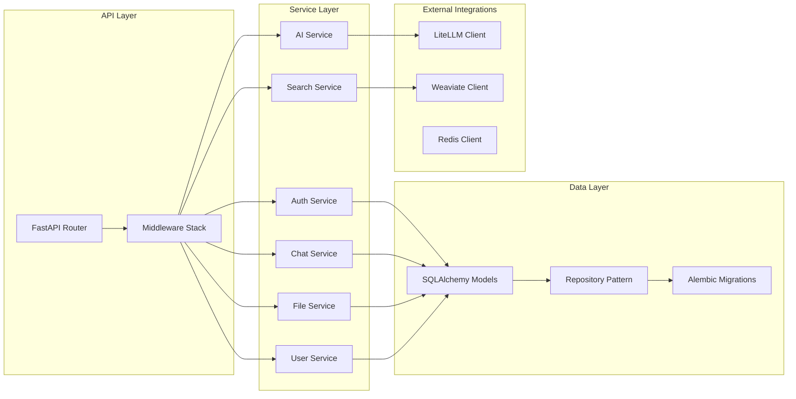

### Frontend Components

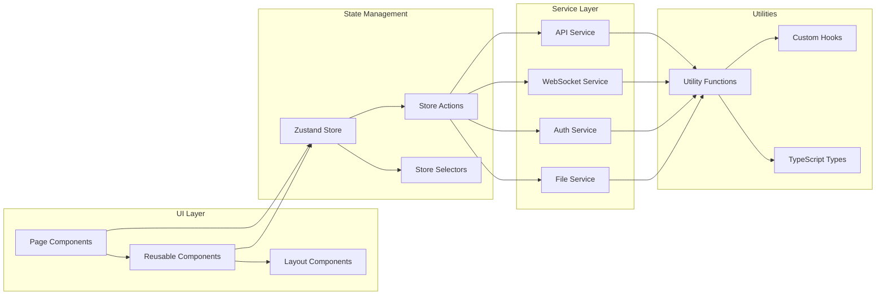

## 🗄️ Database Design

### Entity Relationship Diagram

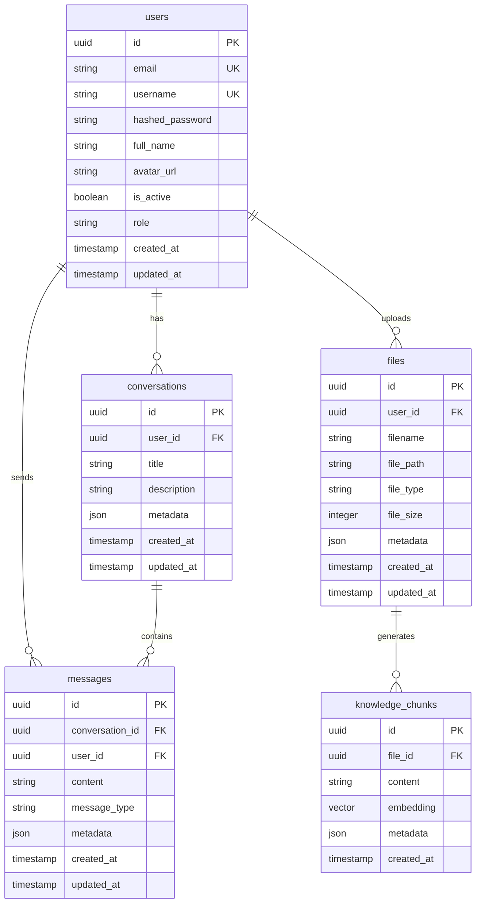

## 🔒 Security Architecture

### Security Layers

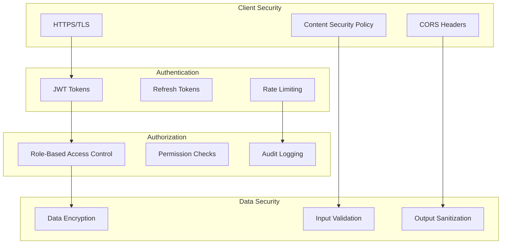

## 📊 Performance Architecture

### Caching Strategy

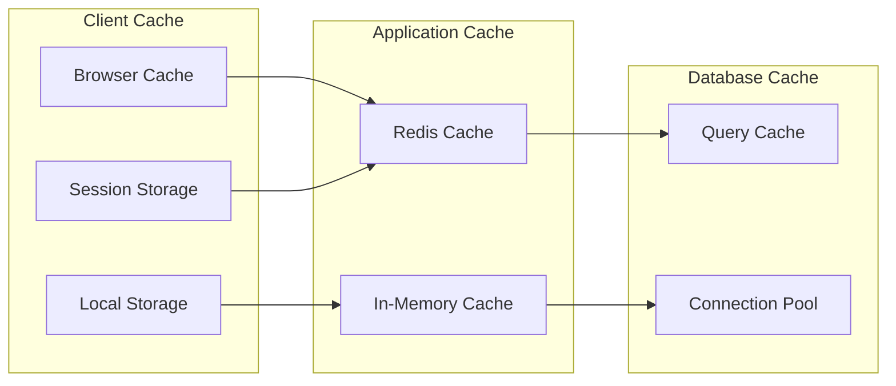

### Load Balancing

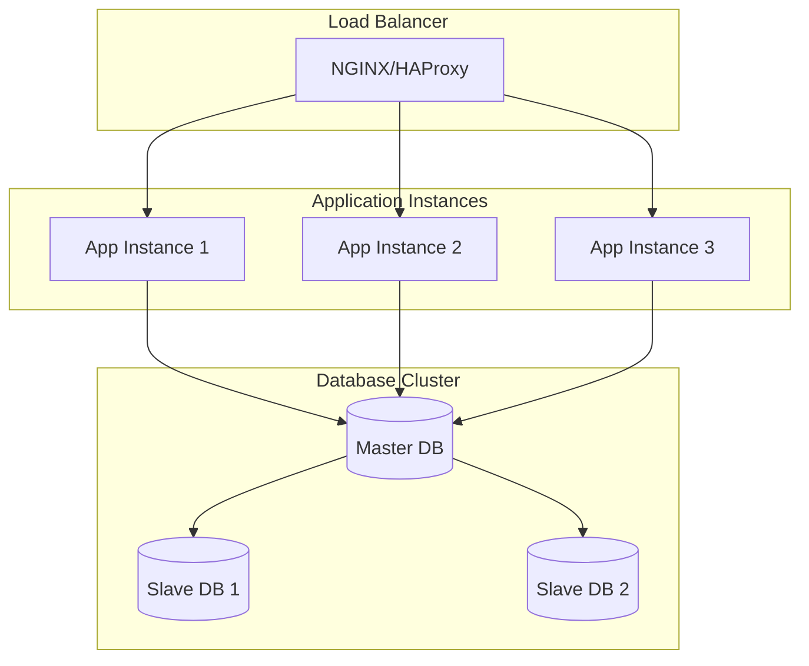

## 🔧 Technology Stack

### Backend Technologies

| Component | Technology | Version | Purpose |
|-----------|------------|---------|---------|
| **Framework** | FastAPI | 0.104+ | Modern Python web framework |
| **Database** | PostgreSQL | 13+ | Primary relational database |
| **Cache** | Redis | 6+ | Session storage and caching |
| **Vector DB** | Weaviate | 1.22+ | Vector database for embeddings |
| **ORM** | SQLAlchemy | 2.0+ | Database ORM and migrations |
| **AI Integration** | LiteLLM | 1.10+ | AI provider abstraction |
| **Authentication** | JWT | - | Token-based authentication |
| **Testing** | Pytest | 7.4+ | Testing framework |

### Frontend Technologies

| Component | Technology | Version | Purpose |
|-----------|------------|---------|---------|
| **Framework** | React | 18+ | UI framework |
| **Language** | TypeScript | 5.0+ | Type-safe JavaScript |
| **State Management** | Zustand | 4.4+ | Lightweight state management |
| **UI Library** | Ant Design | 5.0+ | Component library |
| **Routing** | React Router | 6.8+ | Client-side routing |
| **HTTP Client** | Axios | 1.6+ | API communication |
| **WebSocket** | Socket.io | 4.7+ | Real-time communication |
| **Testing** | Jest + RTL | - | Testing framework |

### DevOps & Infrastructure

| Component | Technology | Purpose |
|-----------|------------|---------|
| **Containerization** | Docker | Application packaging |
| **Orchestration** | Docker Compose | Local development |
| **CI/CD** | GitHub Actions | Automated testing and deployment |
| **Monitoring** | Prometheus + Grafana | System monitoring |
| **Logging** | Structured logging | Application logs |
| **Security** | Security headers, CORS | Application security |

## 🚀 Scalability Considerations

### Horizontal Scaling

The architecture supports horizontal scaling through:

- **Stateless API design** - No server-side session storage
- **Database connection pooling** - Efficient database connections
- **Redis for session storage** - Shared session data across instances
- **Load balancer ready** - Multiple application instances
- **Microservices ready** - Service separation for independent scaling

### Performance Optimization

- **Caching strategy** - Multiple layers of caching
- **Database indexing** - Optimized query performance
- **Connection pooling** - Efficient resource usage
- **Async processing** - Non-blocking operations
- **CDN ready** - Static asset delivery optimization

## 🔄 Deployment Architecture

### Development Environment

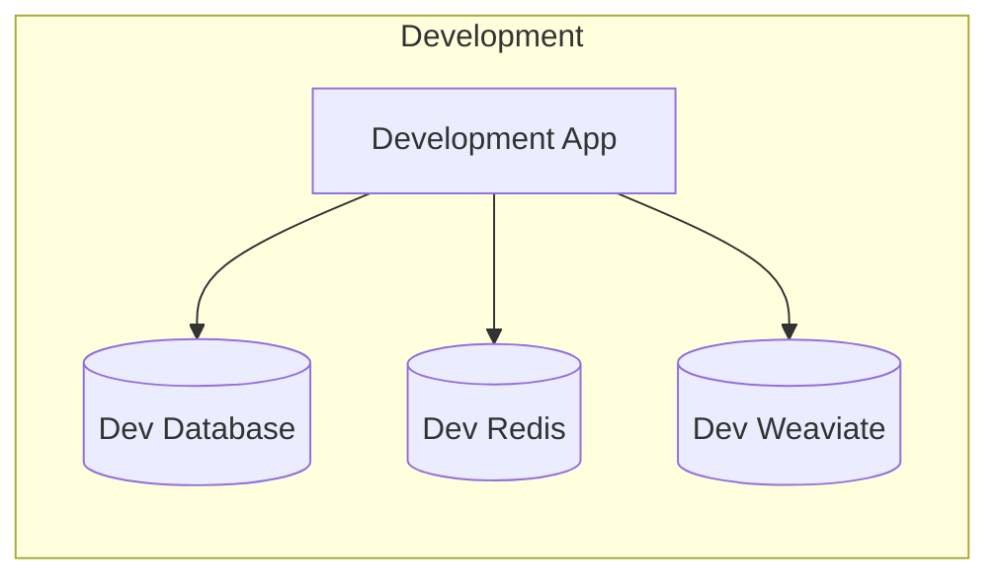

### Production Environment

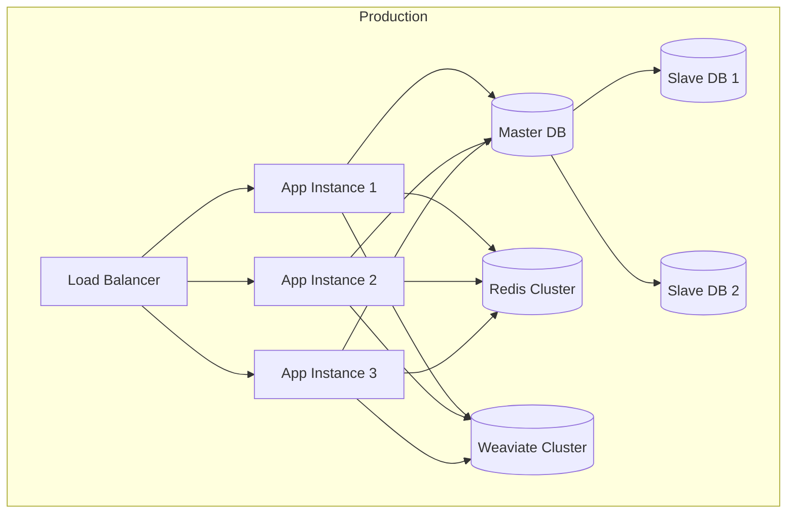

## 📚 Next Steps

- **[Backend Architecture](backend.md)** - Detailed backend design
- **[Frontend Architecture](frontend.md)** - Frontend component design
- **[Database Design](database.md)** - Database schema and relationships
- **[Security Architecture](security.md)** - Security implementation details
- **[API Reference](../api/overview.md)** - Complete API documentation 