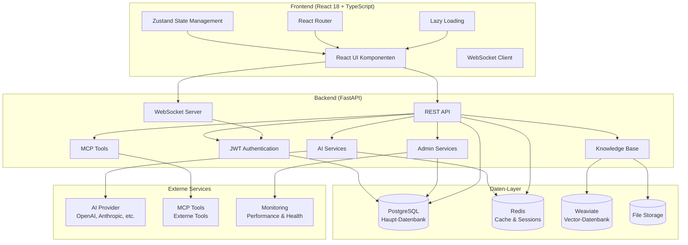

# ConvoSphere - AI Chat Platform

Eine moderne, umfassende AI-Chat-Anwendung mit **FastAPI** (Backend) und **React** (Frontend), die Echtzeit-Messaging, erweiterte Knowledge Base und AI-Funktionen auf Enterprise-Level bietet.

<div align="center">


[](https://your-org.github.io/convosphere/)
[](https://github.com/your-org/convosphere/actions)
[](https://github.com/your-org/convosphere/actions)

</div>

## 🚀 Quick Start (5 Minuten)

**ConvoSphere in unter 5 Minuten einsatzbereit:**

```bash
# Repository klonen
git clone https://github.com/your-org/convosphere.git
cd convosphere

# Mit Docker starten (empfohlen)
docker-compose up --build

# Oder manuelles Setup
make setup
make install
make dev
```

→ [http://localhost:5173](http://localhost:5173) öffnen (Frontend) | [http://localhost:8000](http://localhost:8000) (Backend API)

**Erste Schritte:**
1. Registrieren Sie sich oder melden Sie sich an
2. Starten Sie eine Konversation mit AI-Assistenten
3. Laden Sie Dokumente in die Knowledge Base hoch
4. Erstellen Sie benutzerdefinierte AI-Assistenten
5. Erkunden Sie Tools und Integrationen

## 📖 Für Benutzer

- **[User Guide](user-guide.md)** - Vollständige Anleitung für ConvoSphere
- **[FAQ](faq.md)** - Häufige Fragen und Lösungen
- **[Quick Start](quick-start.md)** - In 5 Minuten startklar

## 🔧 Für Entwickler

- **[Developer Guide](developer-guide.md)** - Setup, Architektur, Entwicklung
- **[API Reference](../api.md)** - Vollständige API-Dokumentation
- **[Features Documentation](../features/)** - Detaillierte Feature-Spezifikationen
- **[Architecture Guide](../architecture.md)** - Systemdesign und Komponenten

## ✨ Vollständiges Feature-Set

### 💬 **Echtzeit-Chat & Messaging**
- **WebSocket-basierte Konversationen** mit sofortiger Zustellung
- **Datei-Anhänge** (PDF, DOCX, TXT, MD) bis zu 50MB
- **Spracheingabe** mit Speech-to-Text-Funktionalität
- **Nachrichtenformatierung** mit Markdown-Unterstützung
- **Schreibindikatoren** und Echtzeit-Status
- **Konversations-Management** mit Verlauf und Suche
- **Nachrichten-Export** und Konversations-Backup

### 📚 **Erweiterte Knowledge Base**
- **Dokumenten-Upload** mit Drag & Drop und Bulk-Import
- **Semantische Suche** mit AI-gestützter Content-Erkennung
- **Tag-Management** mit Tag-Clouds und Statistiken
- **Rollenbasierte Zugriffskontrolle** (User/Premium/Moderator/Admin)
- **Dokumentenverarbeitung** mit automatischer Textextraktion und Chunking
- **Erweiterte Filterung** nach Metadaten, Tags und Inhalten
- **Performance-Optimierungen** mit Virtualisierung und Caching
- **Chat-Integration** für kontextbezogene AI-Antworten

### 🤖 **AI-Integration & Assistenten**
- **Multiple AI-Provider** (OpenAI, Anthropic, etc.) über LiteLLM
- **Benutzerdefinierte AI-Assistenten** mit konfigurierbaren Persönlichkeiten
- **Kontextbezogene Antworten** unter Verwendung der Knowledge Base
- **Tool-Ausführung** und Model Context Protocol (MCP) Integration
- **Assistenten-Management** mit Templates und Sharing
- **AI-Modell-Auswahl** und Parameter-Tuning

### 🔧 **Tools & Integrationen**
- **MCP (Model Context Protocol)** Tool-Integration
- **Benutzerdefinierte Tool-Entwicklung** und Management
- **Tool-Ausführungs-Tracking** mit Performance-Metriken
- **Externe API-Integrationen** und Webhooks
- **Such-Tools** und Rechner-Funktionen
- **Dateiverarbeitungs-Tools** und Utilities

### 👥 **Benutzerverwaltung & Administration**
- **JWT-basierte Authentifizierung** mit Refresh-Tokens
- **Rollenbasierte Zugriffskontrolle** mit 4 Benutzerebenen
- **Benutzerregistrierung** und Profilverwaltung
- **Admin-Dashboard** mit umfassendem Systemüberblick
- **Benutzer-Analytics** und Aktivitäts-Tracking
- **Audit-Logging** und Sicherheits-Monitoring
- **SSO-Integration** und Account-Verknüpfung

### 🎨 **Benutzererfahrung & Interface**
- **Modernes React 18** Frontend mit TypeScript
- **Responsive Design** optimiert für Mobile, Tablet und Desktop
- **Dark/Light Theme** Switching mit System-Präferenz-Erkennung
- **Internationalisierung** (Englisch/Deutsch) mit i18next
- **Performance-Monitoring** mit Echtzeit-Metriken
- **Error Boundaries** und umfassendes Error Handling
- **Lazy Loading** und Code Splitting für optimale Performance

### 📊 **Performance & Monitoring**
- **Echtzeit-Performance-Tracking** mit detaillierten Metriken
- **System-Health-Monitoring** und Status-Dashboard
- **Speicher-Optimierung** und Leak-Detection
- **Response-Time-Monitoring** und API-Performance
- **Benutzeraktivitäts-Analytics** und Nutzungsstatistiken
- **Error-Tracking** und automatisierte Berichterstattung

## 🏗️ Architektur

ConvoSphere folgt einer modernen, skalierbaren Architektur mit klarer Trennung der Belange:



## 🛠️ Vollständiger Technologie-Stack

### **Frontend Stack**
- **React 18** mit TypeScript und Concurrent Features
- **Ant Design** Enterprise UI-Komponenten-Bibliothek
- **Zustand** leichtgewichtiges State Management
- **React Router** mit geschützten Routen
- **WebSocket** Client für Echtzeit-Kommunikation
- **i18next** für Internationalisierung (EN/DE)
- **Vite** für schnelle Entwicklung und optimierte Builds

### **Backend Stack**
- **FastAPI** modernes, schnelles Web-Framework mit Auto-Dokumentation
- **SQLAlchemy** ORM mit PostgreSQL
- **Redis** für Caching und Session-Storage
- **Weaviate** Vector-Datenbank für semantische Suche
- **LiteLLM** AI-Provider-Abstraktions-Layer
- **JWT** Authentifizierung mit Refresh-Tokens
- **WebSocket** für Echtzeit-Messaging

### **Datenbank & Storage**
- **PostgreSQL 13+** primäre Datenbank
- **Redis** Caching und Echtzeit-Features
- **Weaviate** Vector-Embeddings und semantische Suche
- **Dateisystem** Dokument- und Medien-Storage

### **DevOps & Testing**
- **Docker & Docker Compose** Containerisierung
- **Pytest** umfassende Backend-Tests (90%+ Coverage)
- **Jest & Cypress** Frontend-Tests (95%+ Coverage)
- **GitHub Actions** CI/CD Pipeline
- **MkDocs** Dokumentation mit i18n-Unterstützung

## 📈 Performance-Metriken

### **Bewährte Performance**
- **Response Zeit**: < 100ms für Health Checks, < 500ms für API-Calls
- **Gleichzeitige Benutzer**: Unterstützt 100+ simultane Verbindungen
- **Speicher-Effizienz**: < 50MB Erhöhung unter Last
- **Dateiverarbeitung**: Verarbeitet 50MB+ Dateien effizient
- **Echtzeit-Messaging**: < 100ms Nachrichtenzustellung
- **Such-Performance**: Sub-Sekunden semantische Suchergebnisse

### **Test-Coverage**
- **Backend Tests**: 90%+ Coverage mit Unit-, Integration- und Performance-Tests
- **Frontend Tests**: 95%+ Coverage mit Komponenten-, Service- und E2E-Tests
- **Performance Tests**: Load Testing und Memory Monitoring
- **Security Tests**: Authentifizierung, Autorisierung und Input-Validierung

## 🚀 Deployment-Optionen

### **Docker (Empfohlen)**
```bash
# Entwicklung
docker-compose up --build

# Produktion
docker-compose -f docker-compose.prod.yml up -d
```

### **Manuelles Setup**
```bash
# Backend
cd backend
python -m venv .venv
source .venv/bin/activate
pip install -r requirements.txt
uvicorn main:app --reload

# Frontend
cd frontend-react
npm install
npm run dev
```

### **Produktions-Deployment**
- **Environment-Konfiguration**: Umfassende Umgebungsvariablen-Setup
- **Security-Hardening**: JWT-Tokens, CORS, Rate-Limiting
- **Performance-Optimierung**: Caching, Connection-Pooling
- **Monitoring**: Health Checks und Performance-Tracking

## 🎯 Seiten & Benutzeroberfläche

ConvoSphere bietet eine umfassende Web-Oberfläche mit folgenden Seiten:

- **🏠 Dashboard** - Überblick, Statistiken und Schnellaktionen
- **💬 Chat** - Haupt-Chat-Interface mit AI-Assistenten
- **📚 Knowledge Base** - Dokumenten-Management und Suche
- **🤖 Assistants** - AI-Assistenten-Erstellung und -Management
- **🔧 Tools** - Tool-Integration und MCP-Management
- **👤 Profile** - Benutzerprofil und Einstellungen
- **⚙️ Settings** - Anwendungskonfiguration
- **🔐 Authentication** - Login und Registrierung
- **👨‍💼 Admin** - Administratives Dashboard (nur für Admins)
- **💬 Conversations** - Konversationsverlauf und -management
- **🔧 MCP Tools** - Model Context Protocol Tools
- **📊 System Status** - Echtzeit-System-Monitoring

## 🤝 Contributing

Wir freuen uns über Beiträge! ConvoSphere wurde mit modernen Entwicklungspraktiken erstellt:

- **Code-Qualität**: ESLint, Prettier, Type-Safety mit TypeScript
- **Testing**: Umfassende Test-Suites mit hoher Coverage
- **Dokumentation**: Zweisprachige Dokumentation (EN/DE)
- **CI/CD**: Automatisierte Test- und Deployment-Pipelines

Siehe [Contributing Guide](../project/contributing.md) für detaillierte Informationen.

## 📄 License

MIT License - siehe [LICENSE](../../../LICENSE) für Details.

## 🆘 Support & Community

- **📚 Dokumentation**: Umfassende Guides und API-Referenz
- **🐛 Issues**: [GitHub Issues](https://github.com/your-org/convosphere/issues)
- **💬 Discussions**: [GitHub Discussions](https://github.com/your-org/convosphere/discussions)
- **🎮 Discord**: [Community Server](https://discord.gg/your-server)

---

<div align="center">

**Bereit zum Starten?** [Quick Start →](quick-start.md)

**Detaillierte Anleitung?** [User Guide →](user-guide.md) | [Developer Guide →](developer-guide.md)

**Features erkunden:** [Knowledge Base →](../features/knowledge-base.md) | [AI Integration →](../features/ai-integration.md) | [Tools →](../features/tools.md)

**Mit ❤️ erstellt vom ConvoSphere Team**

</div>