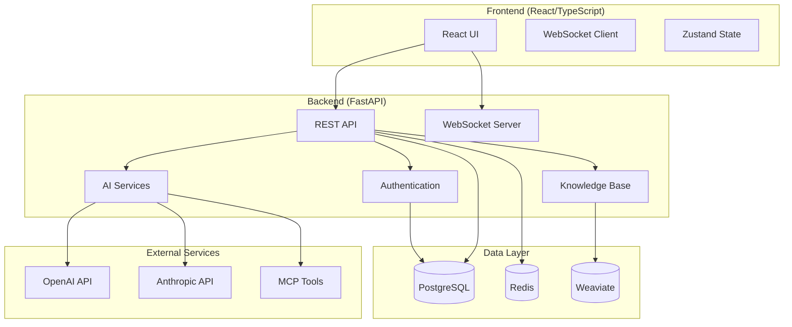

# Developer Guide - Developing ConvoSphere

## 🎯 Overview

ConvoSphere is a modern AI chat platform with FastAPI backend and React frontend. This guide helps developers understand, extend, and deploy the system.

## 🏗️ Architecture

### System Overview


### Technology Stack
- **Backend**: FastAPI, SQLAlchemy, Alembic
- **Frontend**: React 18, TypeScript, Ant Design
- **Database**: PostgreSQL, Redis, Weaviate
- **AI**: LiteLLM, OpenAI, Anthropic
- **Deployment**: Docker, Docker Compose

## 🚀 Development Setup

### Prerequisites
```bash
# Required software
- Python 3.11+
- Node.js 18+
- PostgreSQL 14+
- Redis 6+
- Git
```

### Quick Setup
```bash
# Clone repository
git clone https://github.com/your-org/convosphere.git
cd convosphere

# Start with Docker (recommended)
docker-compose up --build

# Or manual setup
make setup-dev
```

### Manual Setup
```bash
# Backend setup
cd backend
python -m venv venv
source venv/bin/activate  # Windows: venv\Scripts\activate
pip install -r requirements.txt
cp env.example .env
# Edit .env with your settings
alembic upgrade head
uvicorn app.main:app --reload

# Frontend setup
cd frontend-react
npm install
npm run dev
```

## 📁 Project Structure

```
convosphere/
├── backend/                 # FastAPI backend
│   ├── app/
│   │   ├── api/            # API routes
│   │   ├── core/           # Core configuration
│   │   ├── models/         # Database models
│   │   ├── services/       # Business logic
│   │   └── utils/          # Utilities
│   ├── alembic/            # Database migrations
│   └── tests/              # Backend tests
├── frontend-react/         # React frontend
│   ├── src/
│   │   ├── components/     # React components
│   │   ├── pages/          # Page components
│   │   ├── services/       # API services
│   │   └── utils/          # Utilities
│   └── tests/              # Frontend tests
├── docs/                   # Documentation
├── docker-compose.yml      # Docker setup
└── Makefile               # Development commands
```

## 💻 Development

### Code Style
```bash
# Backend (Python)
black app/ tests/
isort app/ tests/
flake8 app/ tests/

# Frontend (TypeScript)
npm run lint
npm run format
```

### Testing
```bash
# Backend tests
cd backend
pytest

# Frontend tests
cd frontend-react
npm test

# E2E tests
npm run test:e2e
```

### Database Migrations
```bash
# Create migration
alembic revision --autogenerate -m "Description"

# Apply migrations
alembic upgrade head

# Rollback migration
alembic downgrade -1
```

### API Development
```python
# Example API endpoint
from fastapi import APIRouter, Depends
from app.models.user import User
from app.services.auth import get_current_user

router = APIRouter()

@router.get("/users/me")
async def get_current_user_info(
    current_user: User = Depends(get_current_user)
):
    return current_user
```

## 🔧 Custom Tools (MCP)

### Creating MCP Tools
```python
# Example MCP tool
from mcp import Server, StdioServerParameters
from mcp.types import TextContent

server = Server("my-tool")

@server.list_tools()
async def list_tools():
    return [
        {
            "name": "my_tool",
            "description": "My custom tool",
            "inputSchema": {
                "type": "object",
                "properties": {
                    "input": {"type": "string"}
                }
            }
        }
    ]

@server.call_tool()
async def call_tool(name: str, arguments: dict):
    if name == "my_tool":
        result = process_arguments(arguments)
        return [TextContent(type="text", text=result)]
```

### Tool Configuration
```yaml
# mcp-config.yaml
tools:
  - name: my-tool
    command: python -m my_tool
    env:
      API_KEY: ${API_KEY}
```

## 🔒 Security

### Authentication
```python
# JWT token validation
from app.core.security import verify_token

async def get_current_user(token: str = Depends(oauth2_scheme)):
    payload = verify_token(token)
    user_id = payload.get("sub")
    return get_user(user_id)
```

### Authorization
```python
# Role-based access control
from app.core.auth import require_role

@router.get("/admin/users")
@require_role("admin")
async def get_all_users():
    return get_users()
```

### Rate Limiting
```python
# Rate limiting middleware
from slowapi import Limiter, _rate_limit_exceeded_handler
from slowapi.util import get_remote_address

limiter = Limiter(key_func=get_remote_address)

@app.middleware("http")
async def rate_limit_middleware(request, call_next):
    # Apply rate limiting
    return await call_next(request)
```

### Security: Rate Limiting & CSP

- Redis-backed rate limiting is available via decorators in `backend/app/core/rate_limiting.py`. For auth endpoints use `@rate_limit_auth`.
- Content Security Policy headers are set in `backend/app/core/security_middleware.py`. `connect-src` is restricted to `backend_url`, `ws_url`, and `frontend_url` from settings.

Configure `backend_url`, `ws_url`, and `frontend_url` in `.env` to match your deployment (development defaults provided). Frontend uses Vite env variables `VITE_API_URL` and `VITE_WS_URL`. WebSocket endpoints are exposed under `/api/v1/ws`.

## 📊 Monitoring & Logging

### Logging Configuration
```python
# Logging setup
import logging
from app.core.config import settings

logging.basicConfig(
    level=settings.LOG_LEVEL,
    format="%(asctime)s - %(name)s - %(levelname)s - %(message)s"
)
```

### Health Checks
```python
# Health check endpoint
@router.get("/health")
async def health_check():
    return {
        "status": "healthy",
        "timestamp": datetime.utcnow(),
        "version": settings.VERSION
    }
```

### Metrics
```python
# Prometheus metrics
from prometheus_client import Counter, Histogram

request_count = Counter('http_requests_total', 'Total HTTP requests')
request_duration = Histogram('http_request_duration_seconds', 'HTTP request duration')
```

## 🚀 Deployment

### Docker Production
```bash
# Build production images
docker-compose -f docker-compose.prod.yml build

# Deploy
docker-compose -f docker-compose.prod.yml up -d
```

### Environment Configuration
```bash
# Production environment
cp env.example .env.prod
# Edit with production values
export $(cat .env.prod | xargs)
```

### Database Setup
```bash
# Production database
docker run -d \
  --name postgres \
  -e POSTGRES_PASSWORD=secure_password \
  -e POSTGRES_DB=convosphere \
  postgres:14

# Run migrations
alembic upgrade head
```

## 🧪 Testing

### Unit Tests
```python
# Example unit test
import pytest
from app.services.user import UserService

def test_create_user():
    service = UserService()
    user = service.create_user("test@example.com", "password")
    assert user.email == "test@example.com"
```

### Integration Tests
```python
# Example integration test
from fastapi.testclient import TestClient
from app.main import app

client = TestClient(app)

def test_login():
    response = client.post("/auth/login", json={
        "email": "test@example.com",
        "password": "password"
    })
    assert response.status_code == 200
```

### E2E Tests
```javascript
// Example E2E test
describe('Chat Interface', () => {
  it('should send and receive messages', () => {
    cy.visit('/chat')
    cy.get('[data-testid="message-input"]').type('Hello AI')
    cy.get('[data-testid="send-button"]').click()
    cy.get('[data-testid="message-list"]').should('contain', 'Hello AI')
  })
})
```

## 🔄 CI/CD

### GitHub Actions
```yaml
# .github/workflows/ci.yml
name: CI/CD Pipeline

on: [push, pull_request]

jobs:
  test:
    runs-on: ubuntu-latest
    steps:
      - uses: actions/checkout@v3
      - name: Run tests
        run: |
          cd backend && pytest
          cd frontend-react && npm test
```

### Docker Build
```yaml
# Build and push Docker images
- name: Build and push
  run: |
    docker build -t convosphere:latest .
    docker push convosphere:latest
```

## 📚 Resources

### Documentation
- **[API Reference](api.md)** - Complete API documentation
- **[User Guide](user-guide.md)** - User-facing features
- **[FAQ](faq.md)** - Common questions

### External Resources
- **[FastAPI Documentation](https://fastapi.tiangolo.com/)**
- **[React Documentation](https://react.dev/)**
- **[PostgreSQL Documentation](https://www.postgresql.org/docs/)**
- **[Docker Documentation](https://docs.docker.com/)**

### Community
- **[GitHub Issues](https://github.com/your-org/convosphere/issues)** - Bug reports
- **[Discord Server](https://discord.gg/your-server)** - Community chat
- **[GitHub Discussions](https://github.com/your-org/convosphere/discussions)** - Questions

## 🤝 Contributing

### Development Workflow
1. **Fork** the repository
2. **Create** a feature branch
3. **Make** your changes
4. **Test** thoroughly
5. **Submit** a pull request

### Code Review Process
- All changes require review
- Tests must pass
- Code style must be followed
- Documentation must be updated

### Release Process
1. **Version bump** in `pyproject.toml`
2. **Update changelog**
3. **Create release** on GitHub
4. **Deploy** to production

---

**Ready to contribute?** [API Reference](api.md) | [Architecture](architecture.md) | [Community](index.md)