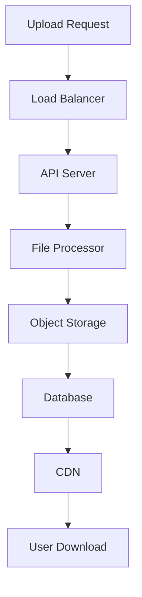

# File Upload

The File Upload feature enables users to upload and manage files for use in conversations and knowledge base integration.

## Overview

The File Upload system provides:

- **Multi-format Support**: Upload various file types (images, documents, etc.)
- **Secure Storage**: Encrypted file storage with access controls
- **File Management**: Organize, categorize, and search uploaded files
- **Conversation Integration**: Attach files to chat messages
- **Knowledge Base**: Automatic processing for document uploads
- **Version Control**: Track file versions and changes

## Architecture

### File Upload Flow


### Storage Architecture



## Features

### Supported File Types

```python
SUPPORTED_FILE_TYPES = {
    # Images
    'image/jpeg': ['.jpg', '.jpeg'],
    'image/png': ['.png'],
    'image/gif': ['.gif'],
    'image/webp': ['.webp'],
    'image/svg+xml': ['.svg'],
    
    # Documents
    'application/pdf': ['.pdf'],
    'application/msword': ['.doc'],
    'application/vnd.openxmlformats-officedocument.wordprocessingml.document': ['.docx'],
    'application/vnd.ms-excel': ['.xls'],
    'application/vnd.openxmlformats-officedocument.spreadsheetml.sheet': ['.xlsx'],
    'text/plain': ['.txt'],
    'text/markdown': ['.md'],
    'text/csv': ['.csv'],
    
    # Archives
    'application/zip': ['.zip'],
    'application/x-rar-compressed': ['.rar'],
    'application/x-7z-compressed': ['.7z'],
    
    # Code
    'text/javascript': ['.js'],
    'text/css': ['.css'],
    'text/html': ['.html', '.htm'],
    'application/json': ['.json'],
    'text/xml': ['.xml'],
    'application/x-python-code': ['.py'],
    'text/x-java-source': ['.java'],
    'text/x-c++src': ['.cpp', '.cc'],
    'text/x-csrc': ['.c'],
    'text/x-php': ['.php'],
    'text/x-ruby': ['.rb'],
    'text/x-go': ['.go'],
    'text/x-rust': ['.rs']
}

# File size limits
FILE_SIZE_LIMITS = {
    'image': 10 * 1024 * 1024,  # 10MB
    'document': 50 * 1024 * 1024,  # 50MB
    'archive': 100 * 1024 * 1024,  # 100MB
    'code': 5 * 1024 * 1024,  # 5MB
    'default': 25 * 1024 * 1024  # 25MB
}
```

### File Validation

```python
class FileValidator:
    def __init__(self):
        self.allowed_types = SUPPORTED_FILE_TYPES
        self.size_limits = FILE_SIZE_LIMITS
    
    def validate_file(self, file: UploadFile) -> ValidationResult:
        """Validate uploaded file"""
        result = ValidationResult()
        
        # Check file size
        if not self._validate_file_size(file):
            result.add_error("File size exceeds limit")
            return result
        
        # Check file type
        if not self._validate_file_type(file):
            result.add_error("File type not supported")
            return result
        
        # Check file content
        if not self._validate_file_content(file):
            result.add_error("File content validation failed")
            return result
        
        # Virus scan
        if not self._scan_for_viruses(file):
            result.add_error("File failed virus scan")
            return result
        
        return result
    
    def _validate_file_size(self, file: UploadFile) -> bool:
        """Validate file size"""
        file_type = self._get_file_category(file.content_type)
        max_size = self.size_limits.get(file_type, self.size_limits['default'])
        
        return file.size <= max_size
    
    def _validate_file_type(self, file: UploadFile) -> bool:
        """Validate file type"""
        content_type = file.content_type
        file_extension = Path(file.filename).suffix.lower()
        
        if content_type not in self.allowed_types:
            return False
        
        allowed_extensions = self.allowed_types[content_type]
        return file_extension in allowed_extensions
    
    def _validate_file_content(self, file: UploadFile) -> bool:
        """Validate file content"""
        # Read file signature
        content = file.file.read(1024)
        file.file.seek(0)  # Reset file pointer
        
        # Check file signatures
        signatures = {
            b'\xff\xd8\xff': 'image/jpeg',
            b'\x89PNG\r\n\x1a\n': 'image/png',
            b'GIF87a': 'image/gif',
            b'GIF89a': 'image/gif',
            b'%PDF': 'application/pdf',
            b'PK\x03\x04': 'application/zip',
        }
        
        for signature, expected_type in signatures.items():
            if content.startswith(signature):
                return file.content_type == expected_type
        
        return True
    
    def _scan_for_viruses(self, file: UploadFile) -> bool:
        """Scan file for viruses"""
        # Implement virus scanning logic
        # This is a placeholder - integrate with actual antivirus service
        return True
    
    def _get_file_category(self, content_type: str) -> str:
        """Get file category from content type"""
        if content_type.startswith('image/'):
            return 'image'
        elif content_type.startswith('application/') and 'document' in content_type:
            return 'document'
        elif content_type in ['application/zip', 'application/x-rar-compressed']:
            return 'archive'
        elif content_type.startswith('text/') or 'code' in content_type:
            return 'code'
        else:
            return 'default'
```

### File Processing

```python
class FileProcessor:
    def __init__(self, storage_service: StorageService):
        self.storage = storage_service
        self.processors = {
            'image': ImageProcessor(),
            'document': DocumentProcessor(),
            'archive': ArchiveProcessor(),
            'code': CodeProcessor()
        }
    
    async def process_file(self, file: UploadFile, user_id: int) -> FileRecord:
        """Process uploaded file"""
        # Generate unique filename
        file_id = str(uuid.uuid4())
        file_extension = Path(file.filename).suffix
        filename = f"{file_id}{file_extension}"
        
        # Determine file category
        category = self._get_file_category(file.content_type)
        
        # Process file based on type
        processor = self.processors.get(category)
        if processor:
            metadata = await processor.process(file)
        else:
            metadata = {}
        
        # Upload to storage
        file_url = await self.storage.upload_file(file, filename)
        
        # Create database record
        file_record = FileRecord(
            id=file_id,
            user_id=user_id,
            original_filename=file.filename,
            filename=filename,
            content_type=file.content_type,
            file_size=file.size,
            file_url=file_url,
            category=category,
            metadata=metadata,
            status='uploaded'
        )
        
        return file_record
    
    def _get_file_category(self, content_type: str) -> str:
        """Get file category from content type"""
        if content_type.startswith('image/'):
            return 'image'
        elif content_type.startswith('application/') and 'document' in content_type:
            return 'document'
        elif content_type in ['application/zip', 'application/x-rar-compressed']:
            return 'archive'
        elif content_type.startswith('text/') or 'code' in content_type:
            return 'code'
        else:
            return 'general'
```

### Image Processing

```python
class ImageProcessor:
    def __init__(self):
        self.max_dimensions = (1920, 1080)
        self.quality = 85
    
    async def process(self, file: UploadFile) -> Dict:
        """Process image file"""
        from PIL import Image
        import io
        
        # Open image
        image = Image.open(file.file)
        
        # Get original metadata
        metadata = {
            'width': image.width,
            'height': image.height,
            'format': image.format,
            'mode': image.mode
        }
        
        # Resize if necessary
        if image.width > self.max_dimensions[0] or image.height > self.max_dimensions[1]:
            image = self._resize_image(image)
            metadata['resized'] = True
            metadata['new_width'] = image.width
            metadata['new_height'] = image.height
        
        # Generate thumbnail
        thumbnail = self._create_thumbnail(image)
        
        # Save processed images
        processed_url = await self._save_processed_image(image)
        thumbnail_url = await self._save_thumbnail(thumbnail)
        
        metadata.update({
            'processed_url': processed_url,
            'thumbnail_url': thumbnail_url
        })
        
        return metadata
    
    def _resize_image(self, image: Image.Image) -> Image.Image:
        """Resize image maintaining aspect ratio"""
        image.thumbnail(self.max_dimensions, Image.Resampling.LANCZOS)
        return image
    
    def _create_thumbnail(self, image: Image.Image, size: tuple = (150, 150)) -> Image.Image:
        """Create thumbnail"""
        thumbnail = image.copy()
        thumbnail.thumbnail(size, Image.Resampling.LANCZOS)
        return thumbnail
```

### Document Processing

```python
class DocumentProcessor:
    def __init__(self):
        self.extractors = {
            'application/pdf': PDFExtractor(),
            'application/vnd.openxmlformats-officedocument.wordprocessingml.document': DocxExtractor(),
            'text/plain': TextExtractor(),
            'text/markdown': MarkdownExtractor()
        }
    
    async def process(self, file: UploadFile) -> Dict:
        """Process document file"""
        content_type = file.content_type
        extractor = self.extractors.get(content_type)
        
        if not extractor:
            return {'error': 'No extractor available for this file type'}
        
        # Extract text content
        text_content = await extractor.extract(file)
        
        # Generate preview
        preview = self._generate_preview(text_content)
        
        # Extract metadata
        metadata = await extractor.extract_metadata(file)
        
        return {
            'text_content': text_content,
            'preview': preview,
            'word_count': len(text_content.split()),
            'metadata': metadata
        }
    
    def _generate_preview(self, text: str, max_length: int = 500) -> str:
        """Generate text preview"""
        if len(text) <= max_length:
            return text
        
        # Find last complete sentence
        preview = text[:max_length]
        last_period = preview.rfind('.')
        last_newline = preview.rfind('\n')
        
        if last_period > last_newline:
            preview = preview[:last_period + 1]
        elif last_newline > 0:
            preview = preview[:last_newline]
        
        return preview + '...'
```

## API Endpoints

### Upload File

**POST** `/api/v1/files/upload`

Upload a file to the system.

```python
@router.post("/upload", response_model=FileResponse)
async def upload_file(
    file: UploadFile = File(...),
    category: Optional[str] = Form(None),
    tags: Optional[str] = Form(None),
    description: Optional[str] = Form(None),
    current_user: User = Depends(get_current_user),
    db: Session = Depends(get_db)
):
    """Upload a file"""
    
    # Validate file
    validator = FileValidator()
    validation_result = validator.validate_file(file)
    
    if not validation_result.is_valid:
        raise HTTPException(
            status_code=400,
            detail=validation_result.errors[0]
        )
    
    # Process file
    processor = FileProcessor(storage_service)
    file_record = await processor.process_file(file, current_user.id)
    
    # Save to database
    db_file = await file_service.create_file(
        user_id=current_user.id,
        file_record=file_record,
        category=category,
        tags=tags.split(',') if tags else [],
        description=description
    )
    
    return db_file
```

### Get File

**GET** `/api/v1/files/{file_id}`

Get file information and download URL.

```python
@router.get("/{file_id}", response_model=FileResponse)
async def get_file(
    file_id: str,
    current_user: User = Depends(get_current_user),
    db: Session = Depends(get_db)
):
    """Get file information"""
    
    file_record = await file_service.get_file(file_id, current_user.id)
    
    if not file_record:
        raise HTTPException(
            status_code=404,
            detail="File not found"
        )
    
    return file_record
```

### Download File

**GET** `/api/v1/files/{file_id}/download`

Download a file.

```python
@router.get("/{file_id}/download")
async def download_file(
    file_id: str,
    current_user: User = Depends(get_current_user),
    db: Session = Depends(get_db)
):
    """Download a file"""
    
    file_record = await file_service.get_file(file_id, current_user.id)
    
    if not file_record:
        raise HTTPException(
            status_code=404,
            detail="File not found"
        )
    
    # Generate signed URL for download
    download_url = await storage_service.generate_download_url(
        file_record.filename,
        expires_in=3600  # 1 hour
    )
    
    return RedirectResponse(url=download_url)
```

### List Files

**GET** `/api/v1/files`

List user's files with filtering and pagination.

```python
@router.get("/", response_model=PaginatedFileResponse)
async def list_files(
    page: int = Query(1, ge=1),
    size: int = Query(20, ge=1, le=100),
    category: Optional[str] = Query(None),
    tags: Optional[str] = Query(None),
    search: Optional[str] = Query(None),
    current_user: User = Depends(get_current_user)
):
    """List user's files"""
    
    filters = {}
    if category:
        filters['category'] = category
    if tags:
        filters['tags'] = tags.split(',')
    
    files = await file_service.list_files(
        user_id=current_user.id,
        filters=filters,
        search=search,
        page=page,
        size=size
    )
    
    return files
```

### Delete File

**DELETE** `/api/v1/files/{file_id}`

Delete a file.

```python
@router.delete("/{file_id}")
async def delete_file(
    file_id: str,
    current_user: User = Depends(get_current_user),
    db: Session = Depends(get_db)
):
    """Delete a file"""
    
    file_record = await file_service.get_file(file_id, current_user.id)
    
    if not file_record:
        raise HTTPException(
            status_code=404,
            detail="File not found"
        )
    
    # Delete from storage
    await storage_service.delete_file(file_record.filename)
    
    # Delete from database
    await file_service.delete_file(file_id, current_user.id)
    
    return {"message": "File deleted successfully"}
```

## Database Schema

### Files Table

```sql
CREATE TABLE files (
    id UUID PRIMARY KEY DEFAULT gen_random_uuid(),
    user_id INTEGER NOT NULL REFERENCES users(id),
    original_filename VARCHAR(255) NOT NULL,
    filename VARCHAR(255) NOT NULL,
    content_type VARCHAR(100) NOT NULL,
    file_size INTEGER NOT NULL,
    file_url VARCHAR(500) NOT NULL,
    category VARCHAR(50),
    tags TEXT[],
    description TEXT,
    metadata JSONB,
    status VARCHAR(20) DEFAULT 'uploaded',
    download_count INTEGER DEFAULT 0,
    created_at TIMESTAMP DEFAULT CURRENT_TIMESTAMP,
    updated_at TIMESTAMP DEFAULT CURRENT_TIMESTAMP
);

-- Indexes
CREATE INDEX idx_files_user_id ON files(user_id);
CREATE INDEX idx_files_category ON files(category);
CREATE INDEX idx_files_tags ON files USING GIN(tags);
CREATE INDEX idx_files_created_at ON files(created_at);
```

### File Shares Table

```sql
CREATE TABLE file_shares (
    id UUID PRIMARY KEY DEFAULT gen_random_uuid(),
    file_id UUID NOT NULL REFERENCES files(id) ON DELETE CASCADE,
    shared_by INTEGER NOT NULL REFERENCES users(id),
    shared_with INTEGER NOT NULL REFERENCES users(id),
    permission VARCHAR(20) DEFAULT 'read', -- read, write, admin
    expires_at TIMESTAMP,
    created_at TIMESTAMP DEFAULT CURRENT_TIMESTAMP,
    UNIQUE(file_id, shared_with)
);
```

## Storage Implementation

### Object Storage Service

```python
class StorageService:
    def __init__(self, config: StorageConfig):
        self.config = config
        self.client = self._create_client()
    
    async def upload_file(self, file: UploadFile, filename: str) -> str:
        """Upload file to storage"""
        bucket_name = self.config.bucket_name
        object_key = f"uploads/{filename}"
        
        # Upload file
        await self.client.upload_fileobj(
            file.file,
            bucket_name,
            object_key,
            ExtraArgs={
                'ContentType': file.content_type,
                'ACL': 'private'
            }
        )
        
        return f"s3://{bucket_name}/{object_key}"
    
    async def generate_download_url(self, filename: str, expires_in: int = 3600) -> str:
        """Generate signed download URL"""
        bucket_name = self.config.bucket_name
        object_key = f"uploads/{filename}"
        
        url = await self.client.generate_presigned_url(
            'get_object',
            Params={
                'Bucket': bucket_name,
                'Key': object_key
            },
            ExpiresIn=expires_in
        )
        
        return url
    
    async def delete_file(self, filename: str):
        """Delete file from storage"""
        bucket_name = self.config.bucket_name
        object_key = f"uploads/{filename}"
        
        await self.client.delete_object(
            Bucket=bucket_name,
            Key=object_key
        )
    
    def _create_client(self):
        """Create storage client"""
        import boto3
        
        return boto3.client(
            's3',
            aws_access_key_id=self.config.access_key_id,
            aws_secret_access_key=self.config.secret_access_key,
            region_name=self.config.region
        )
```

## Security

### Access Control

```python
class FileAccessControl:
    def __init__(self, db: Session):
        self.db = db
    
    def can_access_file(self, user_id: int, file_id: str) -> bool:
        """Check if user can access file"""
        file = self.db.query(File).filter(File.id == file_id).first()
        
        if not file:
            return False
        
        # User owns the file
        if file.user_id == user_id:
            return True
        
        # File is shared with user
        share = self.db.query(FileShare).filter(
            FileShare.file_id == file_id,
            FileShare.shared_with == user_id,
            (FileShare.expires_at.is_(None) | (FileShare.expires_at > datetime.utcnow()))
        ).first()
        
        return share is not None
    
    def can_modify_file(self, user_id: int, file_id: str) -> bool:
        """Check if user can modify file"""
        file = self.db.query(File).filter(File.id == file_id).first()
        
        if not file:
            return False
        
        # User owns the file
        if file.user_id == user_id:
            return True
        
        # User has write permission
        share = self.db.query(FileShare).filter(
            FileShare.file_id == file_id,
            FileShare.shared_with == user_id,
            FileShare.permission.in_(['write', 'admin']),
            (FileShare.expires_at.is_(None) | (FileShare.expires_at > datetime.utcnow()))
        ).first()
        
        return share is not None
```

### File Encryption

```python
class FileEncryption:
    def __init__(self, encryption_key: str):
        self.key = encryption_key.encode()
    
    def encrypt_file(self, file_content: bytes) -> bytes:
        """Encrypt file content"""
        from cryptography.fernet import Fernet
        
        fernet = Fernet(self.key)
        return fernet.encrypt(file_content)
    
    def decrypt_file(self, encrypted_content: bytes) -> bytes:
        """Decrypt file content"""
        from cryptography.fernet import Fernet
        
        fernet = Fernet(self.key)
        return fernet.decrypt(encrypted_content)
```

## Performance Optimization

### CDN Integration

```python
class CDNService:
    def __init__(self, cdn_url: str):
        self.cdn_url = cdn_url
    
    def get_cdn_url(self, filename: str) -> str:
        """Get CDN URL for file"""
        return f"{self.cdn_url}/uploads/{filename}"
    
    def invalidate_cache(self, filename: str):
        """Invalidate CDN cache for file"""
        # Implement CDN cache invalidation
        pass
```

### File Compression

```python
class FileCompression:
    @staticmethod
    def compress_image(image_data: bytes, quality: int = 85) -> bytes:
        """Compress image data"""
        from PIL import Image
        import io
        
        image = Image.open(io.BytesIO(image_data))
        
        # Convert to RGB if necessary
        if image.mode in ('RGBA', 'LA', 'P'):
            image = image.convert('RGB')
        
        # Compress
        output = io.BytesIO()
        image.save(output, format='JPEG', quality=quality, optimize=True)
        
        return output.getvalue()
```

## Monitoring

### File Upload Metrics

```python
class FileUploadMetrics:
    def __init__(self, prometheus_client):
        self.upload_counter = prometheus_client.Counter(
            'file_uploads_total',
            'Total file uploads',
            ['file_type', 'status']
        )
        
        self.upload_size = prometheus_client.Histogram(
            'file_upload_size_bytes',
            'File upload size in bytes',
            ['file_type']
        )
        
        self.upload_duration = prometheus_client.Histogram(
            'file_upload_duration_seconds',
            'File upload duration',
            ['file_type']
        )
    
    def record_upload(self, file_type: str, status: str, size: int, duration: float):
        """Record file upload metrics"""
        self.upload_counter.labels(file_type=file_type, status=status).inc()
        self.upload_size.labels(file_type=file_type).observe(size)
        self.upload_duration.labels(file_type=file_type).observe(duration)
```

## Best Practices

1. **File Validation**: Always validate uploaded files for security
2. **Virus Scanning**: Implement virus scanning for uploaded files
3. **Access Control**: Implement proper file access controls
4. **Storage Security**: Use encrypted storage and secure URLs
5. **CDN Usage**: Use CDN for better performance
6. **File Compression**: Compress files to save storage space
7. **Monitoring**: Monitor file upload metrics and errors
8. **Backup**: Regularly backup file metadata and storage
9. **Cleanup**: Implement automatic cleanup of unused files
10. **Rate Limiting**: Limit upload frequency to prevent abuse