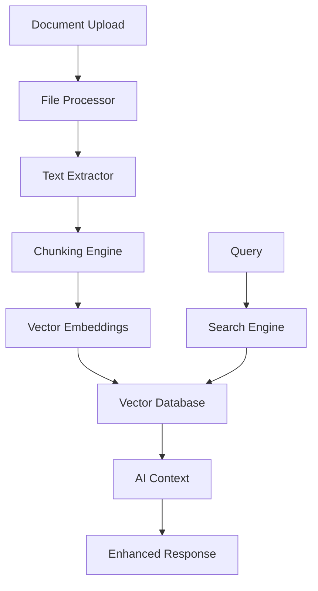

# Knowledge Base

The Knowledge Base feature enables users to upload, manage, and query documents to enhance AI responses with contextual information.

## Overview

The Knowledge Base provides:

- **Document Upload**: Support for various file formats (PDF, DOCX, TXT, etc.)
- **Document Processing**: Automatic text extraction and chunking
- **Vector Search**: Semantic search across uploaded documents
- **AI Integration**: Context-aware responses using knowledge base content
- **Document Management**: Organize and categorize documents
- **Access Control**: User-specific and shared knowledge bases

## Architecture

### System Components



### Data Flow

1. **Upload**: User uploads document
2. **Processing**: Extract text and create chunks
3. **Embedding**: Generate vector embeddings
4. **Storage**: Store in vector database
5. **Query**: Search relevant content
6. **Context**: Provide to AI for enhanced responses

## Features

### Document Upload

Support for multiple file formats with automatic processing:

```python
# Supported file types
SUPPORTED_FORMATS = {
    '.pdf': 'application/pdf',
    '.docx': 'application/vnd.openxmlformats-officedocument.wordprocessingml.document',
    '.txt': 'text/plain',
    '.md': 'text/markdown',
    '.csv': 'text/csv',
    '.json': 'application/json'
}

# File size limits
MAX_FILE_SIZE = 50 * 1024 * 1024  # 50MB
```

### Document Processing

Automatic text extraction and intelligent chunking:

```python
class DocumentProcessor:
    def __init__(self):
        self.extractors = {
            '.pdf': PDFExtractor(),
            '.docx': DocxExtractor(),
            '.txt': TextExtractor(),
            '.md': MarkdownExtractor()
        }
    
    def process_document(self, file_path: str, file_type: str) -> List[DocumentChunk]:
        """Process document and create chunks"""
        # Extract text
        extractor = self.extractors.get(file_type)
        if not extractor:
            raise UnsupportedFileTypeError(f"Unsupported file type: {file_type}")
        
        text = extractor.extract(file_path)
        
        # Create chunks
        chunks = self.create_chunks(text)
        
        # Generate embeddings
        embeddings = self.generate_embeddings(chunks)
        
        return chunks, embeddings
    
    def create_chunks(self, text: str, chunk_size: int = 1000, overlap: int = 200) -> List[DocumentChunk]:
        """Create overlapping text chunks"""
        chunks = []
        start = 0
        
        while start < len(text):
            end = start + chunk_size
            
            # Try to break at sentence boundary
            if end < len(text):
                # Find last sentence boundary
                last_period = text.rfind('.', start, end)
                last_newline = text.rfind('\n', start, end)
                break_point = max(last_period, last_newline)
                
                if break_point > start:
                    end = break_point + 1
            
            chunk_text = text[start:end].strip()
            if chunk_text:
                chunks.append(DocumentChunk(
                    content=chunk_text,
                    start_position=start,
                    end_position=end
                ))
            
            start = end - overlap
        
        return chunks
```

### Vector Search

Semantic search using vector embeddings:

```python
class VectorSearchEngine:
    def __init__(self, vector_db: VectorDatabase):
        self.vector_db = vector_db
        self.embedding_model = SentenceTransformer('all-MiniLM-L6-v2')
    
    def search(self, query: str, user_id: int, limit: int = 5) -> List[SearchResult]:
        """Search for relevant documents"""
        # Generate query embedding
        query_embedding = self.embedding_model.encode(query)
        
        # Search vector database
        results = self.vector_db.search(
            query_embedding=query_embedding,
            user_id=user_id,
            limit=limit,
            similarity_threshold=0.7
        )
        
        return results
    
    def search_with_filters(self, query: str, filters: Dict, user_id: int) -> List[SearchResult]:
        """Search with additional filters"""
        query_embedding = self.embedding_model.encode(query)
        
        results = self.vector_db.search_with_filters(
            query_embedding=query_embedding,
            filters=filters,
            user_id=user_id
        )
        
        return results
```

### AI Integration

Enhance AI responses with knowledge base context:

```python
class KnowledgeBaseService:
    def __init__(self, search_engine: VectorSearchEngine, ai_service: AIService):
        self.search_engine = search_engine
        self.ai_service = ai_service
    
    async def get_enhanced_response(self, query: str, user_id: int, conversation_id: int) -> str:
        """Get AI response enhanced with knowledge base context"""
        # Search knowledge base
        search_results = self.search_engine.search(query, user_id)
        
        # Build context from search results
        context = self.build_context(search_results)
        
        # Get conversation history
        history = await self.get_conversation_history(conversation_id)
        
        # Generate enhanced response
        response = await self.ai_service.generate_response(
            query=query,
            context=context,
            history=history
        )
        
        return response
    
    def build_context(self, search_results: List[SearchResult]) -> str:
        """Build context string from search results"""
        context_parts = []
        
        for result in search_results:
            context_parts.append(f"Document: {result.document_title}")
            context_parts.append(f"Content: {result.content}")
            context_parts.append(f"Relevance: {result.similarity_score:.2f}")
            context_parts.append("---")
        
        return "\n".join(context_parts)
```

## API Endpoints

### Upload Document

**POST** `/api/v1/knowledge-base/documents`

Upload a document to the knowledge base.

```python
@router.post("/documents", response_model=DocumentResponse)
async def upload_document(
    file: UploadFile = File(...),
    title: str = Form(...),
    description: Optional[str] = Form(None),
    category: Optional[str] = Form(None),
    tags: Optional[str] = Form(None),
    current_user: User = Depends(get_current_user),
    db: Session = Depends(get_db)
):
    """Upload document to knowledge base"""
    
    # Validate file
    if not is_valid_file_type(file.filename):
        raise HTTPException(
            status_code=400,
            detail="Unsupported file type"
        )
    
    if file.size > MAX_FILE_SIZE:
        raise HTTPException(
            status_code=400,
            detail="File too large"
        )
    
    # Process document
    processor = DocumentProcessor()
    chunks, embeddings = await processor.process_document_async(file)
    
    # Save to database
    document = await knowledge_base_service.create_document(
        user_id=current_user.id,
        title=title,
        description=description,
        category=category,
        tags=tags.split(',') if tags else [],
        chunks=chunks,
        embeddings=embeddings
    )
    
    return document
```

### Search Documents

**GET** `/api/v1/knowledge-base/search`

Search the knowledge base.

```python
@router.get("/search", response_model=List[SearchResult])
async def search_documents(
    q: str = Query(..., description="Search query"),
    category: Optional[str] = Query(None),
    tags: Optional[str] = Query(None),
    limit: int = Query(5, ge=1, le=20),
    current_user: User = Depends(get_current_user)
):
    """Search knowledge base"""
    
    filters = {}
    if category:
        filters['category'] = category
    if tags:
        filters['tags'] = tags.split(',')
    
    results = knowledge_base_service.search(
        query=q,
        user_id=current_user.id,
        filters=filters,
        limit=limit
    )
    
    return results
```

### List Documents

**GET** `/api/v1/knowledge-base/documents`

List user's documents.

```python
@router.get("/documents", response_model=PaginatedDocumentResponse)
async def list_documents(
    page: int = Query(1, ge=1),
    size: int = Query(20, ge=1, le=100),
    category: Optional[str] = Query(None),
    tags: Optional[str] = Query(None),
    current_user: User = Depends(get_current_user)
):
    """List user's documents"""
    
    filters = {}
    if category:
        filters['category'] = category
    if tags:
        filters['tags'] = tags.split(',')
    
    documents = await knowledge_base_service.list_documents(
        user_id=current_user.id,
        filters=filters,
        page=page,
        size=size
    )
    
    return documents
```

## Database Schema

### Documents Table

```sql
CREATE TABLE documents (
    id SERIAL PRIMARY KEY,
    user_id INTEGER NOT NULL REFERENCES users(id),
    title VARCHAR(255) NOT NULL,
    description TEXT,
    category VARCHAR(100),
    tags TEXT[],
    file_path VARCHAR(500) NOT NULL,
    file_size INTEGER NOT NULL,
    file_type VARCHAR(50) NOT NULL,
    status VARCHAR(20) DEFAULT 'processing',
    chunk_count INTEGER DEFAULT 0,
    created_at TIMESTAMP DEFAULT CURRENT_TIMESTAMP,
    updated_at TIMESTAMP DEFAULT CURRENT_TIMESTAMP
);
```

### Document Chunks Table

```sql
CREATE TABLE document_chunks (
    id SERIAL PRIMARY KEY,
    document_id INTEGER NOT NULL REFERENCES documents(id),
    content TEXT NOT NULL,
    start_position INTEGER NOT NULL,
    end_position INTEGER NOT NULL,
    embedding_vector VECTOR(384),
    created_at TIMESTAMP DEFAULT CURRENT_TIMESTAMP
);
```

### Vector Index

```sql
-- Create vector index for similarity search
CREATE INDEX ON document_chunks 
USING ivfflat (embedding_vector vector_cosine_ops)
WITH (lists = 100);
```

## Implementation Details

### Text Extraction

```python
class PDFExtractor:
    def extract(self, file_path: str) -> str:
        """Extract text from PDF"""
        import PyPDF2
        
        text = ""
        with open(file_path, 'rb') as file:
            pdf_reader = PyPDF2.PdfReader(file)
            for page in pdf_reader.pages:
                text += page.extract_text() + "\n"
        
        return text

class DocxExtractor:
    def extract(self, file_path: str) -> str:
        """Extract text from DOCX"""
        from docx import Document
        
        doc = Document(file_path)
        text = ""
        for paragraph in doc.paragraphs:
            text += paragraph.text + "\n"
        
        return text
```

### Embedding Generation

```python
class EmbeddingGenerator:
    def __init__(self):
        self.model = SentenceTransformer('all-MiniLM-L6-v2')
    
    def generate_embeddings(self, texts: List[str]) -> List[List[float]]:
        """Generate embeddings for text chunks"""
        embeddings = self.model.encode(texts)
        return embeddings.tolist()
    
    def generate_single_embedding(self, text: str) -> List[float]:
        """Generate embedding for single text"""
        embedding = self.model.encode([text])
        return embedding[0].tolist()
```

### Vector Database Integration

```python
class VectorDatabase:
    def __init__(self, connection_string: str):
        self.connection = psycopg2.connect(connection_string)
    
    def insert_embeddings(self, document_id: int, chunks: List[DocumentChunk], embeddings: List[List[float]]):
        """Insert document chunks with embeddings"""
        cursor = self.connection.cursor()
        
        for chunk, embedding in zip(chunks, embeddings):
            cursor.execute("""
                INSERT INTO document_chunks 
                (document_id, content, start_position, end_position, embedding_vector)
                VALUES (%s, %s, %s, %s, %s)
            """, (document_id, chunk.content, chunk.start_position, chunk.end_position, embedding))
        
        self.connection.commit()
        cursor.close()
    
    def search(self, query_embedding: List[float], user_id: int, limit: int = 5) -> List[SearchResult]:
        """Search for similar documents"""
        cursor = self.connection.cursor()
        
        cursor.execute("""
            SELECT dc.content, dc.start_position, dc.end_position,
                   d.title, d.category,
                   1 - (dc.embedding_vector <=> %s) as similarity
            FROM document_chunks dc
            JOIN documents d ON dc.document_id = d.id
            WHERE d.user_id = %s
            ORDER BY dc.embedding_vector <=> %s
            LIMIT %s
        """, (query_embedding, user_id, query_embedding, limit))
        
        results = []
        for row in cursor.fetchall():
            results.append(SearchResult(
                content=row[0],
                document_title=row[3],
                category=row[4],
                similarity_score=row[5]
            ))
        
        cursor.close()
        return results
```

## Performance Optimization

### Caching

```python
class KnowledgeBaseCache:
    def __init__(self, redis_client):
        self.redis = redis_client
        self.cache_ttl = 3600  # 1 hour
    
    def cache_search_results(self, query: str, user_id: int, results: List[SearchResult]):
        """Cache search results"""
        cache_key = f"kb_search:{user_id}:{hash(query)}"
        self.redis.setex(
            cache_key,
            self.cache_ttl,
            json.dumps([result.dict() for result in results])
        )
    
    def get_cached_results(self, query: str, user_id: int) -> Optional[List[SearchResult]]:
        """Get cached search results"""
        cache_key = f"kb_search:{user_id}:{hash(query)}"
        cached = self.redis.get(cache_key)
        
        if cached:
            return [SearchResult(**result) for result in json.loads(cached)]
        
        return None
```

### Batch Processing

```python
class BatchProcessor:
    def __init__(self, batch_size: int = 100):
        self.batch_size = batch_size
    
    async def process_documents_batch(self, documents: List[UploadFile]) -> List[DocumentResponse]:
        """Process multiple documents in batches"""
        results = []
        
        for i in range(0, len(documents), self.batch_size):
            batch = documents[i:i + self.batch_size]
            
            # Process batch concurrently
            batch_results = await asyncio.gather(*[
                self.process_single_document(doc) for doc in batch
            ])
            
            results.extend(batch_results)
        
        return results
```

## Security

### Access Control

```python
class DocumentAccessControl:
    def __init__(self, db: Session):
        self.db = db
    
    def can_access_document(self, user_id: int, document_id: int) -> bool:
        """Check if user can access document"""
        document = self.db.query(Document).filter(
            Document.id == document_id
        ).first()
        
        if not document:
            return False
        
        # User owns the document
        if document.user_id == user_id:
            return True
        
        # Document is shared with user
        shared_doc = self.db.query(SharedDocument).filter(
            SharedDocument.document_id == document_id,
            SharedDocument.user_id == user_id
        ).first()
        
        return shared_doc is not None
    
    def can_modify_document(self, user_id: int, document_id: int) -> bool:
        """Check if user can modify document"""
        document = self.db.query(Document).filter(
            Document.id == document_id
        ).first()
        
        return document and document.user_id == user_id
```

### File Validation

```python
class FileValidator:
    def __init__(self):
        self.allowed_extensions = {'.pdf', '.docx', '.txt', '.md', '.csv', '.json'}
        self.max_file_size = 50 * 1024 * 1024  # 50MB
    
    def validate_file(self, file: UploadFile) -> bool:
        """Validate uploaded file"""
        # Check file extension
        file_extension = Path(file.filename).suffix.lower()
        if file_extension not in self.allowed_extensions:
            return False
        
        # Check file size
        if file.size > self.max_file_size:
            return False
        
        # Check file content (basic malware check)
        if not self.is_safe_file(file):
            return False
        
        return True
    
    def is_safe_file(self, file: UploadFile) -> bool:
        """Basic file safety check"""
        # Read first few bytes to check file signature
        content = file.file.read(1024)
        file.file.seek(0)  # Reset file pointer
        
        # Check for common file signatures
        signatures = {
            b'%PDF': '.pdf',
            b'PK\x03\x04': '.docx',
            b'\xef\xbb\xbf': '.txt',  # UTF-8 BOM
        }
        
        for signature, extension in signatures.items():
            if content.startswith(signature):
                return Path(file.filename).suffix.lower() == extension
        
        return True
```

## Monitoring

### Metrics

```python
class KnowledgeBaseMetrics:
    def __init__(self, prometheus_client):
        self.upload_counter = prometheus_client.Counter(
            'kb_document_uploads_total',
            'Total document uploads',
            ['file_type', 'status']
        )
        
        self.search_counter = prometheus_client.Counter(
            'kb_searches_total',
            'Total knowledge base searches',
            ['user_id']
        )
        
        self.processing_time = prometheus_client.Histogram(
            'kb_document_processing_seconds',
            'Document processing time',
            ['file_type']
        )
    
    def record_upload(self, file_type: str, status: str):
        """Record document upload"""
        self.upload_counter.labels(file_type=file_type, status=status).inc()
    
    def record_search(self, user_id: int):
        """Record search"""
        self.search_counter.labels(user_id=str(user_id)).inc()
    
    def record_processing_time(self, file_type: str, duration: float):
        """Record processing time"""
        self.processing_time.labels(file_type=file_type).observe(duration)
```

## Best Practices

1. **File Validation**: Always validate uploaded files for security
2. **Chunking Strategy**: Use intelligent chunking for better search results
3. **Embedding Quality**: Use high-quality embedding models
4. **Caching**: Cache frequently accessed search results
5. **Access Control**: Implement proper document access controls
6. **Monitoring**: Monitor system performance and usage
7. **Backup**: Regularly backup knowledge base data
8. **Versioning**: Consider document versioning for important files