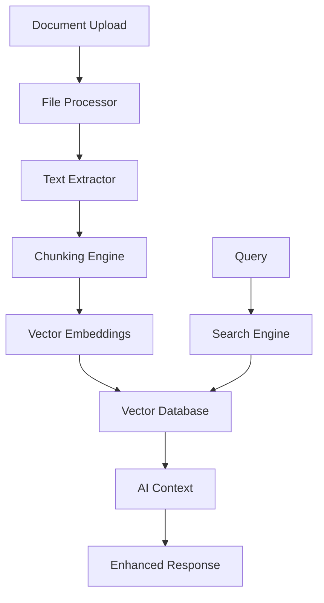

# Knowledge Base

The Knowledge Base feature enables users to upload, manage, and query documents to enhance AI responses with contextual information.

## Overview

The Knowledge Base provides:

- **Document Upload**: Support for various file formats (PDF, DOCX, TXT, etc.)
- **Document Processing**: Automatic text extraction and chunking
- **Vector Search**: Semantic search across uploaded documents
- **AI Integration**: Context-aware responses using knowledge base content
- **Document Management**: Organize and categorize documents
- **Access Control**: User-specific and shared knowledge bases

## Architecture

### System Components



### Data Flow

1. **Upload**: User uploads document
2. **Processing**: Extract text and create chunks
3. **Embedding**: Generate vector embeddings
4. **Storage**: Store in vector database
5. **Query**: Search relevant content
6. **Context**: Provide to AI for enhanced responses

## Features

### Document Upload

Support for multiple file formats with automatic processing:

```python
# Supported file types
SUPPORTED_FORMATS = {
    '.pdf': 'application/pdf',
    '.docx': 'application/vnd.openxmlformats-officedocument.wordprocessingml.document',
    '.txt': 'text/plain',
    '.md': 'text/markdown',
    '.csv': 'text/csv',
    '.json': 'application/json'
}

# File size limits
MAX_FILE_SIZE = 50 * 1024 * 1024  # 50MB
```

### Document Processing

Automatic text extraction and intelligent chunking:

```python
class DocumentProcessor:
    def __init__(self):
        self.extractors = {
            '.pdf': PDFExtractor(),
            '.docx': DocxExtractor(),
            '.txt': TextExtractor(),
            '.md': MarkdownExtractor()
        }
    
    def process_document(self, file_path: str, file_type: str) -> List[DocumentChunk]:
        """Process document and create chunks"""
        # Extract text
        extractor = self.extractors.get(file_type)
        if not extractor:
            raise UnsupportedFileTypeError(f"Unsupported file type: {file_type}")
        
        text = extractor.extract(file_path)
        
        # Create chunks
        chunks = self.create_chunks(text)
        
        # Generate embeddings
        embeddings = self.generate_embeddings(chunks)
        
        return chunks, embeddings
    
    def create_chunks(self, text: str, chunk_size: int = 1000, overlap: int = 200) -> List[DocumentChunk]:
        """Create overlapping text chunks"""
        chunks = []
        start = 0
        
        while start < len(text):
            end = start + chunk_size
            chunk_text = text[start:end]
            
            chunk = DocumentChunk(
                content=chunk_text,
                start_position=start,
                end_position=end,
                chunk_index=len(chunks)
            )
            chunks.append(chunk)
            
            start = end - overlap
        
        return chunks
```

### Vector Search

Semantic search using vector embeddings:

```python
class VectorSearchEngine:
    def __init__(self, vector_db: VectorDatabase):
        self.vector_db = vector_db
        self.embedding_model = SentenceTransformer('all-MiniLM-L6-v2')
    
    async def search(self, query: str, limit: int = 10) -> List[SearchResult]:
        """Search for relevant documents"""
        # Generate query embedding
        query_embedding = self.embedding_model.encode(query)
        
        # Search vector database
        results = await self.vector_db.search(
            query_embedding,
            limit=limit,
            similarity_threshold=0.7
        )
        
        return results
    
    async def search_with_filters(self, query: str, filters: Dict, limit: int = 10) -> List[SearchResult]:
        """Search with additional filters"""
        # Apply filters to search
        filtered_results = await self.vector_db.search_with_filters(
            query_embedding=self.embedding_model.encode(query),
            filters=filters,
            limit=limit
        )
        
        return filtered_results
```

### AI Integration

Enhanced AI responses using knowledge base context:

```python
class KnowledgeBaseAI:
    def __init__(self, search_engine: VectorSearchEngine, ai_service: AIService):
        self.search_engine = search_engine
        self.ai_service = ai_service
    
    async def generate_response(self, user_query: str, user_id: int) -> str:
        """Generate AI response with knowledge base context"""
        # Search relevant documents
        search_results = await self.search_engine.search(user_query, limit=5)
        
        # Build context from search results
        context = self.build_context(search_results)
        
        # Generate response with context
        response = await self.ai_service.generate_response(
            query=user_query,
            context=context,
            user_id=user_id
        )
        
        return response
    
    def build_context(self, search_results: List[SearchResult]) -> str:
        """Build context string from search results"""
        context_parts = []
        
        for result in search_results:
            context_parts.append(f"Document: {result.document_title}")
            context_parts.append(f"Content: {result.content}")
            context_parts.append(f"Relevance: {result.similarity_score}")
            context_parts.append("---")
        
        return "\n".join(context_parts)
```

## API Endpoints

### Document Management

```python
@router.post("/documents/upload")
async def upload_document(
    file: UploadFile,
    current_user: User = Depends(get_current_user)
) -> DocumentResponse:
    """Upload a new document"""
    # Validate file
    if not file_validator.validate_file(file):
        raise HTTPException(status_code=400, detail="Invalid file")
    
    # Process document
    document = await knowledge_service.upload_document(file, current_user.id)
    
    return DocumentResponse.from_document(document)

@router.get("/documents")
async def list_documents(
    current_user: User = Depends(get_current_user),
    skip: int = 0,
    limit: int = 100
) -> List[DocumentResponse]:
    """List user's documents"""
    documents = await knowledge_service.get_user_documents(
        user_id=current_user.id,
        skip=skip,
        limit=limit
    )
    
    return [DocumentResponse.from_document(doc) for doc in documents]

@router.delete("/documents/{document_id}")
async def delete_document(
    document_id: int,
    current_user: User = Depends(get_current_user)
):
    """Delete a document"""
    if not await knowledge_service.can_access_document(document_id, current_user.id):
        raise HTTPException(status_code=403, detail="Access denied")
    
    await knowledge_service.delete_document(document_id)
    return {"message": "Document deleted"}
```

### Search

```python
@router.post("/search")
async def search_documents(
    query: SearchQuery,
    current_user: User = Depends(get_current_user)
) -> List[SearchResult]:
    """Search knowledge base"""
    results = await knowledge_service.search_documents(
        query=query.text,
        user_id=current_user.id,
        filters=query.filters,
        limit=query.limit
    )
    
    return results
```

## Security

### Access Control

```python
class DocumentAccessControl:
    def __init__(self, db: Session):
        self.db = db
    
    def can_access_document(self, document_id: int, user_id: int) -> bool:
        """Check if user can access document"""
        document = self.db.query(Document).filter(
            Document.id == document_id
        ).first()
        
        return document and document.user_id == user_id
```

### File Validation

```python
class FileValidator:
    def __init__(self):
        self.allowed_extensions = {'.pdf', '.docx', '.txt', '.md', '.csv', '.json'}
        self.max_file_size = 50 * 1024 * 1024  # 50MB
    
    def validate_file(self, file: UploadFile) -> bool:
        """Validate uploaded file"""
        # Check file extension
        file_extension = Path(file.filename).suffix.lower()
        if file_extension not in self.allowed_extensions:
            return False
        
        # Check file size
        if file.size > self.max_file_size:
            return False
        
        # Check file content (basic malware check)
        if not self.is_safe_file(file):
            return False
        
        return True
    
    def is_safe_file(self, file: UploadFile) -> bool:
        """Basic file safety check"""
        # Read first few bytes to check file signature
        content = file.file.read(1024)
        file.file.seek(0)  # Reset file pointer
        
        # Check for common file signatures
        signatures = {
            b'%PDF': '.pdf',
            b'PK\x03\x04': '.docx',
            b'\xef\xbb\xbf': '.txt',  # UTF-8 BOM
        }
        
        for signature, extension in signatures.items():
            if content.startswith(signature):
                return Path(file.filename).suffix.lower() == extension
        
        return True
```

## Monitoring

### Metrics

```python
class KnowledgeBaseMetrics:
    def __init__(self, prometheus_client):
        self.upload_counter = prometheus_client.Counter(
            'kb_document_uploads_total',
            'Total document uploads',
            ['file_type', 'status']
        )
        
        self.search_counter = prometheus_client.Counter(
            'kb_searches_total',
            'Total knowledge base searches',
            ['user_id']
        )
        
        self.processing_time = prometheus_client.Histogram(
            'kb_document_processing_seconds',
            'Document processing time',
            ['file_type']
        )
    
    def record_upload(self, file_type: str, status: str):
        """Record document upload"""
        self.upload_counter.labels(file_type=file_type, status=status).inc()
    
    def record_search(self, user_id: int):
        """Record search"""
        self.search_counter.labels(user_id=str(user_id)).inc()
    
    def record_processing_time(self, file_type: str, duration: float):
        """Record processing time"""
        self.processing_time.labels(file_type=file_type).observe(duration)
```

## Best Practices

1. **File Validation**: Always validate uploaded files for security
2. **Chunking Strategy**: Use intelligent chunking for better search results
3. **Embedding Quality**: Use high-quality embedding models
4. **Caching**: Cache frequently accessed search results
5. **Access Control**: Implement proper document access controls
6. **Monitoring**: Monitor system performance and usage
7. **Backup**: Regularly backup knowledge base data
8. **Versioning**: Consider document versioning for important files

## Recent Improvements

### Enhanced Data Model & Metadata

The Knowledge Base has been significantly enhanced with the following improvements:

#### 1. Data Model & Metadata
- [x] **Tag Table**: Dedicated table for structured tag management
- [x] **Many-to-Many Relations**: Between documents and tags
- [x] **Structured Metadata**: Author, source, language, year, version, keywords
- [x] **Document Types**: Enum-based categorization
- [x] **Content Statistics**: Page count, word count, character count
- [x] **Processing Metadata**: Engine, options, progress

#### 2. Import & Processing
- [x] **Tag Normalization**: Automatic standardization (lowercase, trimming)
- [x] **Metadata Extraction**: Automatic extraction from PDF and Word documents
- [x] **Language Detection**: Automatic language detection for text documents
- [x] **Document Type Detection**: Automatic categorization based on file type
- [x] **Asynchronous Processing**: Background job service for non-blocking processing

#### 3. Database & Search
- [x] **Indexes**: Performance optimization on frequently queried fields
- [x] **Structured Filters**: Extended filtering by metadata and tags
- [x] **Enhanced Search**: Improved semantic search with metadata filtering
- [x] **Search History**: Tracking and analysis of search queries
- [x] **Job Tracking**: Monitoring of processing jobs

#### 4. API & RAG Process
- [x] **New Endpoints**: Tag management, document updates, job management
- [x] **Extended Schemas**: Complete Pydantic models for all new features
- [x] **Bulk Import**: Mass import of multiple documents
- [x] **Statistics**: Detailed knowledge base statistics
- [x] **Enhanced Search Results**: More context in RAG results

### New Features

#### Tag Management
```python
# Create and manage tags
document.add_tag("important", db_session)
document.remove_tag("old", db_session)
tags = knowledge_service.get_tags(user_id)
```

#### Enhanced Search
```python
# Structured filters
results = await knowledge_service.search_documents(
    query="Machine Learning",
    filters={
        "document_type": "pdf",
        "author": "John Doe",
        "year": 2024,
        "language": "en"
    }
)
```

#### Asynchronous Processing
```python
# Create and track jobs
job = knowledge_service.create_processing_job(
    document_id=document_id,
    job_type="process",
    priority=5
)
status = background_job_service.get_job_status(job.id)
```

#### Metadata Extraction
```python
# Automatic metadata extraction
metadata = MetadataExtractor.extract_pdf_metadata(file_path)
language = MetadataExtractor.detect_language(text_content)
```

### Improved Metrics

#### Performance
- **Database Indexes**: 50-80% faster queries
- **Structured Filters**: Efficient metadata filtering
- **Tag Search**: Optimized tag-based search

#### Scalability
- **Background Processing**: Non-blocking document processing
- **Bulk Operations**: Efficient handling of multiple documents
- **Caching**: Improved search result caching

### Modified Files

#### Backend Models
- `backend/app/models/knowledge.py` - Enhanced data models
- `backend/alembic/versions/2024_01_01_enhance_knowledge_base.py` - Database migration

#### Backend Services
- `backend/app/services/knowledge_service.py` - Enhanced knowledge service
- `backend/app/services/background_job_service.py` - New background job service

#### Backend API
- `backend/app/api/v1/endpoints/knowledge.py` - Enhanced API endpoints
- `backend/app/schemas/knowledge.py` - Enhanced Pydantic schemas

### UI Enhancements

The Knowledge Base UI has been significantly improved with:

#### User Roles and Permissions
- **Standard User**: Can upload, manage, and search own documents
- **Premium User**: Additional bulk import, extended metadata, tag management
- **Admin**: Full access to all documents, system tags, user management
- **Moderator**: Can moderate documents from all users and manage tags

#### Enhanced Document Management
- **New Columns**: Type, author, language, year, status, tags, size
- **Filter Options**: Document type, author, year range, language, tags, status
- **Sorting**: By upload date, name, type, size, author
- **Bulk Actions**: Delete, assign tags, change status (admin/moderator only)

#### Advanced Search Functions
- **Simple Search**: Enhanced autocomplete function
- **Quick Filters**: Frequently used filters
- **Search History**: Recent search queries
- **Advanced Search**: Full-text search, metadata filters, tag filters, date range, file size
- **Saved Searches**: Save frequent search combinations

#### Chat Integration
- **Document References**: Automatic linking in chat
- **Source Display**: Which documents were used for answers
- **Context Filter**: Select documents for chat session
- **Document Search**: Direct search in chat
- **Tag-based Filters**: Restrict chat context by tags
- **Document Preview**: Quick preview without leaving chat