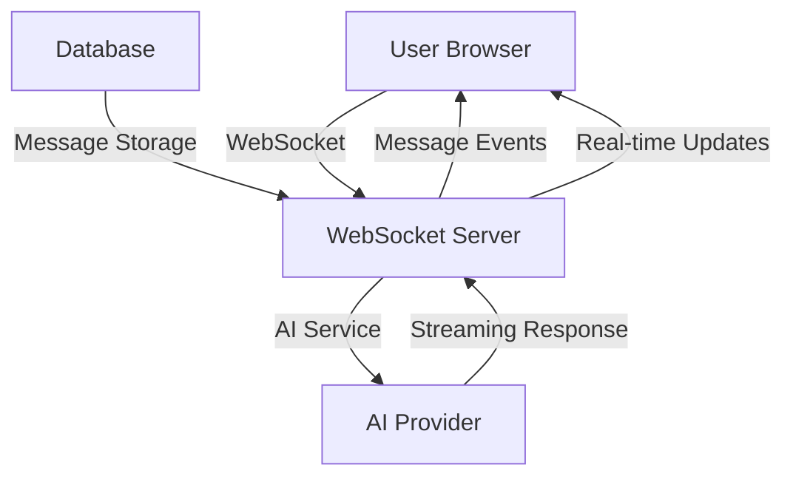

# Real-time Chat

The AI Chat Application provides real-time chat capabilities with instant message delivery, typing indicators, and live streaming responses.

## Overview

Real-time chat enables instant communication between users and AI assistants with features like:

- **Instant Message Delivery**: Messages appear immediately without page refresh
- **Typing Indicators**: Visual feedback when AI is generating responses
- **Streaming Responses**: Real-time display of AI responses as they're generated
- **Live Updates**: Real-time synchronization across multiple browser tabs
- **WebSocket Connection**: Persistent connection for low-latency communication

## Architecture

### WebSocket Implementation

The real-time chat system uses WebSocket connections for bidirectional communication:



### Connection Flow

1. **Authentication**: User authenticates with JWT token
2. **WebSocket Connection**: Establishes persistent connection
3. **Message Exchange**: Bidirectional message flow
4. **Streaming**: Real-time AI response streaming
5. **Disconnection**: Graceful connection termination

## Features

### Instant Messaging

Messages are delivered instantly without requiring page refresh:

```javascript
// Send message
socket.send(JSON.stringify({
  type: 'send_message',
  data: {
    conversation_id: 123,
    content: 'Hello, AI!',
    message_type: 'user'
  }
}));

// Receive message
socket.onmessage = (event) => {
  const data = JSON.parse(event.data);
  if (data.type === 'message_received') {
    displayMessage(data.data.message);
  }
};
```

### Typing Indicators

Visual feedback shows when AI is generating a response:

```javascript
// Show typing indicator
socket.send(JSON.stringify({
  type: 'typing_start',
  data: { conversation_id: 123 }
}));

// Hide typing indicator
socket.send(JSON.stringify({
  type: 'typing_stop',
  data: { conversation_id: 123 }
}));
```

### Streaming Responses

AI responses are displayed in real-time as they're generated:

```javascript
socket.onmessage = (event) => {
  const data = JSON.parse(event.data);
  
  switch (data.type) {
    case 'stream_start':
      startStreamingMessage(data.data.message_id);
      break;
      
    case 'stream_content':
      appendToStreamingMessage(data.data.content);
      break;
      
    case 'stream_complete':
      finalizeStreamingMessage(data.data.usage);
      break;
  }
};
```

### Live Updates

Real-time synchronization across multiple browser tabs:

```javascript
// Listen for conversation updates
socket.onmessage = (event) => {
  const data = JSON.parse(event.data);
  
  if (data.type === 'conversation_updated') {
    updateConversationList(data.data.conversation);
  }
  
  if (data.type === 'message_added') {
    addMessageToConversation(data.data.message);
  }
};
```

## Implementation

### Frontend WebSocket Client

```javascript
class ChatWebSocket {
  constructor(token) {
    this.token = token;
    this.socket = null;
    this.reconnectAttempts = 0;
    this.maxReconnectAttempts = 5;
    this.reconnectDelay = 1000;
  }

  connect() {
    this.socket = new WebSocket(`${WS_URL}/api/v1/chat/ws`);
    
    this.socket.onopen = () => {
      console.log('WebSocket connected');
      this.authenticate();
      this.reconnectAttempts = 0;
    };

    this.socket.onmessage = (event) => {
      this.handleMessage(JSON.parse(event.data));
    };

    this.socket.onclose = () => {
      console.log('WebSocket disconnected');
      this.handleReconnect();
    };

    this.socket.onerror = (error) => {
      console.error('WebSocket error:', error);
    };
  }

  authenticate() {
    this.send({
      type: 'auth',
      token: this.token
    });
  }

  send(data) {
    if (this.socket && this.socket.readyState === WebSocket.OPEN) {
      this.socket.send(JSON.stringify(data));
    }
  }

  handleMessage(data) {
    switch (data.type) {
      case 'auth_success':
        this.onAuthSuccess(data);
        break;
      case 'message_received':
        this.onMessageReceived(data);
        break;
      case 'stream_start':
        this.onStreamStart(data);
        break;
      case 'stream_content':
        this.onStreamContent(data);
        break;
      case 'stream_complete':
        this.onStreamComplete(data);
        break;
      case 'typing_indicator':
        this.onTypingIndicator(data);
        break;
      case 'error':
        this.onError(data);
        break;
    }
  }

  handleReconnect() {
    if (this.reconnectAttempts < this.maxReconnectAttempts) {
      this.reconnectAttempts++;
      setTimeout(() => {
        console.log(`Reconnecting... Attempt ${this.reconnectAttempts}`);
        this.connect();
      }, this.reconnectDelay * this.reconnectAttempts);
    }
  }

  disconnect() {
    if (this.socket) {
      this.socket.close();
    }
  }
}
```

### Backend WebSocket Handler

```python
import asyncio
import json
from typing import Dict, Set
from fastapi import WebSocket, WebSocketDisconnect
from app.core.security import verify_token
from app.services.chat_service import ChatService

class ConnectionManager:
    def __init__(self):
        self.active_connections: Dict[int, WebSocket] = {}
        self.user_conversations: Dict[int, Set[int]] = {}

    async def connect(self, websocket: WebSocket, user_id: int):
        await websocket.accept()
        self.active_connections[user_id] = websocket
        self.user_conversations[user_id] = set()

    def disconnect(self, user_id: int):
        if user_id in self.active_connections:
            del self.active_connections[user_id]
        if user_id in self.user_conversations:
            del self.user_conversations[user_id]

    async def send_personal_message(self, message: dict, user_id: int):
        if user_id in self.active_connections:
            await self.active_connections[user_id].send_text(json.dumps(message))

    async def broadcast_to_conversation(self, message: dict, conversation_id: int):
        for user_id in self.user_conversations:
            if conversation_id in self.user_conversations[user_id]:
                await self.send_personal_message(message, user_id)

manager = ConnectionManager()

@router.websocket("/ws")
async def websocket_endpoint(websocket: WebSocket):
    user_id = None
    try:
        # Accept connection
        await websocket.accept()
        
        # Wait for authentication
        auth_data = await websocket.receive_text()
        auth_message = json.loads(auth_data)
        
        if auth_message["type"] != "auth":
            await websocket.close(code=4001, reason="Authentication required")
            return
        
        # Verify token
        token = auth_message["token"]
        user_id = verify_token(token)
        if not user_id:
            await websocket.close(code=4001, reason="Invalid token")
            return
        
        # Connect user
        await manager.connect(websocket, user_id)
        await manager.send_personal_message({
            "type": "auth_success",
            "user_id": user_id
        }, user_id)
        
        # Handle messages
        while True:
            data = await websocket.receive_text()
            message = json.loads(data)
            await handle_websocket_message(user_id, message)
            
    except WebSocketDisconnect:
        if user_id:
            manager.disconnect(user_id)
    except Exception as e:
        print(f"WebSocket error: {e}")
        if user_id:
            manager.disconnect(user_id)

async def handle_websocket_message(user_id: int, message: dict):
    """Handle incoming WebSocket messages"""
    message_type = message.get("type")
    data = message.get("data", {})
    
    if message_type == "send_message":
        await handle_send_message(user_id, data)
    elif message_type == "stream_response":
        await handle_stream_response(user_id, data)
    elif message_type == "typing":
        await handle_typing_indicator(user_id, data)
    elif message_type == "join_conversation":
        await handle_join_conversation(user_id, data)
    elif message_type == "leave_conversation":
        await handle_leave_conversation(user_id, data)

async def handle_send_message(user_id: int, data: dict):
    """Handle message sending"""
    chat_service = ChatService()
    
    # Create message in database
    message = await chat_service.create_message(
        user_id=user_id,
        conversation_id=data["conversation_id"],
        content=data["content"],
        message_type=data["message_type"]
    )
    
    # Broadcast to conversation participants
    await manager.broadcast_to_conversation({
        "type": "message_received",
        "data": {"message": message}
    }, data["conversation_id"])
    
    # Start AI response if needed
    if data["message_type"] == "user":
        await start_ai_response(user_id, data["conversation_id"], message["id"])

async def handle_stream_response(user_id: int, data: dict):
    """Handle streaming AI response"""
    chat_service = ChatService()
    
    # Start streaming
    await manager.send_personal_message({
        "type": "stream_start",
        "data": {"message_id": data["message_id"]}
    }, user_id)
    
    # Stream AI response
    async for chunk in chat_service.stream_ai_response(
        conversation_id=data["conversation_id"],
        message_id=data["message_id"],
        assistant_id=data["assistant_id"]
    ):
        await manager.send_personal_message({
            "type": "stream_content",
            "data": {
                "message_id": data["message_id"],
                "content": chunk["content"],
                "is_complete": chunk["is_complete"]
            }
        }, user_id)
        
        if chunk["is_complete"]:
            await manager.send_personal_message({
                "type": "stream_complete",
                "data": {
                    "message_id": data["message_id"],
                    "usage": chunk["usage"]
                }
            }, user_id)
            break
```

### Message Types

#### Client to Server

```javascript
// Authentication
{
  type: 'auth',
  token: 'jwt-token'
}

// Send message
{
  type: 'send_message',
  data: {
    conversation_id: 123,
    content: 'Hello, AI!',
    message_type: 'user'
  }
}

// Request streaming response
{
  type: 'stream_response',
  data: {
    conversation_id: 123,
    message_id: 456,
    assistant_id: 'gpt-4'
  }
}

// Typing indicator
{
  type: 'typing',
  data: {
    conversation_id: 123,
    is_typing: true
  }
}

// Join conversation
{
  type: 'join_conversation',
  data: {
    conversation_id: 123
  }
}
```

#### Server to Client

```javascript
// Authentication success
{
  type: 'auth_success',
  user_id: 789
}

// Message received
{
  type: 'message_received',
  data: {
    message: {
      id: 456,
      content: 'Hello, AI!',
      message_type: 'user',
      sender_id: 789,
      created_at: '2024-01-15T10:30:00Z'
    }
  }
}

// Stream start
{
  type: 'stream_start',
  data: {
    message_id: 789
  }
}

// Stream content
{
  type: 'stream_content',
  data: {
    message_id: 789,
    content: 'Hello! I\'m here to help you.',
    is_complete: false
  }
}

// Stream complete
{
  type: 'stream_complete',
  data: {
    message_id: 789,
    usage: {
      prompt_tokens: 15,
      completion_tokens: 20,
      total_tokens: 35
    }
  }
}

// Typing indicator
{
  type: 'typing_indicator',
  data: {
    conversation_id: 123,
    user_id: 789,
    is_typing: true
  }
}

// Error
{
  type: 'error',
  data: {
    code: 'MESSAGE_TOO_LONG',
    message: 'Message exceeds maximum length'
  }
}
```

## Performance Optimization

### Connection Management

- **Connection Pooling**: Efficient WebSocket connection management
- **Heartbeat**: Keep connections alive with periodic pings
- **Reconnection**: Automatic reconnection with exponential backoff
- **Load Balancing**: Distribute connections across multiple servers

### Message Optimization

- **Message Batching**: Batch multiple messages for efficiency
- **Compression**: Compress large messages
- **Caching**: Cache frequently accessed data
- **Rate Limiting**: Prevent message spam

### Scalability

- **Horizontal Scaling**: Multiple WebSocket servers
- **Redis Pub/Sub**: Cross-server message broadcasting
- **Database Optimization**: Efficient message storage and retrieval
- **CDN**: Static asset delivery optimization

## Security

### Authentication

- **JWT Tokens**: Secure WebSocket authentication
- **Token Validation**: Verify tokens on connection
- **Session Management**: Track active sessions
- **Access Control**: Verify user permissions

### Data Protection

- **Message Encryption**: Encrypt sensitive messages
- **Input Validation**: Validate all incoming messages
- **Rate Limiting**: Prevent abuse
- **Audit Logging**: Log all activities

## Monitoring

### Metrics

- **Connection Count**: Active WebSocket connections
- **Message Rate**: Messages per second
- **Response Time**: AI response latency
- **Error Rate**: Connection and message errors

### Health Checks

- **Connection Health**: Monitor WebSocket server health
- **Database Health**: Monitor database connectivity
- **AI Service Health**: Monitor AI provider availability
- **Memory Usage**: Monitor server resource usage

## Troubleshooting

### Common Issues

1. **Connection Drops**: Implement automatic reconnection
2. **Message Loss**: Use message acknowledgments
3. **High Latency**: Optimize network and database queries
4. **Memory Leaks**: Proper connection cleanup

### Debugging

```javascript
// Enable WebSocket debugging
const socket = new WebSocket(WS_URL);
socket.onopen = () => console.log('Connected');
socket.onmessage = (event) => console.log('Received:', event.data);
socket.onclose = (event) => console.log('Disconnected:', event.code, event.reason);
socket.onerror = (error) => console.error('Error:', error);
```

## Best Practices

1. **Connection Management**: Properly handle connection lifecycle
2. **Error Handling**: Implement comprehensive error handling
3. **Message Validation**: Validate all incoming messages
4. **Resource Cleanup**: Clean up resources on disconnection
5. **Monitoring**: Monitor connection health and performance
6. **Security**: Implement proper authentication and authorization
7. **Scalability**: Design for horizontal scaling
8. **Testing**: Test WebSocket functionality thoroughly