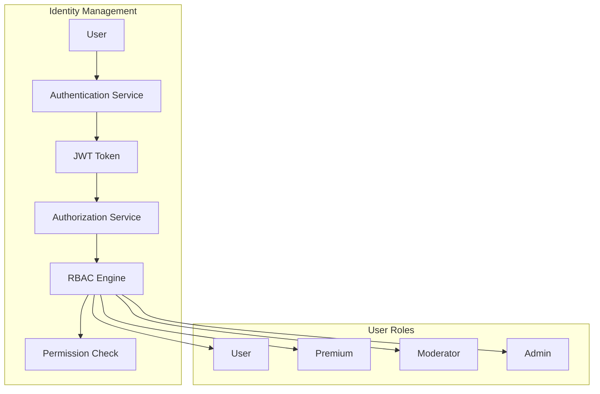
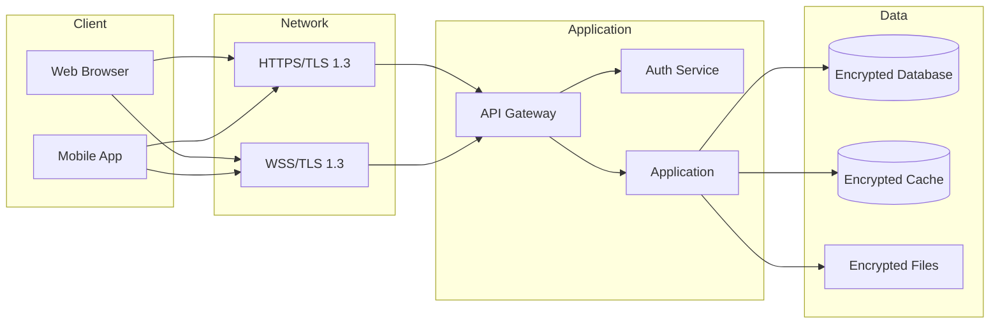
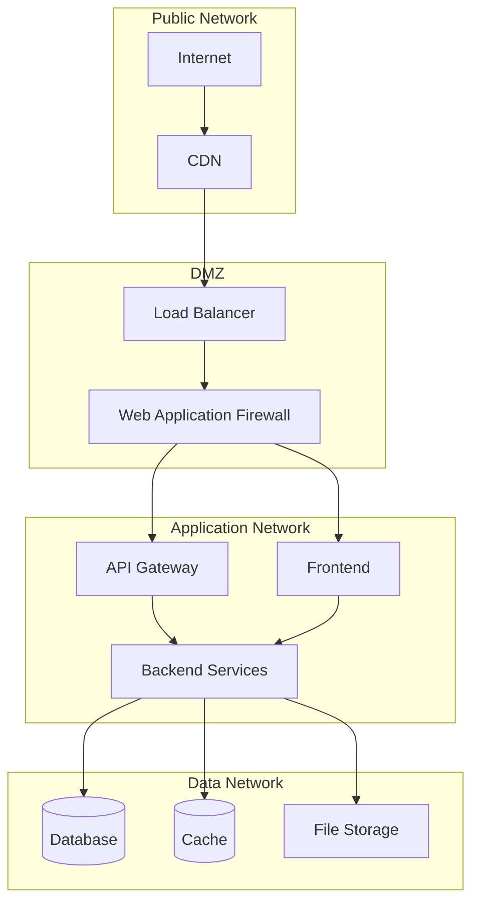
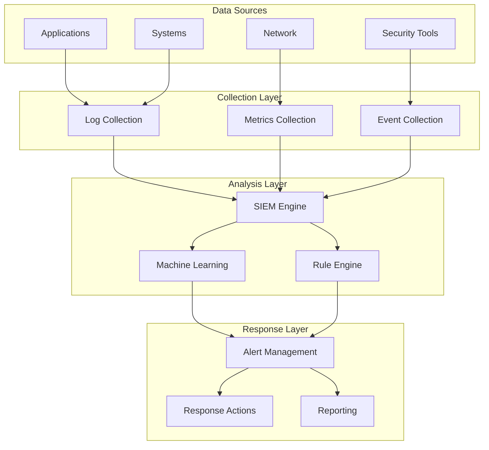
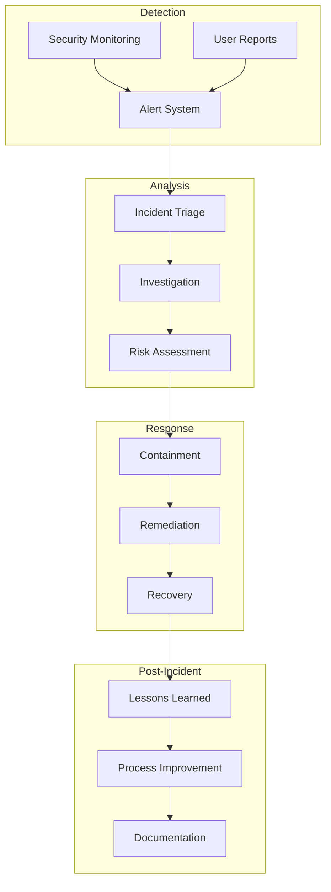

# Security Architecture

This document describes the security architecture and design principles for ConvoSphere.

## 🏗️ Architecture Overview

### Security-First Design
ConvoSphere follows a **Security-First** architecture approach with security considerations integrated at every layer:

- **Defense in Depth**: Multiple layers of security controls
- **Zero Trust**: Verify every request and connection
- **Principle of Least Privilege**: Minimal required permissions
- **Secure by Default**: Secure default configurations

### Architecture Layers
```
┌─────────────────────────────────────────────────────────────┐
│                    Security Architecture                     │
├─────────────────────────────────────────────────────────────┤
│  Presentation Layer  │  Authentication & Authorization      │
├─────────────────────┼───────────────────────────────────────┤
│  Application Layer  │  Input Validation & Output Encoding   │
├─────────────────────┼───────────────────────────────────────┤
│  Service Layer      │  Business Logic Security              │
├─────────────────────┼───────────────────────────────────────┤
│  Data Layer         │  Data Encryption & Access Control     │
├─────────────────────┼───────────────────────────────────────┤
│  Infrastructure     │  Network Security & Container Security │
└─────────────────────┴───────────────────────────────────────┘
```

## 🔐 Authentication & Authorization

### Authentication Architecture
- **Multi-Factor Authentication**: JWT + 2FA support
- **Session Management**: Secure session handling
- **Token Management**: JWT token lifecycle management
- **Password Security**: Secure password policies and hashing

### Authorization Architecture
- **Role-Based Access Control (RBAC)**: Four user roles
- **Permission System**: Granular permission management
- **Resource-Level Authorization**: Per-resource access control
- **Dynamic Authorization**: Runtime permission checking

### Identity Management


## 🛡️ Data Security

### Data Classification
- **Public Data**: Non-sensitive information
- **Internal Data**: Company internal information
- **Confidential Data**: Sensitive business information
- **Restricted Data**: Highly sensitive information

### Encryption Architecture
- **Data in Transit**: TLS 1.3 for all communications
- **Data at Rest**: AES-256 encryption for stored data
- **Field-Level Encryption**: Sensitive field encryption
- **Key Management**: Secure key management system

### Data Flow Security


## 🌐 Network Security

### Network Architecture
- **Microservices**: Isolated service communication
- **API Gateway**: Centralized API security
- **Load Balancer**: Traffic distribution and security
- **Reverse Proxy**: SSL termination and security headers

### Container Security
- **Container Isolation**: Network and process isolation
- **Non-root Containers**: Containers run as non-root users
- **Resource Limits**: CPU and memory limits
- **Security Scanning**: Container image vulnerability scanning

### Network Segmentation


## 🔍 Security Monitoring

### Monitoring Architecture
- **Centralized Logging**: All logs collected centrally
- **Real-time Analysis**: Real-time security event analysis
- **Alert Management**: Automated alert generation and management
- **Incident Response**: Integrated incident response procedures

### Security Information and Event Management (SIEM)
- **Log Collection**: Collect logs from all systems
- **Event Correlation**: Correlate events across systems
- **Threat Detection**: Detect security threats
- **Response Automation**: Automated response actions

### Monitoring Components


## 🔧 Security Controls

### Application Security Controls
- **Input Validation**: Comprehensive input validation
- **Output Encoding**: Secure output encoding
- **Session Management**: Secure session handling
- **Error Handling**: Secure error handling

### API Security Controls
- **Rate Limiting**: API rate limiting
- **Authentication**: API authentication
- **Authorization**: API authorization
- **Input Validation**: API input validation

### Database Security Controls
- **Connection Encryption**: Encrypted database connections
- **Access Control**: Database access control
- **Audit Logging**: Database audit logging
- **Backup Security**: Secure database backups

### Infrastructure Security Controls
- **Container Security**: Container security controls
- **Network Security**: Network security controls
- **Monitoring**: Infrastructure monitoring
- **Backup Security**: Secure infrastructure backups

## 🚨 Incident Response

### Response Architecture
- **Detection**: Automated threat detection
- **Analysis**: Automated and manual analysis
- **Response**: Automated and manual response
- **Recovery**: System recovery procedures

### Response Components


## 📊 Security Metrics

### Performance Metrics
- **Mean Time to Detection (MTTD)**: Time to detect incidents
- **Mean Time to Response (MTTR)**: Time to respond to incidents
- **False Positive Rate**: False positive percentage
- **Detection Rate**: Incident detection rate

### Compliance Metrics
- **Policy Compliance**: Security policy compliance
- **Regulatory Compliance**: Regulatory compliance
- **Audit Results**: Security audit results
- **Risk Assessment**: Security risk assessment

### Operational Metrics
- **System Availability**: Security system availability
- **Performance Impact**: Security performance impact
- **Resource Usage**: Security resource usage
- **Cost Efficiency**: Security cost efficiency

## 🔄 Security Lifecycle

### Development Lifecycle
1. **Requirements**: Security requirements gathering
2. **Design**: Security architecture design
3. **Implementation**: Secure implementation
4. **Testing**: Security testing
5. **Deployment**: Secure deployment
6. **Maintenance**: Security maintenance

### Security Operations
1. **Monitoring**: Continuous security monitoring
2. **Detection**: Threat detection
3. **Response**: Incident response
4. **Recovery**: System recovery
5. **Improvement**: Process improvement

### Continuous Improvement
- **Regular Assessments**: Regular security assessments
- **Process Updates**: Security process updates
- **Tool Updates**: Security tool updates
- **Training**: Security training updates

## 📋 Security Standards

### Compliance Standards
- **ISO 27001**: Information security management
- **SOC 2**: Security, availability, and confidentiality
- **GDPR**: Data protection and privacy
- **NIST Cybersecurity Framework**: Cybersecurity framework

### Security Frameworks
- **OWASP**: Web application security
- **NIST**: National Institute of Standards and Technology
- **CIS**: Center for Internet Security
- **SANS**: Security training and certification

### Best Practices
- **Defense in Depth**: Multiple security layers
- **Zero Trust**: Verify everything
- **Principle of Least Privilege**: Minimal permissions
- **Secure by Default**: Secure defaults

## 📞 Security Team

### Team Structure
- **Security Lead**: Overall security responsibility
- **Security Engineers**: Security implementation
- **Security Analysts**: Security monitoring and analysis
- **Incident Response**: Incident response team

### Responsibilities
- **Architecture**: Security architecture design
- **Implementation**: Security implementation
- **Monitoring**: Security monitoring
- **Response**: Incident response

### Contact Information
- **Security Team**: security@convosphere.com
- **Incident Response**: incident-response@convosphere.com
- **Security Lead**: security-lead@convosphere.com
- **Emergency**: emergency@convosphere.com

## 📚 Additional Resources

### Documentation
- **Security Policy**: [Security Documentation](../security.md)
- **Security Testing**: [Security Testing Guide](security-testing.md)
- **Incident Response**: [Incident Response Plan](incident-response.md)
- **Security Monitoring**: [Security Monitoring](security-monitoring.md)

### External Resources
- **OWASP**: https://owasp.org/
- **NIST**: https://www.nist.gov/cyberframework
- **ISO 27001**: https://www.iso.org/isoiec-27001-information-security.html
- **SANS**: https://www.sans.org/