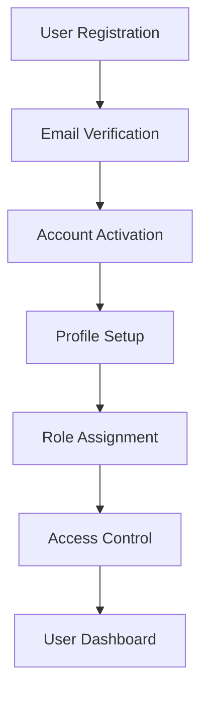
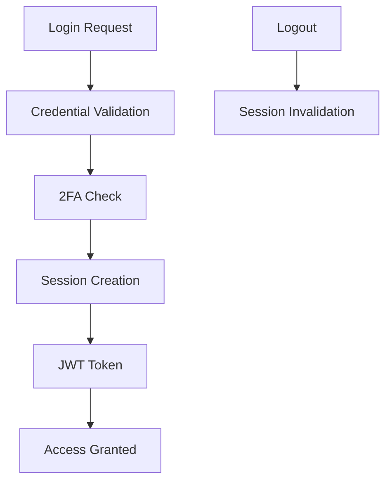

# User Management

The User Management feature provides comprehensive user account management, authentication, authorization, and profile management capabilities.

## Overview

The User Management system includes:

- **User Registration & Authentication**: Secure user account creation and login
- **Profile Management**: User profile customization and settings
- **Role-Based Access Control**: Granular permissions and roles
- **User Administration**: Admin tools for user management
- **Security Features**: Password policies, 2FA, session management
- **User Analytics**: Usage tracking and user behavior insights

## Architecture

### User Management Flow



### Authentication Flow



## Features

### User Registration

Secure user registration with email verification:

```python
class UserRegistrationService:
    def __init__(self, db: Session, email_service: EmailService):
        self.db = db
        self.email_service = email_service
    
    async def register_user(self, user_data: UserRegistrationData) -> User:
        """Register a new user"""
        # Validate user data
        self._validate_registration_data(user_data)
        
        # Check if user already exists
        existing_user = self.db.query(User).filter(
            User.email == user_data.email
        ).first()
        
        if existing_user:
            raise UserAlreadyExistsError("User with this email already exists")
        
        # Hash password
        hashed_password = self._hash_password(user_data.password)
        
        # Create user
        user = User(
            email=user_data.email,
            full_name=user_data.full_name,
            hashed_password=hashed_password,
            is_active=False,  # Requires email verification
            email_verification_token=self._generate_verification_token()
        )
        
        self.db.add(user)
        self.db.commit()
        self.db.refresh(user)
        
        # Send verification email
        await self.email_service.send_verification_email(
            user.email,
            user.email_verification_token
        )
        
        return user
    
    def _validate_registration_data(self, user_data: UserRegistrationData):
        """Validate registration data"""
        # Email validation
        if not self._is_valid_email(user_data.email):
            raise ValidationError("Invalid email format")
        
        # Password strength validation
        if not self._is_strong_password(user_data.password):
            raise ValidationError("Password does not meet strength requirements")
        
        # Name validation
        if len(user_data.full_name.strip()) < 2:
            raise ValidationError("Full name must be at least 2 characters")
    
    def _is_strong_password(self, password: str) -> bool:
        """Check password strength"""
        if len(password) < 8:
            return False
        
        has_upper = any(c.isupper() for c in password)
        has_lower = any(c.islower() for c in password)
        has_digit = any(c.isdigit() for c in password)
        has_special = any(c in '!@#$%^&*(),.?":{}|<>' for c in password)
        
        return has_upper and has_lower and has_digit and has_special
    
    def _generate_verification_token(self) -> str:
        """Generate email verification token"""
        return secrets.token_urlsafe(32)
```

### Email Verification

```python
class EmailVerificationService:
    def __init__(self, db: Session):
        self.db = db
    
    async def verify_email(self, token: str) -> bool:
        """Verify user email with token"""
        user = self.db.query(User).filter(
            User.email_verification_token == token,
            User.is_active == False
        ).first()
        
        if not user:
            raise InvalidTokenError("Invalid or expired verification token")
        
        # Activate user
        user.is_active = True
        user.email_verified_at = datetime.utcnow()
        user.email_verification_token = None
        
        self.db.commit()
        
        return True
    
    async def resend_verification_email(self, email: str):
        """Resend verification email"""
        user = self.db.query(User).filter(
            User.email == email,
            User.is_active == False
        ).first()
        
        if not user:
            raise UserNotFoundError("User not found")
        
        # Generate new token
        user.email_verification_token = self._generate_verification_token()
        self.db.commit()
        
        # Send new verification email
        await self.email_service.send_verification_email(
            user.email,
            user.email_verification_token
        )
```

### Authentication

```python
class AuthenticationService:
    def __init__(self, db: Session, jwt_service: JWTService):
        self.db = db
        self.jwt_service = jwt_service
    
    async def authenticate_user(self, email: str, password: str) -> Optional[User]:
        """Authenticate user with email and password"""
        user = self.db.query(User).filter(User.email == email).first()
        
        if not user:
            return None
        
        if not user.is_active:
            raise InactiveUserError("User account is not active")
        
        if not user.verify_password(password):
            return None
        
        # Check if 2FA is required
        if user.two_factor_enabled:
            return self._require_2fa(user)
        
        return user
    
    async def login_user(self, user: User, remember_me: bool = False) -> LoginResponse:
        """Log in user and create session"""
        # Create access token
        access_token = self.jwt_service.create_access_token(
            data={"sub": str(user.id)}
        )
        
        # Create refresh token if remember me
        refresh_token = None
        if remember_me:
            refresh_token = self.jwt_service.create_refresh_token(
                data={"sub": str(user.id)}
            )
        
        # Update last login
        user.last_login_at = datetime.utcnow()
        user.login_count += 1
        self.db.commit()
        
        # Create session
        session = UserSession(
            user_id=user.id,
            access_token=access_token,
            refresh_token=refresh_token,
            expires_at=datetime.utcnow() + timedelta(hours=24)
        )
        self.db.add(session)
        self.db.commit()
        
        return LoginResponse(
            access_token=access_token,
            refresh_token=refresh_token,
            token_type="bearer",
            expires_in=3600,
            user=user
        )
    
    def _require_2fa(self, user: User) -> User:
        """Mark user as requiring 2FA"""
        user.requires_2fa = True
        self.db.commit()
        return user
```

### Two-Factor Authentication

```python
class TwoFactorAuthService:
    def __init__(self, db: Session):
        self.db = db
    
    def enable_2fa(self, user_id: int) -> str:
        """Enable 2FA for user"""
        user = self.db.query(User).filter(User.id == user_id).first()
        
        if not user:
            raise UserNotFoundError("User not found")
        
        # Generate secret key
        secret = pyotp.random_base32()
        user.two_factor_secret = secret
        user.two_factor_enabled = True
        
        self.db.commit()
        
        return secret
    
    def verify_2fa_code(self, user_id: int, code: str) -> bool:
        """Verify 2FA code"""
        user = self.db.query(User).filter(User.id == user_id).first()
        
        if not user or not user.two_factor_enabled:
            return False
        
        totp = pyotp.TOTP(user.two_factor_secret)
        return totp.verify(code)
    
    def disable_2fa(self, user_id: int, code: str) -> bool:
        """Disable 2FA for user"""
        if not self.verify_2fa_code(user_id, code):
            return False
        
        user = self.db.query(User).filter(User.id == user_id).first()
        user.two_factor_enabled = False
        user.two_factor_secret = None
        user.requires_2fa = False
        
        self.db.commit()
        return True
```

### Profile Management

```python
class ProfileService:
    def __init__(self, db: Session):
        self.db = db
    
    async def update_profile(self, user_id: int, profile_data: ProfileUpdateData) -> User:
        """Update user profile"""
        user = self.db.query(User).filter(User.id == user_id).first()
        
        if not user:
            raise UserNotFoundError("User not found")
        
        # Update allowed fields
        if profile_data.full_name is not None:
            user.full_name = profile_data.full_name
        
        if profile_data.bio is not None:
            user.bio = profile_data.bio
        
        if profile_data.avatar_url is not None:
            user.avatar_url = profile_data.avatar_url
        
        if profile_data.preferences is not None:
            user.preferences.update(profile_data.preferences)
        
        user.updated_at = datetime.utcnow()
        self.db.commit()
        
        return user
    
    async def change_password(self, user_id: int, current_password: str, new_password: str) -> bool:
        """Change user password"""
        user = self.db.query(User).filter(User.id == user_id).first()
        
        if not user:
            raise UserNotFoundError("User not found")
        
        # Verify current password
        if not user.verify_password(current_password):
            raise InvalidPasswordError("Current password is incorrect")
        
        # Validate new password
        if not self._is_strong_password(new_password):
            raise ValidationError("New password does not meet strength requirements")
        
        # Update password
        user.hashed_password = self._hash_password(new_password)
        user.password_changed_at = datetime.utcnow()
        
        self.db.commit()
        
        # Invalidate all sessions
        await self._invalidate_user_sessions(user_id)
        
        return True
    
    async def _invalidate_user_sessions(self, user_id: int):
        """Invalidate all user sessions"""
        self.db.query(UserSession).filter(
            UserSession.user_id == user_id
        ).delete()
        self.db.commit()
```

### Role-Based Access Control

```python
class RBACService:
    def __init__(self, db: Session):
        self.db = db
    
    def assign_role(self, user_id: int, role_name: str) -> bool:
        """Assign role to user"""
        user = self.db.query(User).filter(User.id == user_id).first()
        role = self.db.query(Role).filter(Role.name == role_name).first()
        
        if not user or not role:
            return False
        
        # Check if user already has this role
        existing_role = self.db.query(UserRole).filter(
            UserRole.user_id == user_id,
            UserRole.role_id == role.id
        ).first()
        
        if existing_role:
            return True
        
        # Assign role
        user_role = UserRole(user_id=user_id, role_id=role.id)
        self.db.add(user_role)
        self.db.commit()
        
        return True
    
    def remove_role(self, user_id: int, role_name: str) -> bool:
        """Remove role from user"""
        role = self.db.query(Role).filter(Role.name == role_name).first()
        
        if not role:
            return False
        
        user_role = self.db.query(UserRole).filter(
            UserRole.user_id == user_id,
            UserRole.role_id == role.id
        ).first()
        
        if user_role:
            self.db.delete(user_role)
            self.db.commit()
            return True
        
        return False
    
    def has_permission(self, user_id: int, permission: str) -> bool:
        """Check if user has specific permission"""
        user_permissions = self.db.query(Permission).join(
            RolePermission, Permission.id == RolePermission.permission_id
        ).join(
            UserRole, RolePermission.role_id == UserRole.role_id
        ).filter(
            UserRole.user_id == user_id
        ).all()
        
        return any(p.name == permission for p in user_permissions)
    
    def get_user_roles(self, user_id: int) -> List[Role]:
        """Get all roles for user"""
        roles = self.db.query(Role).join(
            UserRole, Role.id == UserRole.role_id
        ).filter(
            UserRole.user_id == user_id
        ).all()
        
        return roles
```

## API Endpoints

### User Registration

**POST** `/api/v1/auth/register`

Register a new user account.

```python
@router.post("/register", response_model=UserResponse, status_code=201)
async def register_user(
    user_data: UserRegistrationData,
    db: Session = Depends(get_db)
):
    """Register a new user"""
    
    registration_service = UserRegistrationService(db, email_service)
    user = await registration_service.register_user(user_data)
    
    return user
```

### Email Verification

**POST** `/api/v1/auth/verify-email`

Verify user email with token.

```python
@router.post("/verify-email")
async def verify_email(
    token: str = Form(...),
    db: Session = Depends(get_db)
):
    """Verify user email"""
    
    verification_service = EmailVerificationService(db)
    success = await verification_service.verify_email(token)
    
    if success:
        return {"message": "Email verified successfully"}
    else:
        raise HTTPException(
            status_code=400,
            detail="Invalid verification token"
        )
```

### User Login

**POST** `/api/v1/auth/login`

Authenticate user and get access token.

```python
@router.post("/login", response_model=LoginResponse)
async def login(
    form_data: OAuth2PasswordRequestForm = Depends(),
    remember_me: bool = Form(False),
    db: Session = Depends(get_db)
):
    """Login user"""
    
    auth_service = AuthenticationService(db, jwt_service)
    
    try:
        user = await auth_service.authenticate_user(
            form_data.username,  # username field contains email
            form_data.password
        )
        
        if not user:
            raise HTTPException(
                status_code=401,
                detail="Incorrect email or password"
            )
        
        if user.requires_2fa:
            return {"requires_2fa": True, "user_id": user.id}
        
        login_response = await auth_service.login_user(user, remember_me)
        return login_response
        
    except InactiveUserError:
        raise HTTPException(
            status_code=401,
            detail="Account not activated"
        )
```

### Two-Factor Authentication

**POST** `/api/v1/auth/2fa/verify`

Verify 2FA code.

```python
@router.post("/2fa/verify", response_model=LoginResponse)
async def verify_2fa(
    user_id: int = Form(...),
    code: str = Form(...),
    db: Session = Depends(get_db)
):
    """Verify 2FA code"""
    
    two_fa_service = TwoFactorAuthService(db)
    auth_service = AuthenticationService(db, jwt_service)
    
    if not two_fa_service.verify_2fa_code(user_id, code):
        raise HTTPException(
            status_code=401,
            detail="Invalid 2FA code"
        )
    
    user = db.query(User).filter(User.id == user_id).first()
    user.requires_2fa = False
    
    login_response = await auth_service.login_user(user)
    return login_response
```

### Profile Management

**GET** `/api/v1/users/profile`

Get current user profile.

```python
@router.get("/profile", response_model=UserProfileResponse)
async def get_profile(
    current_user: User = Depends(get_current_user)
):
    """Get current user profile"""
    return current_user
```

**PUT** `/api/v1/users/profile`

Update user profile.

```python
@router.put("/profile", response_model=UserProfileResponse)
async def update_profile(
    profile_data: ProfileUpdateData,
    current_user: User = Depends(get_current_user),
    db: Session = Depends(get_db)
):
    """Update user profile"""
    
    profile_service = ProfileService(db)
    updated_user = await profile_service.update_profile(
        current_user.id,
        profile_data
    )
    
    return updated_user
```

### Password Management

**POST** `/api/v1/users/change-password`

Change user password.

```python
@router.post("/change-password")
async def change_password(
    current_password: str = Form(...),
    new_password: str = Form(...),
    current_user: User = Depends(get_current_user),
    db: Session = Depends(get_db)
):
    """Change user password"""
    
    profile_service = ProfileService(db)
    success = await profile_service.change_password(
        current_user.id,
        current_password,
        new_password
    )
    
    if success:
        return {"message": "Password changed successfully"}
    else:
        raise HTTPException(
            status_code=400,
            detail="Failed to change password"
        )
```

### User Administration

**GET** `/api/v1/admin/users`

List all users (admin only).

```python
@router.get("/admin/users", response_model=PaginatedUserResponse)
async def list_users(
    page: int = Query(1, ge=1),
    size: int = Query(20, ge=1, le=100),
    search: Optional[str] = Query(None),
    status: Optional[str] = Query(None),
    current_user: User = Depends(get_current_admin_user),
    db: Session = Depends(get_db)
):
    """List all users (admin only)"""
    
    filters = {}
    if status:
        filters['is_active'] = status == 'active'
    
    users = await user_service.list_users(
        filters=filters,
        search=search,
        page=page,
        size=size
    )
    
    return users
```

**PUT** `/api/v1/admin/users/{user_id}/status`

Update user status (admin only).

```python
@router.put("/admin/users/{user_id}/status")
async def update_user_status(
    user_id: int,
    is_active: bool = Form(...),
    current_user: User = Depends(get_current_admin_user),
    db: Session = Depends(get_db)
):
    """Update user status (admin only)"""
    
    user = db.query(User).filter(User.id == user_id).first()
    
    if not user:
        raise HTTPException(
            status_code=404,
            detail="User not found"
        )
    
    user.is_active = is_active
    user.updated_at = datetime.utcnow()
    
    if not is_active:
        # Invalidate user sessions
        await profile_service._invalidate_user_sessions(user_id)
    
    db.commit()
    
    return {"message": f"User {'activated' if is_active else 'deactivated'} successfully"}
```

## Database Schema

### Users Table

```sql
CREATE TABLE users (
    id SERIAL PRIMARY KEY,
    email VARCHAR(255) UNIQUE NOT NULL,
    full_name VARCHAR(255) NOT NULL,
    hashed_password VARCHAR(255) NOT NULL,
    bio TEXT,
    avatar_url VARCHAR(500),
    preferences JSONB DEFAULT '{}',
    is_active BOOLEAN DEFAULT FALSE,
    is_admin BOOLEAN DEFAULT FALSE,
    email_verified_at TIMESTAMP,
    email_verification_token VARCHAR(255),
    two_factor_enabled BOOLEAN DEFAULT FALSE,
    two_factor_secret VARCHAR(255),
    requires_2fa BOOLEAN DEFAULT FALSE,
    password_changed_at TIMESTAMP,
    last_login_at TIMESTAMP,
    login_count INTEGER DEFAULT 0,
    created_at TIMESTAMP DEFAULT CURRENT_TIMESTAMP,
    updated_at TIMESTAMP DEFAULT CURRENT_TIMESTAMP
);

-- Indexes
CREATE INDEX idx_users_email ON users(email);
CREATE INDEX idx_users_is_active ON users(is_active);
CREATE INDEX idx_users_created_at ON users(created_at);
```

### Roles Table

```sql
CREATE TABLE roles (
    id SERIAL PRIMARY KEY,
    name VARCHAR(100) UNIQUE NOT NULL,
    description TEXT,
    created_at TIMESTAMP DEFAULT CURRENT_TIMESTAMP
);

-- Default roles
INSERT INTO roles (name, description) VALUES
    ('user', 'Regular user'),
    ('admin', 'Administrator'),
    ('moderator', 'Content moderator');
```

### Permissions Table

```sql
CREATE TABLE permissions (
    id SERIAL PRIMARY KEY,
    name VARCHAR(100) UNIQUE NOT NULL,
    description TEXT,
    created_at TIMESTAMP DEFAULT CURRENT_TIMESTAMP
);

-- Default permissions
INSERT INTO permissions (name, description) VALUES
    ('read:own', 'Read own data'),
    ('write:own', 'Write own data'),
    ('read:all', 'Read all data'),
    ('write:all', 'Write all data'),
    ('admin:users', 'Manage users'),
    ('admin:system', 'System administration');
```

### User Roles Table

```sql
CREATE TABLE user_roles (
    id SERIAL PRIMARY KEY,
    user_id INTEGER NOT NULL REFERENCES users(id) ON DELETE CASCADE,
    role_id INTEGER NOT NULL REFERENCES roles(id) ON DELETE CASCADE,
    assigned_at TIMESTAMP DEFAULT CURRENT_TIMESTAMP,
    assigned_by INTEGER REFERENCES users(id),
    UNIQUE(user_id, role_id)
);
```

### Role Permissions Table

```sql
CREATE TABLE role_permissions (
    id SERIAL PRIMARY KEY,
    role_id INTEGER NOT NULL REFERENCES roles(id) ON DELETE CASCADE,
    permission_id INTEGER NOT NULL REFERENCES permissions(id) ON DELETE CASCADE,
    UNIQUE(role_id, permission_id)
);
```

### User Sessions Table

```sql
CREATE TABLE user_sessions (
    id SERIAL PRIMARY KEY,
    user_id INTEGER NOT NULL REFERENCES users(id) ON DELETE CASCADE,
    access_token VARCHAR(500) NOT NULL,
    refresh_token VARCHAR(500),
    expires_at TIMESTAMP NOT NULL,
    created_at TIMESTAMP DEFAULT CURRENT_TIMESTAMP,
    last_used_at TIMESTAMP DEFAULT CURRENT_TIMESTAMP
);
```

## Security Features

### Password Policies

```python
class PasswordPolicy:
    def __init__(self):
        self.min_length = 8
        self.require_uppercase = True
        self.require_lowercase = True
        self.require_digits = True
        self.require_special = True
        self.max_age_days = 90  # Password expiration
    
    def validate_password(self, password: str) -> List[str]:
        """Validate password against policy"""
        errors = []
        
        if len(password) < self.min_length:
            errors.append(f"Password must be at least {self.min_length} characters")
        
        if self.require_uppercase and not any(c.isupper() for c in password):
            errors.append("Password must contain at least one uppercase letter")
        
        if self.require_lowercase and not any(c.islower() for c in password):
            errors.append("Password must contain at least one lowercase letter")
        
        if self.require_digits and not any(c.isdigit() for c in password):
            errors.append("Password must contain at least one digit")
        
        if self.require_special and not any(c in '!@#$%^&*(),.?":{}|<>' for c in password):
            errors.append("Password must contain at least one special character")
        
        return errors
    
    def is_password_expired(self, password_changed_at: datetime) -> bool:
        """Check if password has expired"""
        if not password_changed_at:
            return False
        
        expiration_date = password_changed_at + timedelta(days=self.max_age_days)
        return datetime.utcnow() > expiration_date
```

### Session Management

```python
class SessionManager:
    def __init__(self, db: Session):
        self.db = db
    
    def create_session(self, user_id: int, access_token: str, refresh_token: str = None) -> UserSession:
        """Create new user session"""
        session = UserSession(
            user_id=user_id,
            access_token=access_token,
            refresh_token=refresh_token,
            expires_at=datetime.utcnow() + timedelta(hours=24)
        )
        
        self.db.add(session)
        self.db.commit()
        
        return session
    
    def validate_session(self, access_token: str) -> Optional[UserSession]:
        """Validate session token"""
        session = self.db.query(UserSession).filter(
            UserSession.access_token == access_token,
            UserSession.expires_at > datetime.utcnow()
        ).first()
        
        if session:
            session.last_used_at = datetime.utcnow()
            self.db.commit()
        
        return session
    
    def invalidate_session(self, access_token: str):
        """Invalidate session"""
        self.db.query(UserSession).filter(
            UserSession.access_token == access_token
        ).delete()
        self.db.commit()
    
    def cleanup_expired_sessions(self):
        """Clean up expired sessions"""
        self.db.query(UserSession).filter(
            UserSession.expires_at <= datetime.utcnow()
        ).delete()
        self.db.commit()
```

## Monitoring

### User Analytics

```python
class UserAnalytics:
    def __init__(self, db: Session):
        self.db = db
    
    def get_user_stats(self) -> Dict:
        """Get user statistics"""
        total_users = self.db.query(User).count()
        active_users = self.db.query(User).filter(User.is_active == True).count()
        verified_users = self.db.query(User).filter(User.email_verified_at.isnot(None)).count()
        
        # Users registered in last 30 days
        thirty_days_ago = datetime.utcnow() - timedelta(days=30)
        new_users = self.db.query(User).filter(
            User.created_at >= thirty_days_ago
        ).count()
        
        return {
            'total_users': total_users,
            'active_users': active_users,
            'verified_users': verified_users,
            'new_users_30d': new_users
        }
    
    def get_login_stats(self, days: int = 30) -> List[Dict]:
        """Get login statistics"""
        start_date = datetime.utcnow() - timedelta(days=days)
        
        # Group by date
        results = self.db.query(
            func.date(User.last_login_at).label('date'),
            func.count(User.id).label('logins')
        ).filter(
            User.last_login_at >= start_date
        ).group_by(
            func.date(User.last_login_at)
        ).all()
        
        return [{'date': r.date, 'logins': r.logins} for r in results]
```

## Best Practices

1. **Password Security**: Implement strong password policies
2. **Email Verification**: Require email verification for new accounts
3. **Two-Factor Authentication**: Support 2FA for enhanced security
4. **Session Management**: Proper session handling and cleanup
5. **Access Control**: Implement role-based access control
6. **Rate Limiting**: Limit authentication attempts
7. **Audit Logging**: Log all user management activities
8. **Data Privacy**: Follow data protection regulations
9. **Account Recovery**: Provide secure account recovery options
10. **Monitoring**: Monitor user activities and security events