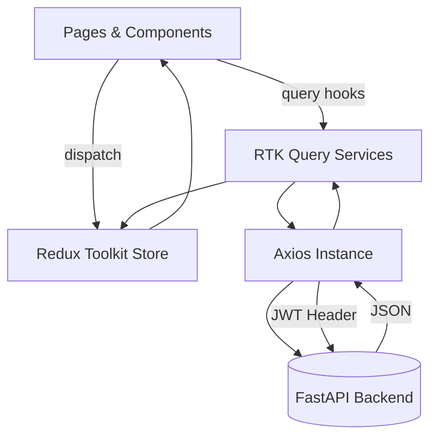

# Frontend Architecture

> **Target stack:** React 18 • Vite • TypeScript • Redux Toolkit • Tailwind CSS

---

## 1. High-level Diagram



## 2. Layers

| Layer | Folder | Responsibility |
|-------|--------|----------------|
| **Pages** | `src/pages/` | Route‐level views (e.g. `Chat`, `Dashboard`) |
| **Features** | `src/features/` | Vertical slices bundling components, Redux slice, RTK Query endpoints |
| **Components** | `src/components/` | Reusable presentational atoms/molecules |
| **App** | `src/app/` | Redux store setup, root reducers, middleware |
| **Router** | `src/router/` | Route config, protected routes, layout wrappers |
| **API** | `src/api/` | Axios instances, RTK Query endpoint definitions |
| **Styles** | `src/styles/` | Tailwind globals, CSS variables for themes |

## 3. Routing & Layout

```
<BrowserRouter>
  <AppLayout>
    <Routes>
      <Route path="/" element={<Home />} />
      <Route path="/login" element={<Login />} />
      <Route element={<ProtectedRoute />}> <!-- requires JWT -->
        <Route path="/chat" element={<Chat />} />
        <Route path="/dashboard" element={<Dashboard />} />
      </Route>
    </Routes>
  </AppLayout>
</BrowserRouter>
```

* `AppLayout` renders the header/nav and theme toggle.
* `ProtectedRoute` checks `auth.isAuthenticated` from Redux and redirects.

## 4. State Management

### 4.1 Store Setup (`src/app/store.ts`)

```ts
export const store = configureStore({
  reducer: {
    auth: authSlice.reducer,
    [apiSlice.reducerPath]: apiSlice.reducer,
  },
  middleware: (getDefault) =>
    getDefault().concat(apiSlice.middleware, jwtRefreshMiddleware),
});
```

* `apiSlice` – generated by RTK Query for backend REST.
* `jwtRefreshMiddleware` – intercepts 401 and dispatches token refresh action.

### 4.2 Slices & Selectors

Each feature owns its slice in `src/features/<name>/<nameSlice>.ts` with selectors exported for components.

## 5. Data Fetching (RTK Query)

```ts
export const apiSlice = createApi({
  baseQuery: fetchBaseQuery({
    baseUrl: import.meta.env.VITE_API_URL,
    prepareHeaders: (headers, { getState }) => {
      const token = (getState() as RootState).auth.accessToken;
      if (token) headers.set('Authorization', `Bearer ${token}`);
      return headers;
    },
  }),
  endpoints: (builder) => ({
    getConversations: builder.query<Conversation[], void>({
      query: () => '/conversations',
    }),
    /* … */
  }),
});
```

Hooks auto-generated: `useGetConversationsQuery()` etc.

## 6. Theme System

* Light/dark handled via `themeSlice` storing `"light" | "dark"`.
* Tailwind `@apply` utilities + CSS variables for colors ensuring WCAG contrast.

## 7. Error & Loading Handling

* Global `<ErrorBoundary>` catches React errors.
* Each RTK Query hook exposes `isLoading`, `isError`, `error` handled in components.

## 8. Folder Example – Chat Feature

```
features/chat/
├── ChatPage.tsx      # route wrapper
├── ChatSlice.ts      # local UI state
├── ChatMessages.tsx  # messages list
├── ChatInput.tsx
├── chatApi.ts        # RTK Query endpoints
└── index.ts          # barrel export
```

## 9. Internationalization

`react-i18next` integrated; translations in `public/locales/{en,de}/translation.json`.

---
This architecture aligns with ConvoSphere’s principles of Klarheit und Zugänglichkeit while remaining highly extensible.
