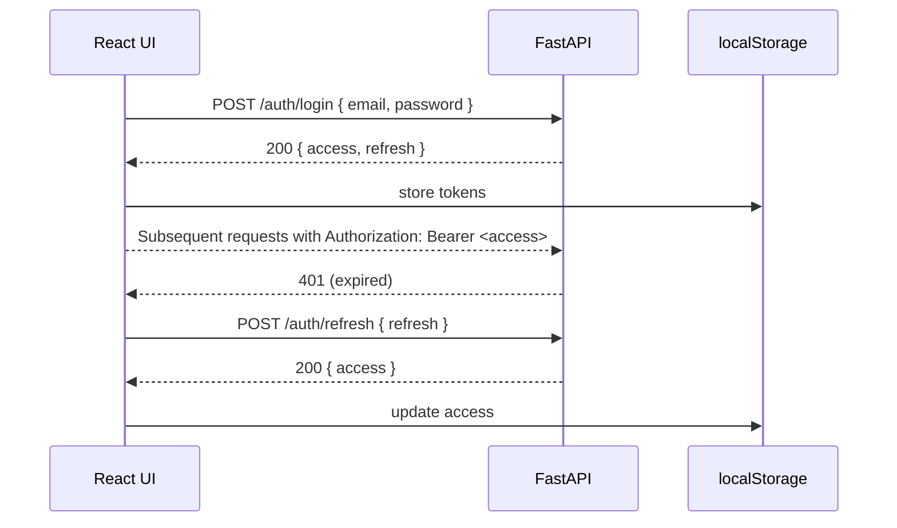

# Authentication (JWT)

The backend exposes `/auth/register` and `/auth/login` endpoints returning **access** + **refresh** JWTs.

---

## 1. Flow Diagram



## 2. Axios Instance

```ts title="src/api/axios.ts"
import axios from 'axios';
import { store } from '../app/store';
import { refreshToken, logout } from '../features/auth/authSlice';

const api = axios.create({
  baseURL: import.meta.env.VITE_API_URL,
});

api.interceptors.request.use((config) => {
  const token = store.getState().auth.accessToken;
  if (token) {
    config.headers.Authorization = `Bearer ${token}`;
  }
  return config;
});

api.interceptors.response.use(
  (res) => res,
  async (error) => {
    const original = error.config;
    if (error.response?.status === 401 && !original._retry) {
      original._retry = true;
      try {
        await store.dispatch(refreshToken()).unwrap();
        return api(original);
      } catch (_) {
        store.dispatch(logout());
      }
    }
    return Promise.reject(error);
  },
);

export default api;
```

## 3. Redux Slice

```ts title="features/auth/authSlice.ts"
interface AuthState {
  accessToken?: string;
  refreshToken?: string;
  user?: User;
  status: 'idle' | 'loading' | 'failed';
}
```

`login`, `register`, `refreshToken`, `logout` async thunks call the above Axios instance.

## 4. Protected Routes

```tsx
export const ProtectedRoute = () => {
  const authenticated = useAppSelector((s) => !!s.auth.accessToken);
  return authenticated ? <Outlet /> : <Navigate to="/login" />;
};
```

## 5. Token Storage

* Tokens kept in `localStorage` under `convosphere.jwt.*`.
* Migrated to **httpOnly cookies** once backend supports – tracked in roadmap.

## 6. Registration

Open sign-up page uses the same RTK Query mutation; on success user is logged in directly.

## 7. Logout

Simply clears tokens and Redux state, then redirects to `/login`.
