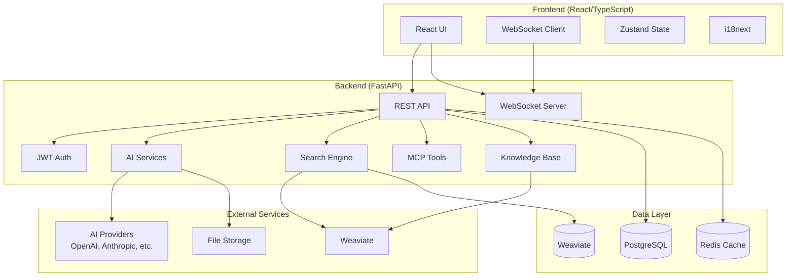

# ConvoSphere - AI Assistant Platform

Eine moderne, vollständige AI-Assistenten-Plattform entwickelt mit **FastAPI** (Backend) und **React** (Frontend), mit umfassender Testabdeckung, Echtzeit-Messaging und erweiterten AI-Funktionen.

<div class="grid cards" markdown>

-   :fontawesome-solid-rocket: __[Quick Start](getting-started/quick-start.md)__
    
    In unter 10 Minuten einsatzbereit mit unserer Schritt-für-Schritt-Anleitung.

-   :fontawesome-solid-book: __[User Guide](user-guide/getting-started.md)__
    
    Lernen Sie die Chat-Oberfläche zu nutzen, Dateien zu verwalten und Einstellungen anzupassen.

-   :fontawesome-solid-code: __[API Reference](api/overview.md)__
    
    Vollständige API-Dokumentation mit Beispielen und interaktiven Tests.

-   :fontawesome-solid-cogs: __[Architecture](architecture/overview.md)__
    
    Verstehen Sie das Systemdesign, Komponenten und Datenfluss.

</div>

## 🚀 Kernfunktionen

### ✅ Vollständig implementiert (100%)

#### **Echtzeit-Chat-System**
- **WebSocket-basierte Kommunikation** mit sofortiger Zustellung
- **Datei-Anhänge** und Dokumenten-Sharing (PDF, DOCX, TXT)
- **Tool-Ausführung** innerhalb von Konversationen
- **Nachrichtenverlauf** und erweiterte Suche
- **Typing-Indikatoren** und Status-Tracking
- **Konversationsverwaltung** mit Organisation und Kategorisierung

#### **AI-Integration & Knowledge Base**
- **LiteLLM-Unterstützung** für mehrere AI-Provider (OpenAI, Anthropic, etc.)
- **Mehrere AI-Modelle** konfigurierbar
- **Kontextbewusste Antworten** mit Knowledge Base Integration
- **Semantische Suche** mit Weaviate Vector Database
- **Dokumentenverarbeitung** mit automatischer Chunking und Embedding
- **Tag-Management** mit System- und User-Tags
- **Bulk-Import/-Export** Funktionalität

#### **Authentifizierung & Sicherheit**
- **JWT-basierte Authentifizierung** mit Refresh-Tokens
- **Rollenbasierte Zugriffskontrolle (RBAC)** - User, Premium, Moderator, Admin
- **Passwort-Hashing** mit bcrypt
- **Rate Limiting** auf API-Endpunkten (100 requests/minute)
- **Audit-Logging** für Compliance und Sicherheit
- **Token-Blacklisting** für sichere Abmeldung
- **CORS-Konfiguration** für Cross-Origin-Requests

#### **Tool-Integration (MCP)**
- **Model Context Protocol (MCP)** Server-Integration
- **Tool-Discovery** und -Registrierung
- **Parameter-Validierung** und -Ausführung
- **Ergebnis-Visualisierung** und Fehlerbehandlung
- **Custom Tool Development** Framework

#### **Benutzerverwaltung & Admin**
- **Benutzerprofile** und Einstellungen
- **Aktivitäts-Tracking** und Analytics
- **Admin-Dashboard** mit System-Monitoring
- **System-Statistiken** für Admins
- **Bulk-Operationen** für Benutzer- und Dokumentenverwaltung

### 🔄 In Entwicklung (10%)

#### **Internationalisierung (i18n)**
- ✅ Translation-Infrastruktur eingerichtet
- ✅ HTTP-Header-basierte Spracherkennung
- 🔄 Individuelle Benutzerspracheinstellungen
- 🔄 JSON-basierte Übersetzungsdateien
- 🔄 Middleware für Spracherkennung
- 🔄 Multi-Sprach-Support (Deutsch/Englisch)

#### **Performance-Monitoring**
- ✅ OpenTelemetry-Integration vorbereitet
- ✅ System-Status-API implementiert
- ✅ Admin-UI mit Visualisierungen
- 🔄 Erweiterte Performance-Metriken

### 📋 Geplante Features (Roadmap)

#### **Phase 1: Hohe Priorität (2-4 Monate)**
- 🎤 **Voice Integration** - Voice-to-Text, Text-to-Speech, Voice Calls
- 💬 **Multi-Chat System** - Split Windows, parallele Konversationen
- 💻 **Code Interpreter** - Sichere Code-Ausführungsumgebung

#### **Phase 2: Mittlere Priorität (4-8 Monate)**
- 🤖 **Advanced Agents** - Web-Browsing, File System Agents
- 🎨 **Image Generation** - Text-to-Image-Funktionen
- 📄 **Enhanced RAG** - Multi-modale Dokumentenverarbeitung

#### **Phase 3: Langfristig (8-12 Monate)**
- 👤 **Character System** - AI-Personas und Role-Playing
- 📊 **Analytics Dashboard** - Erweiterte Analytics und Insights
- 🏢 **Enterprise Features** - SSO, erweiterte RBAC, Multi-Tenancy

## 🏗️ Architektur-Übersicht



## 📊 System-Performance

### Backend-Performance-Metriken
- **Response Time**: < 100ms für Health Checks, < 500ms für API-Calls
- **Concurrent Users**: Unterstützt 100+ gleichzeitige Verbindungen
- **Memory Usage**: < 50MB Zuwachs unter Last
- **Database Queries**: Optimiert mit Connection Pooling
- **File Upload**: Verarbeitet 1MB+ Dateien effizient
- **Rate Limiting**: 100 requests/minute pro Benutzer

### Frontend-Performance-Metriken
- **Page Load**: < 3 Sekunden für initiale Ladung
- **Bundle Size**: Optimiert mit Code Splitting
- **Echtzeit-Updates**: < 100ms Nachrichtenzustellung
- **Memory Management**: Effiziente Component Lifecycle
- **Accessibility**: WCAG 2.1 AA konform

## 🧪 Test-Abdeckung

### Backend-Test-Abdeckung: **90%+**
- **Unit Tests**: 200+ Tests für alle Services und Utilities
- **Integration Tests**: API-Endpunkt-Tests mit Datenbank-Integration
- **Performance Tests**: Load Testing, Memory Monitoring, Response Time Validation
- **Security Tests**: Authentifizierung, Autorisierung und Input Validation
- **21 Test-Dateien** mit umfassender Abdeckung

### Frontend-Test-Abdeckung: **95%+**
- **Component Tests**: React Component Testing mit User Interactions
- **Store Tests**: Zustand State Management Testing
- **Service Tests**: API Service Layer Testing mit Mocking
- **E2E Tests**: Vollständige User Flow Tests mit Cypress

## 🛠️ Technology Stack

### Backend
- **FastAPI**: Modernes, schnelles Web-Framework mit automatischer API-Dokumentation
- **SQLAlchemy**: SQL Toolkit und ORM für Datenbankoperationen
- **PostgreSQL**: Primäre Datenbank für Benutzerdaten und Konversationen
- **Redis**: Caching und Session Storage
- **Weaviate**: Vector Database für semantische Suche
- **LiteLLM**: AI Provider Abstraktions-Layer
- **Alembic**: Datenbank-Migrationen

### Frontend
- **React 18**: Modernes React mit Concurrent Features
- **TypeScript**: Type-safe JavaScript Development
- **Zustand**: Lightweight State Management
- **Ant Design**: Enterprise UI Component Library
- **WebSocket**: Echtzeit-Kommunikation
- **React Router**: Client-side Routing
- **i18next**: Internationalisierung

### Development & Testing
- **Python 3.11+**: Backend Programming Language
- **Node.js 18+**: Frontend Runtime
- **Pytest**: Python Testing Framework
- **Jest**: JavaScript Testing Framework
- **Cypress**: End-to-End Testing
- **Docker**: Containerization und Deployment
- **GitHub Actions**: CI/CD Pipeline

## 🚀 Quick Start

In unter 10 Minuten einsatzbereit:

```bash
# Repository klonen
git clone https://github.com/your-org/convosphere.git
cd convosphere

# Schnelle Einrichtung mit Docker
docker-compose up --build

# Oder manuelle Einrichtung
make install
make dev
```

**Bereit für mehr Details?** Schauen Sie sich unseren [Quick Start Guide](getting-started/quick-start.md) für detaillierte Anweisungen an.

## 📚 Dokumentations-Abschnitte

### Getting Started
- **[Quick Start](getting-started/quick-start.md)** - In Minuten einsatzbereit
- **[Installation](getting-started/installation.md)** - Detaillierte Installationsanweisungen
- **[Configuration](getting-started/configuration.md)** - Umgebungs- und Service-Setup
- **[First Steps](getting-started/first-steps.md)** - Ihre erste Konversation

### Architecture
- **[Overview](architecture/overview.md)** - High-Level System-Architektur
- **[System Design](architecture/system-design.md)** - Detaillierte System Design Patterns
- **[Backend](architecture/backend.md)** - FastAPI Backend-Architektur
- **[Frontend](architecture/frontend.md)** - React Frontend-Architektur
- **[Database](architecture/database.md)** - Datenbank-Design und Schema
- **[Security](architecture/security.md)** - Sicherheits-Architektur und Best Practices

### Development
- **[Setup](development/setup.md)** - Development Environment Setup
- **[Testing](development/testing.md)** - Tests ausführen und Test-Abdeckung
- **[Contributing](development/contributing.md)** - Wie man zum Projekt beiträgt
- **[Code Style](development/code-style.md)** - Coding Standards und Konventionen
- **[API Development](development/api-development.md)** - API Development Guidelines

### API Reference
- **[Overview](api/overview.md)** - API Design Principles und Patterns
- **[Authentication](api/authentication.md)** - Authentifizierung und Autorisierung
- **[Users](api/users.md)** - Benutzer-Management Endpunkte
- **[Chat](api/chat.md)** - Chat und Messaging Endpunkte
- **[Conversations](api/conversations.md)** - Konversations-Management
- **[Knowledge Base](api/knowledge.md)** - Dokument- und Knowledge-Management
- **[Tools](api/tools.md)** - Tool-Integration Endpunkte
- **[WebSocket](api/websocket.md)** - Echtzeit-Kommunikation
- **[Errors](api/errors.md)** - Error Handling und Codes

### Features
- **[AI Integration](features/ai-integration.md)** - AI Provider Integration Details
- **[Real-time Chat](features/real-time-chat.md)** - WebSocket-basiertes Messaging
- **[Knowledge Base](features/knowledge-base.md)** - Dokumentenverarbeitung und Suche
- **[File Upload](features/file-upload.md)** - File Handling und Verarbeitung
- **[User Management](features/user-management.md)** - Benutzer- und Rollen-Management
- **[Security](features/security.md)** - Sicherheitsfeatures und Best Practices
- **[Performance](features/performance.md)** - Performance-Optimierung
- **[Tools & MCP](features/tools.md)** - Tool-Integration und MCP-Protokoll

### Deployment
- **[Docker](deployment/docker.md)** - Containerisierte Deployment
- **[Production](deployment/production.md)** - Production Deployment Guide
- **[Monitoring](deployment/monitoring.md)** - Monitoring und Observability
- **[CI/CD](deployment/ci-cd.md)** - Continuous Integration und Deployment

### User Guide
- **[Getting Started](user-guide/getting-started.md)** - Benutzer-Onboarding Guide
- **[Chat Interface](user-guide/chat-interface.md)** - Chat-Oberfläche nutzen
- **[File Management](user-guide/file-management.md)** - Hochgeladene Dateien verwalten
- **[Settings](user-guide/settings.md)** - Benutzer-Präferenzen und Einstellungen
- **[Troubleshooting](user-guide/troubleshooting.md)** - Häufige Probleme und Lösungen

### Project
- **[Status](project/status.md)** - Aktueller Implementierungsstatus und Fortschritt
- **[Roadmap](project/roadmap.md)** - Entwicklungs-Roadmap und Timeline
- **[Changelog](project/changelog.md)** - Versionshistorie und Änderungen
- **[Contributing](project/contributing.md)** - Wie man beiträgt

## 🔒 Sicherheitsfeatures

### Authentifizierung & Autorisierung
- JWT-basierte Authentifizierung mit Refresh-Tokens
- Rollenbasierte Zugriffskontrolle (RBAC)
- Passwort-Hashing mit bcrypt
- Rate Limiting auf API-Endpunkten
- CORS-Konfiguration für Cross-Origin-Requests
- Audit-Logging für Compliance

### Datenschutz
- Input Validation und Sanitization
- SQL Injection Prevention
- XSS Protection
- File Upload Validation
- Secure Headers Configuration
- Token-Blacklisting für sichere Abmeldung

## 🏢 Enterprise Features

### SSO (Single Sign-On)
- Unterstützung für OIDC, SAML, OAuth2 (Google, Microsoft, GitHub)
- SSO-Login, Callback und Account-Linking
- Just-in-Time Provisioning und SSO-Attribut-Mapping
- SSO-Konfigurationsguide im Deployment-Abschnitt

### Erweiterte RBAC
- Hierarchische Rollen (Super Admin, Admin, Manager, User, Guest)
- Gruppenbasierte Berechtigungen und Bereichs-Admins
- Feingranulare Berechtigungsverwaltung (z.B. Resource-Level)
- Admin-UI für Rollen, Berechtigungen und Gruppen

### Security & Self-Service
- 2FA/MFA (TOTP, WebAuthn)
- Self-Service-UI für Benutzer (API-Tokens, 2FA, Account-Löschung)
- Bulk-Import/-Export von Benutzern/Rollen
- DSGVO-Features (Datenexport, Account-Löschung)

### Audit-Logging
- Audit-Log-API und UI für Admins
- Logging aller sicherheitsrelevanten Events (Login, SSO, Rollenänderungen)

## 🤝 Contributing

Wir freuen uns über Beiträge! Bitte schauen Sie sich unseren [Contributing Guide](development/contributing.md) für Details an:

- Development Environment Setup
- Code Style und Konventionen
- Testing Requirements
- Pull Request Process

## 📄 License

Dieses Projekt ist unter der MIT License lizenziert - siehe die [LICENSE](../LICENSE) Datei für Details.

## 🆘 Support

- **Dokumentation**: Diese Seite enthält umfassende Dokumentation
- **Issues**: Bugs melden und Features anfordern auf [GitHub](https://github.com/your-org/convosphere/issues)
- **Discussions**: Treten Sie unserem [Discord Server](https://discord.gg/your-server) für Community-Support bei

---

<div align="center">

**Bereit zum Starten?** [Quick Start Guide →](getting-started/quick-start.md)

**Aktuellen Status sehen?** [Project Status →](project/status.md)

</div> 