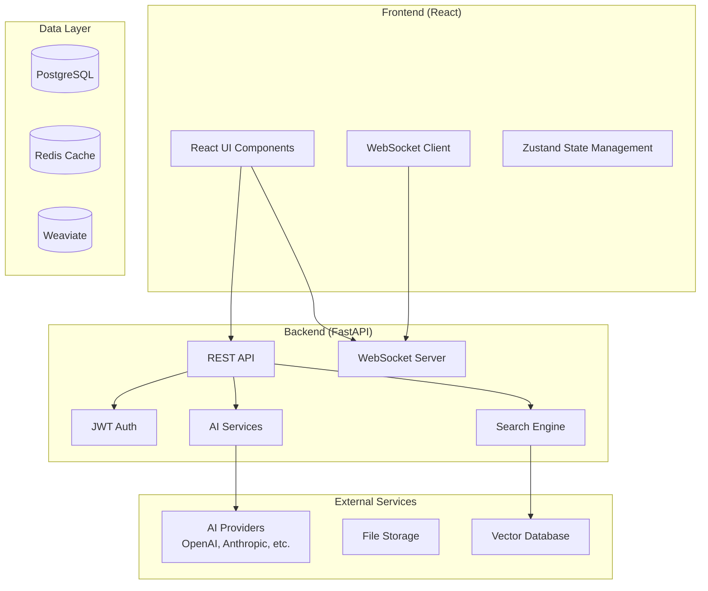

# ConvoSphere Documentation

A modern, full-stack AI assistant platform with **FastAPI** backend and **React** frontend, featuring real-time messaging, knowledge base integration, and enterprise-grade AI capabilities.

## 🚀 Quick Start

Get started in under 5 minutes:

```bash
# Clone repository
git clone https://github.com/ConvoSphere/ConvoSphere.git
cd ConvoSphere

# Start with Docker (recommended)
docker-compose up --build
```

→ Open [http://localhost:8081](http://localhost:8081) (Frontend) | [http://localhost:8000](http://localhost:8000) (Backend API)

## ✨ Key Features

### 💬 **Real-time Chat**
- WebSocket-based conversations with instant delivery (WS base: `/api/v1/ws`)
- File attachments (PDF, DOCX, TXT, MD) – 10MB default (configurable up to 100MB)
- Audio file processing with speech recognition
- Typing indicators and real-time status

### 📚 **Knowledge Base**
- Document upload with drag & drop
- Semantic search with AI-powered content discovery
- Role-based access control
- Chat integration for context-aware responses

### 🤖 **AI Integration**
- Multiple AI providers (OpenAI, Anthropic) via LiteLLM
- Custom AI assistants with configurable personalities
- Context-aware responses using knowledge base content
- Tool execution and Model Context Protocol (MCP) integration

### 👥 **User Management**
- JWT-based authentication with refresh tokens
- Comprehensive SSO integration (LDAP, SAML, OAuth2)
- Role-based access control with 4 user levels
- Advanced admin dashboard

## 🛠️ Technology Stack

### **Frontend**
- React 18 with TypeScript
- Ant Design UI components
- Zustand state management
- WebSocket for real-time communication

- FastAPI with auto-documentation (enabled in development)
- SQLAlchemy ORM with PostgreSQL
- Redis for caching and sessions
- Weaviate vector database for semantic search

### **DevOps**
- Docker & Docker Compose
- Comprehensive testing (targets high coverage)
- GitHub Actions CI/CD
- MkDocs documentation

## 📖 Documentation Structure

### **User Documentation**
- **[Quick Start](quick-start.md)** - Get started in 5 minutes
- **[User Guide](user-guide.md)** - Complete user documentation
- **[FAQ](faq.md)** - Frequently asked questions

### **Developer Documentation**
- **[Developer Guide](developer-guide.md)** - Setup and development
- **[Architecture](architecture.md)** - System architecture overview
- **[API Reference](api.md)** - Complete API documentation
- **[Security](security.md)** - Security documentation

### **Configuration & Features**
- **[Knowledge Base Settings](KNOWLEDGE_BASE_SETTINGS.md)** - Document processing configuration
- **[RAG Features](RAG_FEATURES.md)** - Retrieval-augmented generation
- **[Bulk Operations](BULK_OPERATIONS.md)** - Document management
- **[Storage Integration](STORAGE_INTEGRATION.md)** - Cloud storage setup
- **[SSO Setup](SSO_SETUP.md)** - Enterprise authentication

### **Development Resources**
- **[Development Guide](development/README.md)** - Development setup and guidelines
- **[Design System](development/DESIGN_SYSTEM.md)** - UI/UX design guidelines
- **[Export Features](development/EXTENDED_EXPORT_FEATURES.md)** - Advanced export functionality
- **[Service Architecture](ai-service-architecture.md)** - AI service architecture
- **[Agent Implementation](agent-implementation.md)** - AI agent implementation
- **[Assistants vs Agents](assistants-vs-agents.md)** - Key differences and similarities

## 🏗️ Architecture Overview



## 🔧 Development

### **Getting Started**
1. **Environment Setup**: Follow the [Developer Guide](developer-guide.md)
2. **API Documentation**: Explore the [API Reference](api.md)
3. **Architecture**: Understand the [System Architecture](architecture.md)

### **Key Components**
- **AI Services**: [AI Service Architecture](ai-service-architecture.md)
- **User Management**: [SSO Setup](SSO_SETUP.md)
- **Knowledge Base**: [Knowledge Base Settings](KNOWLEDGE_BASE_SETTINGS.md)
- **Search & RAG**: [RAG Features](RAG_FEATURES.md)

## 📚 Additional Resources

- **[Changelog](changelog.md)** - Recent updates and changes
- **[Security](security.md)** - Security documentation and best practices
- **[Development](development/README.md)** - Development resources and guidelines

---

**Need help?** Check our [FAQ](faq.md) or [User Guide](user-guide.md) for detailed information. 