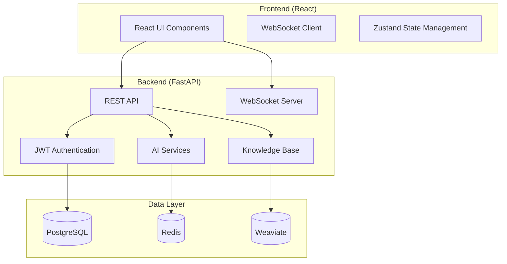

# ConvoSphere

A modern, full-stack AI assistant platform with **FastAPI** backend and **React** frontend, featuring real-time messaging, knowledge base integration, and enterprise-grade AI capabilities.

## 🚀 Quick Start

Get started in under 5 minutes:

```bash
# Clone repository
git clone https://github.com/ConvoSphere/ConvoSphere.git
cd ConvoSphere

# Start with Docker (recommended)
docker-compose up --build
```

→ Open [http://localhost:8081](http://localhost:8081) (Frontend) | [http://localhost:8000](http://localhost:8000) (Backend API)

> **⚠️ Beta Version**: This is currently version 0.1.0-beta. Some features may be incomplete or subject to change.

## ✨ Key Features

### 💬 **Real-time Chat**
- WebSocket-based conversations with instant delivery
- File attachments (PDF, DOCX, TXT, MD) up to 50MB
- Audio file processing with speech recognition
- Typing indicators and real-time status

### 📚 **Knowledge Base**
- Document upload with drag & drop
- Semantic search with AI-powered content discovery
- Role-based access control
- Chat integration for context-aware responses

### 🤖 **AI Integration**
- Multiple AI providers (OpenAI, Anthropic) via LiteLLM
- Custom AI assistants with configurable personalities
- Context-aware responses using knowledge base content
- Tool execution and Model Context Protocol (MCP) integration

### 👥 **User Management**
- JWT-based authentication with refresh tokens
- Comprehensive SSO integration (LDAP, SAML, OAuth2)
- Role-based access control with 4 user levels
- Advanced admin dashboard

## 🛠️ Technology Stack

### **Frontend**
- React 18 with TypeScript
- Ant Design UI components
- Zustand state management
- WebSocket for real-time communication

### **Backend**
- FastAPI with auto-documentation
- SQLAlchemy ORM with PostgreSQL
- Redis for caching and sessions
- Weaviate vector database for semantic search

### **DevOps**
- Docker & Docker Compose
- Comprehensive testing (90%+ coverage)
- GitHub Actions CI/CD
- MkDocs documentation

## 📖 Documentation

- **[Quick Start](quick-start.md)** - Get started in 5 minutes
- **[User Guide](user-guide.md)** - Complete user documentation
- **[Developer Guide](developer-guide.md)** - Setup and development
- **[API Reference](api.md)** - Complete API documentation
- **[Security](security.md)** - Security documentation
- **[FAQ](faq.md)** - Frequently asked questions

## 🏗️ Architecture



## 🚀 Deployment

### **Docker (Recommended)**
```bash
# Development
docker-compose up --build

# Production
docker-compose -f docker-compose.prod.yml up -d
```

### **Manual Setup**
```bash
# Backend
cd backend
pip install -r requirements.txt
uvicorn main:app --reload

# Frontend
cd frontend-react
npm install
npm run dev
```

## 🤝 Contributing

We welcome contributions! See [GitHub Issues](https://github.com/ConvoSphere/ConvoSphere/issues) for details.

## 📄 License

MIT License - see [LICENSE](https://github.com/ConvoSphere/ConvoSphere/blob/main/LICENSE) for details.

---

**Ready to get started?** [Quick Start →](quick-start.md) 