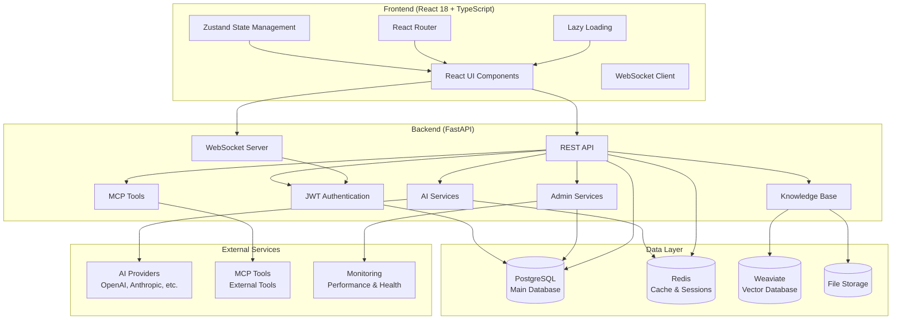

# ConvoSphere - AI Chat Platform

A modern, comprehensive AI chat application with **FastAPI** (Backend) and **React** (Frontend), featuring real-time messaging, advanced knowledge base, and enterprise-grade AI capabilities.

<div align="center">


[](https://your-org.github.io/convosphere/)
[](https://github.com/your-org/convosphere/actions)
[](https://github.com/your-org/convosphere/actions)

</div>

## 🚀 Quick Start (5 Minutes)

**Get ConvoSphere running in under 5 minutes:**

```bash
# Clone repository
git clone https://github.com/your-org/convosphere.git
cd convosphere

# Start with Docker (recommended)
docker-compose up --build

# Or manual setup
make setup
make install
make dev
```

→ Open [http://localhost:5173](http://localhost:5173) (Frontend) | [http://localhost:8000](http://localhost:8000) (Backend API)

**First steps:**
1. Register an account or login
2. Start a conversation with AI assistants
3. Upload documents to the knowledge base
4. Create custom AI assistants
5. Explore tools and integrations

## 📖 For Users

- **[User Guide](user-guide.md)** - Complete guide to using ConvoSphere
- **[FAQ](faq.md)** - Frequently Asked Questions and Solutions
- **[Quick Start](quick-start.md)** - Get started in 5 minutes

## 🔧 For Developers

- **[Developer Guide](developer-guide.md)** - Setup, Architecture, Development
- **[API Reference](api.md)** - Complete API Documentation
- **[Features Documentation](features/)** - Detailed feature specifications
- **[Architecture Guide](architecture.md)** - System design and components

## ✨ Complete Feature Set

### 💬 **Real-time Chat & Messaging**
- **WebSocket-based conversations** with instant delivery
- **File attachments** (PDF, DOCX, TXT, MD) up to 50MB
- **Voice input** with speech-to-text functionality
- **Message formatting** with Markdown support
- **Typing indicators** and real-time status
- **Conversation management** with history and search
- **Message export** and conversation backup

### 📚 **Advanced Knowledge Base**
- **Document upload** with drag & drop and bulk import
- **Semantic search** with AI-powered content discovery
- **Tag management** with tag clouds and statistics
- **Role-based access control** (User/Premium/Moderator/Admin)
- **Document processing** with automatic text extraction and chunking
- **Advanced filtering** by metadata, tags, and content
- **Performance optimizations** with virtualization and caching
- **Chat integration** for context-aware AI responses

### 🤖 **AI Integration & Assistants**
- **Multiple AI providers** (OpenAI, Anthropic, etc.) via LiteLLM
- **Custom AI assistants** with configurable personalities
- **Context-aware responses** using knowledge base content
- **Tool execution** and Model Context Protocol (MCP) integration
- **Assistant management** with templates and sharing
- **AI model selection** and parameter tuning

### 🔧 **Tools & Integrations**
- **MCP (Model Context Protocol)** tool integration
- **Custom tool development** and management
- **Tool execution tracking** with performance metrics
- **External API integrations** and webhooks
- **Search tools** and calculator functions
- **File processing tools** and utilities

### 👥 **User Management & Administration**
- **JWT-based authentication** with refresh tokens
- **Role-based access control** with 4 user levels
- **User registration** and profile management
- **Admin dashboard** with comprehensive system overview
- **User analytics** and activity tracking
- **Audit logging** and security monitoring
- **SSO integration** and account linking

### 🎨 **User Experience & Interface**
- **Modern React 18** frontend with TypeScript
- **Responsive design** optimized for mobile, tablet, and desktop
- **Dark/Light theme** switching with system preference detection
- **Internationalization** (English/German) with i18next
- **Performance monitoring** with real-time metrics
- **Error boundaries** and comprehensive error handling
- **Lazy loading** and code splitting for optimal performance

### 📊 **Performance & Monitoring**
- **Real-time performance tracking** with detailed metrics
- **System health monitoring** and status dashboard
- **Memory usage optimization** and leak detection
- **Response time monitoring** and API performance
- **User activity analytics** and usage statistics
- **Error tracking** and automated reporting

## 🏗️ Architecture

ConvoSphere follows a modern, scalable architecture with clear separation of concerns:



## 🛠️ Complete Technology Stack

### **Frontend Stack**
- **React 18** with TypeScript and concurrent features
- **Ant Design** enterprise UI component library
- **Zustand** lightweight state management
- **React Router** with protected routes
- **WebSocket** client for real-time communication
- **i18next** for internationalization (EN/DE)
- **Vite** for fast development and optimized builds

### **Backend Stack**
- **FastAPI** modern, fast web framework with auto-documentation
- **SQLAlchemy** ORM with PostgreSQL
- **Redis** for caching and session storage
- **Weaviate** vector database for semantic search
- **LiteLLM** AI provider abstraction layer
- **JWT** authentication with refresh tokens
- **WebSocket** for real-time messaging

### **Database & Storage**
- **PostgreSQL 13+** primary database
- **Redis** caching and real-time features
- **Weaviate** vector embeddings and semantic search
- **File system** document and media storage

### **DevOps & Testing**
- **Docker & Docker Compose** containerization
- **Pytest** comprehensive backend testing (90%+ coverage)
- **Jest & Cypress** frontend testing (95%+ coverage)
- **GitHub Actions** CI/CD pipeline
- **MkDocs** documentation with i18n support

## 📈 Performance Metrics

### **Proven Performance**
- **Response Time**: < 100ms for health checks, < 500ms for API calls
- **Concurrent Users**: Supports 100+ simultaneous connections
- **Memory Efficiency**: < 50MB increase under load
- **File Processing**: Handles 50MB+ files efficiently
- **Real-time Messaging**: < 100ms message delivery
- **Search Performance**: Sub-second semantic search results

### **Test Coverage**
- **Backend Tests**: 90%+ coverage with unit, integration, and performance tests
- **Frontend Tests**: 95%+ coverage with component, service, and E2E tests
- **Performance Tests**: Load testing and memory monitoring
- **Security Tests**: Authentication, authorization, and input validation

## 🚀 Deployment Options

### **Docker (Recommended)**
```bash
# Development
docker-compose up --build

# Production
docker-compose -f docker-compose.prod.yml up -d
```

### **Manual Setup**
```bash
# Backend
cd backend
python -m venv .venv
source .venv/bin/activate
pip install -r requirements.txt
uvicorn main:app --reload

# Frontend
cd frontend-react
npm install
npm run dev
```

### **Production Deployment**
- **Environment Configuration**: Comprehensive environment variable setup
- **Security Hardening**: JWT tokens, CORS, rate limiting
- **Performance Optimization**: Caching, connection pooling
- **Monitoring**: Health checks and performance tracking

## 🎯 Pages & User Interface

ConvoSphere provides a comprehensive web interface with the following pages:

- **🏠 Dashboard** - Overview, statistics, and quick actions
- **💬 Chat** - Main chat interface with AI assistants
- **📚 Knowledge Base** - Document management and search
- **🤖 Assistants** - AI assistant creation and management
- **🔧 Tools** - Tool integration and MCP management
- **👤 Profile** - User profile and preferences
- **⚙️ Settings** - Application configuration
- **🔐 Authentication** - Login and registration
- **👨‍💼 Admin** - Administrative dashboard (admin only)
- **💬 Conversations** - Conversation history and management
- **🔧 MCP Tools** - Model Context Protocol tools
- **📊 System Status** - Real-time system monitoring

## 🤝 Contributing

We welcome contributions! ConvoSphere is built with modern development practices:

- **Code Quality**: ESLint, Prettier, type safety with TypeScript
- **Testing**: Comprehensive test suites with high coverage
- **Documentation**: Bilingual documentation (EN/DE)
- **CI/CD**: Automated testing and deployment pipelines

See [Contributing Guide](project/contributing.md) for detailed information.

## 📄 License

MIT License - see [LICENSE](../../LICENSE) for details.

## 🆘 Support & Community

- **📚 Documentation**: Comprehensive guides and API reference
- **🐛 Issues**: [GitHub Issues](https://github.com/your-org/convosphere/issues)
- **💬 Discussions**: [GitHub Discussions](https://github.com/your-org/convosphere/discussions)
- **🎮 Discord**: [Community Server](https://discord.gg/your-server)

---

<div align="center">

**Ready to get started?** [Quick Start →](quick-start.md)

**Need detailed guidance?** [User Guide →](user-guide.md) | [Developer Guide →](developer-guide.md)

**Explore Features:** [Knowledge Base →](features/knowledge-base.md) | [AI Integration →](features/ai-integration.md) | [Tools →](features/tools.md)

**Built with ❤️ by the ConvoSphere Team**

</div> 