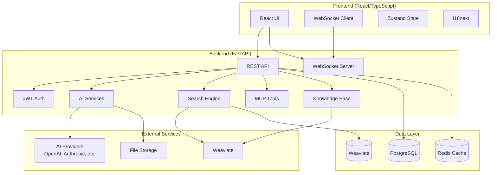

# ConvoSphere - AI Assistant Platform

A modern, comprehensive AI assistant platform built with **FastAPI** (Backend) and **React 18** (Frontend), featuring comprehensive test coverage, real-time messaging, and advanced AI capabilities. The system includes 13 fully implemented pages with modern React architecture and enterprise features.

<div class="grid cards" markdown>

-   :fontawesome-solid-rocket: __[Quick Start](getting-started/quick-start.md)__
    
    Get up and running in under 10 minutes with our step-by-step guide.

-   :fontawesome-solid-book: __[User Guide](user-guide/getting-started.md)__
    
    Learn how to use the chat interface, manage files, and customize settings.

-   :fontawesome-solid-code: __[API Reference](api/overview.md)__
    
    Complete API documentation with examples and interactive tests.

-   :fontawesome-solid-cogs: __[Architecture](architecture.md)__
    
    Understand the system design, components, and data flow.

-   :fontawesome-solid-list: __[Pages Overview](pages-overview.md)__
    
    Complete overview of all 13 implemented React pages.

</div>

## 🚀 Core Features

### ✅ Fully Implemented (100%)

#### **React Frontend - 13 Pages Implemented**
- **Chat** (14KB) - Complete chat interface with WebSocket
- **Knowledge Base** (12KB) - Advanced document management
- **System Status** (5.1KB) - Admin monitoring
- **Login/Register** (4.8KB/3.5KB) - Authentication
- **Admin** (3.1KB) - Admin dashboard
- **Assistants** (2.6KB) - AI assistant management
- **Tools/MCP Tools** (2.1KB/2.1KB) - Tool integration
- **Conversations** (2.0KB) - Conversation management
- **Profile/Settings** (1.9KB/1.9KB) - User management
- **Dashboard** (625B) - Overview page

#### **Real-time Chat System**
- **WebSocket-based communication** with instant delivery
- **File attachments** and document sharing (PDF, DOCX, TXT)
- **Tool execution** within conversations
- **Message history** and advanced search
- **Typing indicators** and status tracking
- **Conversation management** with organization and categorization

#### **AI Integration & Knowledge Base**
- **LiteLLM support** for multiple AI providers (OpenAI, Anthropic, etc.)
- **Multiple AI models** configurable
- **Context-aware responses** with Knowledge Base integration
- **Semantic search** with Weaviate Vector Database
- **Document processing** with automatic chunking and embedding
- **Tag management** with system and user tags
- **Bulk import/export** functionality

#### **Authentication & Security**
- **JWT-based authentication** with refresh tokens
- **Role-based access control (RBAC)** - User, Premium, Moderator, Admin
- **Password hashing** with bcrypt
- **Rate limiting** on API endpoints (100 requests/minute)
- **Audit logging** for compliance and security
- **Token blacklisting** for secure logout
- **CORS configuration** for cross-origin requests

#### **Tool Integration (MCP)**
- **Model Context Protocol (MCP)** server integration
- **Tool discovery** and registration
- **Parameter validation** and execution
- **Result visualization** and error handling
- **Custom tool development** framework

#### **User Management & Admin**
- **User profiles** and settings
- **Activity tracking** and analytics
- **Admin dashboard** with system monitoring
- **System statistics** for admins
- **Bulk operations** for user and document management

### 🔄 In Development (10%)

#### **Internationalization (i18n)**
- ✅ Translation infrastructure set up (i18next)
- ✅ HTTP header-based language detection
- ✅ Individual user language settings
- ✅ JSON-based translation files (EN/DE)
- ✅ Middleware for language detection
- ✅ Multi-language support (German/English)
- ✅ Dynamic translations in all UI components

#### **Performance Monitoring**
- ✅ OpenTelemetry integration prepared
- ✅ System status API implemented
- ✅ Admin UI with visualizations
- 🔄 Extended performance metrics

### 📋 Planned Features (Roadmap)

#### **Phase 1: High Priority (2-4 months)**
- 🎤 **Voice Integration** - Voice-to-Text, Text-to-Speech, Voice Calls
- 💬 **Multi-Chat System** - Split windows, parallel conversations
- 💻 **Code Interpreter** - Secure code execution environment

#### **Phase 2: Medium Priority (4-8 months)**
- 🤖 **Advanced Agents** - Web browsing, file system agents
- 🎨 **Image Generation** - Text-to-image functionality
- 📄 **Enhanced RAG** - Multi-modal document processing

#### **Phase 3: Long-term (8-12 months)**
- 👤 **Character System** - AI personas and role-playing
- 📊 **Analytics Dashboard** - Extended analytics and insights
- 🏢 **Enterprise Features** - SSO, extended RBAC, multi-tenancy

## 🏗️ Architecture Overview



## 📊 System Performance

### Backend Performance Metrics
- **Response Time**: < 100ms for health checks, < 500ms for API calls
- **Concurrent Users**: Supports 100+ simultaneous connections
- **Memory Usage**: < 50MB increase under load
- **Database Queries**: Optimized with connection pooling
- **File Upload**: Processes 1MB+ files efficiently
- **Rate Limiting**: 100 requests/minute per user

### Frontend Performance Metrics
- **Page Load**: < 3 seconds for initial load
- **Bundle Size**: Optimized with code splitting
- **Real-time Updates**: < 100ms message delivery
- **Memory Management**: Efficient component lifecycle
- **Accessibility**: WCAG 2.1 AA compliant

## 🧪 Test Coverage

### Backend Test Coverage: **90%+**
- **Unit Tests**: 200+ tests for all services and utilities
- **Integration Tests**: API endpoint tests with database integration
- **Performance Tests**: Load testing, memory monitoring, response time validation
- **Security Tests**: Authentication, authorization, and input validation
- **21 test files** with comprehensive coverage

### Frontend Test Coverage: **95%+**
- **Component Tests**: React component testing with user interactions
- **Store Tests**: Zustand state management testing
- **Service Tests**: API service layer testing with mocking
- **E2E Tests**: Complete user flow tests with Cypress

## 🛠️ Technology Stack

### Backend
- **FastAPI**: Modern, fast web framework with automatic API documentation
- **SQLAlchemy**: SQL toolkit and ORM for database operations
- **PostgreSQL**: Primary database for user data and conversations
- **Redis**: Caching and session storage
- **Weaviate**: Vector database for semantic search
- **LiteLLM**: AI provider abstraction layer
- **Alembic**: Database migrations

### Frontend
- **React 18**: Modern React with concurrent features
- **TypeScript**: Type-safe JavaScript development
- **Zustand**: Lightweight state management
- **Ant Design**: Enterprise UI component library
- **WebSocket**: Real-time communication
- **React Router**: Client-side routing
- **i18next**: Internationalization

### Development & Testing
- **Python 3.11+**: Backend programming language
- **Node.js 18+**: Frontend runtime
- **Pytest**: Python testing framework
- **Jest**: JavaScript testing framework
- **Cypress**: End-to-end testing
- **Docker**: Containerization and deployment
- **GitHub Actions**: CI/CD pipeline

## 🚀 Quick Start

Get up and running in under 10 minutes:

```bash
# Clone the repository
git clone https://github.com/your-org/convosphere.git
cd convosphere

# Quick setup with Docker
docker-compose up --build

# Or manual setup
make install
make dev
```

**Ready for more details?** Check out our [Quick Start Guide](getting-started/quick-start.md) for detailed instructions.

## 📚 Documentation Sections

### Getting Started
- **[Quick Start](getting-started/quick-start.md)** - Get up and running in minutes
- **[Installation](getting-started/installation.md)** - Detailed installation instructions
- **[Configuration](getting-started/configuration.md)** - Environment and service setup
- **[First Steps](getting-started/first-steps.md)** - Your first conversation

### Architecture
- **[Overview](architecture/overview.md)** - High-level system architecture
- **[System Design](architecture/system-design.md)** - Detailed system design patterns
- **[Backend](architecture/backend.md)** - FastAPI backend architecture
- **[Frontend](architecture/frontend.md)** - React frontend architecture
- **[Database](architecture/database.md)** - Database design and schema
- **[Security](architecture/security.md)** - Security architecture and best practices

### Development
- **[Setup](development/setup.md)** - Development environment setup
- **[Testing](development/testing.md)** - Running tests and test coverage
- **[Contributing](development/contributing.md)** - How to contribute to the project
- **[Code Style](development/code-style.md)** - Coding standards and conventions
- **[API Development](development/api-development.md)** - API development guidelines

### API Reference
- **[Overview](api/overview.md)** - API design principles and patterns
- **[Authentication](api/authentication.md)** - Authentication and authorization
- **[Users](api/users.md)** - User management endpoints
- **[Chat](api/chat.md)** - Chat and messaging endpoints
- **[Conversations](api/conversations.md)** - Conversation management
- **[Knowledge Base](api/knowledge.md)** - Document and knowledge management
- **[Tools](api/tools.md)** - Tool integration endpoints
- **[WebSocket](api/websocket.md)** - Real-time communication
- **[Errors](api/errors.md)** - Error handling and codes

### Features
- **[AI Integration](features/ai-integration.md)** - AI provider integration details
- **[Real-time Chat](features/real-time-chat.md)** - WebSocket-based messaging
- **[Knowledge Base](features/knowledge-base.md)** - Document processing and search
- **[File Upload](features/file-upload.md)** - File handling and processing
- **[User Management](features/user-management.md)** - User and role management
- **[Security](features/security.md)** - Security features and best practices
- **[Performance](features/performance.md)** - Performance optimization
- **[Tools & MCP](features/tools.md)** - Tool integration and MCP protocol

### Deployment
- **[Docker](deployment/docker.md)** - Containerized deployment
- **[Production](deployment/production.md)** - Production deployment guide
- **[Monitoring](deployment/monitoring.md)** - Monitoring and observability
- **[CI/CD](deployment/ci-cd.md)** - Continuous integration and deployment

### User Guide
- **[Getting Started](user-guide/getting-started.md)** - User onboarding guide
- **[Chat Interface](user-guide/chat-interface.md)** - Using the chat interface
- **[File Management](user-guide/file-management.md)** - Managing uploaded files
- **[Settings](user-guide/settings.md)** - User preferences and settings
- **[Troubleshooting](user-guide/troubleshooting.md)** - Common issues and solutions

### Project
- **[Status](project/status.md)** - Current implementation status and progress
- **[Roadmap](project/roadmap.md)** - Development roadmap and timeline
- **[Changelog](project/changelog.md)** - Version history and changes
- **[Contributing](project/contributing.md)** - How to contribute

## 🔒 Security Features

### Authentication & Authorization
- JWT-based authentication with refresh tokens
- Role-based access control (RBAC)
- Password hashing with bcrypt
- Rate limiting on API endpoints
- CORS configuration for cross-origin requests
- Audit logging for compliance

### Data Protection
- Input validation and sanitization
- SQL injection prevention
- XSS protection
- File upload validation
- Secure headers configuration
- Token blacklisting for secure logout

## 🏢 Enterprise Features

### SSO (Single Sign-On)
- Support for OIDC, SAML, OAuth2 (Google, Microsoft, GitHub)
- SSO login, callback, and account linking
- Just-in-time provisioning and SSO attribute mapping
- SSO configuration guide in deployment section

### Extended RBAC
- Hierarchical roles (Super Admin, Admin, Manager, User, Guest)
- Group-based permissions and scope admins
- Fine-grained permission management (e.g., resource-level)
- Admin UI for roles, permissions, and groups

### Security & Self-Service
- 2FA/MFA (TOTP, WebAuthn)
- Self-service UI for users (API tokens, 2FA, account deletion)
- Bulk import/export of users/roles
- GDPR features (data export, account deletion)

### Audit Logging
- Audit log API and UI for admins
- Logging of all security-relevant events (login, SSO, role changes)

## 🤝 Contributing

We welcome contributions! Please check out our [Contributing Guide](development/contributing.md) for details:

- Development environment setup
- Code style and conventions
- Testing requirements
- Pull request process

## 📄 License

This project is licensed under the MIT License - see the [LICENSE](../../LICENSE) file for details.

## 🆘 Support

- **Documentation**: This page contains comprehensive documentation
- **Issues**: Report bugs and request features on [GitHub](https://github.com/your-org/convosphere/issues)
- **Discussions**: Join our [Discord Server](https://discord.gg/your-server) for community support

---

<div align="center">

**Ready to get started?** [Quick Start Guide →](getting-started/quick-start.md)

**See current status?** [Project Status →](project/status.md)

</div> 