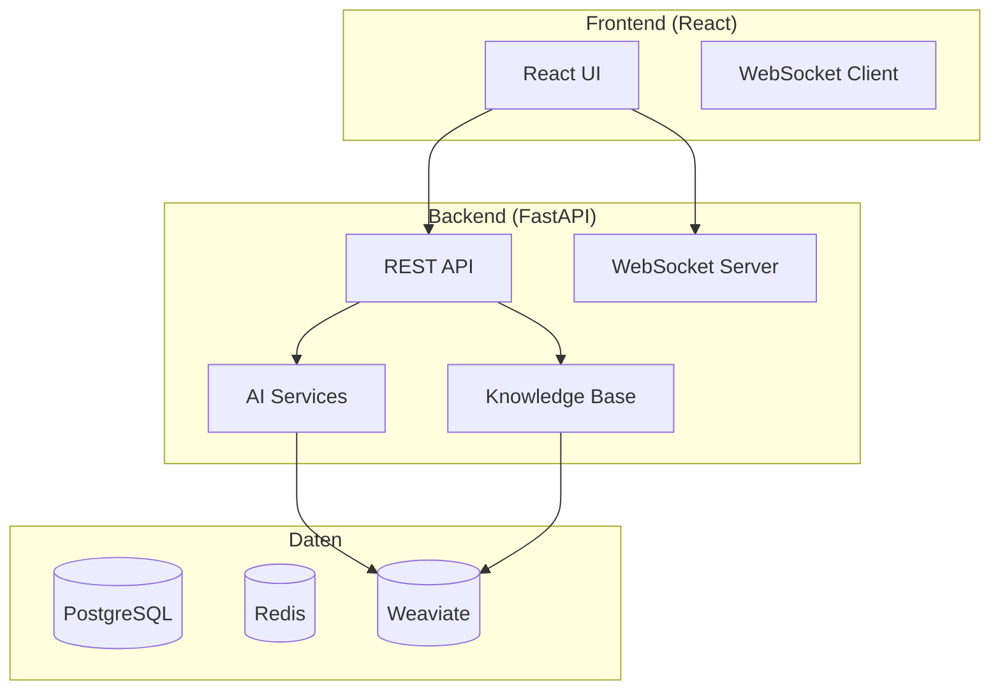

# ConvoSphere - AI Chat Platform

Eine moderne AI-Chat-Plattform mit Echtzeit-Messaging, Knowledge Base und erweiterten AI-Funktionen.

<div align="center">


[](https://your-org.github.io/convosphere/)
[](https://github.com/your-org/convosphere/actions)

</div>

## 🚀 Quick Start (5 Minuten)

**In 5 Minuten einsatzbereit:**

```bash
# Repository klonen
git clone https://github.com/your-org/convosphere.git
cd convosphere

# Mit Docker starten
docker-compose up --build
```

→ [http://localhost:5173](http://localhost:5173) öffnen

**Erste Schritte:**
1. Registrieren Sie sich
2. Starten Sie eine Konversation
3. Laden Sie Dokumente in die Knowledge Base hoch

## 📖 Für Benutzer

- **[User Guide](user-guide.md)** - Chat, Knowledge Base, Einstellungen
- **[FAQ](faq.md)** - Häufige Fragen und Lösungen

## 🔧 Für Entwickler

- **[Developer Guide](developer-guide.md)** - Setup, Architektur, API
- **[API Reference](api-reference.md)** - API-Endpunkte und Beispiele
- **[Deployment](deployment.md)** - Production Setup

## 🎯 Hauptfunktionen

### 💬 **Echtzeit-Chat**
- WebSocket-basierte Konversationen
- Datei-Anhänge (PDF, DOCX, TXT)
- Tool-Integration (MCP)
- Nachrichtenverlauf und Suche

### 📚 **Knowledge Base**
- Dokumente hochladen und verwalten
- Semantische Suche mit AI
- Tag-System und Metadaten
- Bulk-Import und Export

### 🤖 **AI-Integration**
- Multiple AI-Provider (OpenAI, Anthropic, etc.)
- Konfigurierbare AI-Assistenten
- Kontextbewusste Antworten
- Tool-Ausführung

### 👥 **Multi-User System**
- JWT-basierte Authentifizierung
- Rollenbasierte Zugriffskontrolle
- Admin-Dashboard
- Audit-Logging

## 🏗️ Architektur



## 🛠️ Technology Stack

- **Backend**: FastAPI, PostgreSQL, Redis, Weaviate
- **Frontend**: React 18, TypeScript, Ant Design
- **AI**: LiteLLM, OpenAI, Anthropic
- **Deployment**: Docker, Docker Compose

## 🚀 Deployment

### Docker (Empfohlen)
```bash
docker-compose up -d
```

### Production
```bash
# Environment konfigurieren
cp env.example .env
# Production starten
docker-compose -f docker-compose.prod.yml up -d
```

## 🤝 Contributing

Wir freuen uns über Beiträge! Siehe [Contributing Guide](project/contributing.md) für Details.

## 📄 License

MIT License - siehe [LICENSE](../../LICENSE) für Details.

## 🆘 Support

- **Dokumentation**: Diese Seite und verlinkte Guides
- **Issues**: [GitHub Issues](https://github.com/your-org/convosphere/issues)
- **Discussions**: [Discord Server](https://discord.gg/your-server)

---

<div align="center">

**Bereit zum Starten?** [Quick Start →](quick-start.md)

**Mehr Details?** [User Guide →](user-guide.md) | [Developer Guide →](developer-guide.md)

</div> 