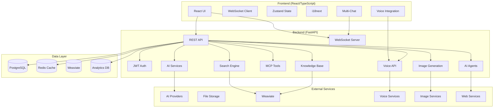

# 🗺️ ConvoSphere - Entwicklungs-Roadmap

## 🎯 Übersicht

Diese Roadmap beschreibt die geplante Entwicklung von ConvoSphere über die nächsten 12 Monate. Das Projekt hat bereits eine solide Grundlage mit vollständig implementierten Kernfunktionen und ist bereit für die Entwicklung erweiterter Features.

## 📊 Aktueller Status

### ✅ **Vollständig implementiert (100%)**
- **Kernplattform**: FastAPI Backend + React Frontend
- **Authentifizierung**: JWT-basierte Auth mit RBAC
- **Echtzeit-Chat**: WebSocket-basiertes Messaging
- **Knowledge Base**: Dokumentenverarbeitung und Vector Search
- **Tool-Integration**: MCP-Protokoll für erweiterbare Tools
- **Sicherheit**: Rate Limiting, Audit Logging, Token Blacklisting
- **DevOps**: Docker, CI/CD, automatisierte Tests (>90% Coverage)
- **Admin-Features**: Dashboard, System-Monitoring, User Management

### 🔄 **In Entwicklung (10%)**
- **Internationalisierung (i18n)**: Translation-Infrastruktur, HTTP-Header-basierte Spracherkennung
- **Performance-Monitoring**: OpenTelemetry-Integration, erweiterte Metriken

## 🚀 Entwicklungsphasen

### **Phase 3: Internationalisierung & Performance (Aktuell)**
**Zeitraum**: Januar - März 2025
**Status**: 🔄 In Entwicklung

#### **Internationalisierung (i18n)**
- [x] Translation-Infrastruktur eingerichtet
- [x] HTTP-Header-basierte Spracherkennung
- [ ] Individuelle Benutzerspracheinstellungen
- [ ] JSON-basierte Übersetzungsdateien
- [ ] Middleware für Spracherkennung
- [ ] Multi-Sprach-Support (Deutsch/Englisch)
- [ ] Übersetzungs-Management-Interface
- [ ] Automatische Übersetzungsvorschläge

#### **Performance-Optimierung**
- [x] OpenTelemetry-Integration vorbereitet
- [x] System-Status-API implementiert
- [x] Admin-UI mit Visualisierungen
- [ ] Erweiterte Performance-Metriken
- [ ] Performance-Monitoring-Dashboard
- [ ] Automatische Performance-Alerts
- [ ] Database-Query-Optimierung
- [ ] Caching-Strategie-Erweiterung

#### **Erwartete Ergebnisse**
- Vollständige Multi-Sprach-Unterstützung
- Umfassendes Performance-Monitoring
- Verbesserte Benutzererfahrung
- Optimierte System-Performance

---

### **Phase 4: Erweiterte Chat-Features (Q2 2025)**
**Zeitraum**: April - Juni 2025
**Status**: 📋 Geplant

#### **Voice Integration**
- [ ] **Voice-to-Text**: Spracherkennung für Chat-Eingaben
- [ ] **Text-to-Speech**: Sprachausgabe für AI-Antworten
- [ ] **Voice Calls**: Echtzeit-Sprachkommunikation
- [ ] **Voice Settings**: Sprache, Geschwindigkeit, Stimme
- [ ] **Offline-Voice**: Lokale Spracherkennung
- [ ] **Voice-Commands**: Sprachgesteuerte Navigation

#### **Multi-Chat System**
- [ ] **Split Windows**: Mehrere Chat-Fenster gleichzeitig
- [ ] **Parallele Konversationen**: Unabhängige Chat-Ströme
- [ ] **Chat-Gruppierung**: Organisierte Chat-Verwaltung
- [ ] **Chat-Templates**: Vorlagen für häufige Szenarien
- [ ] **Chat-Export**: Export von Chat-Verläufen
- [ ] **Chat-Archivierung**: Langzeit-Speicherung

#### **Code Interpreter**
- [ ] **Sichere Code-Ausführung**: Sandbox-Umgebung
- [ ] **Multi-Language Support**: Python, JavaScript, SQL
- [ ] **Code-Visualisierung**: Syntax-Highlighting, Output-Formatting
- [ ] **File-System Access**: Sichere Datei-Operationen
- [ ] **Package Management**: Automatische Abhängigkeitsverwaltung
- [ ] **Code-Debugging**: Fehlerbehandlung und Logging

#### **Erwartete Ergebnisse**
- Vollständige Voice-Integration
- Multi-Chat-Funktionalität
- Sichere Code-Ausführungsumgebung
- Verbesserte Benutzerproduktivität

---

### **Phase 5: Advanced AI Features (Q3 2025)**
**Zeitraum**: Juli - September 2025
**Status**: 📋 Geplant

#### **Advanced Agents**
- [ ] **Web-Browsing Agent**: Internet-Recherche und -Navigation
- [ ] **File System Agent**: Datei-Management und -Verarbeitung
- [ ] **Email Agent**: E-Mail-Verwaltung und -Kommunikation
- [ ] **Calendar Agent**: Termin-Management und -Planung
- [ ] **Database Agent**: Datenbank-Abfragen und -Verwaltung
- [ ] **API Agent**: Externe API-Integrationen

#### **Image Generation**
- [ ] **Text-to-Image**: Bildgenerierung aus Textbeschreibungen
- [ ] **Image Editing**: Bildbearbeitung und -Manipulation
- [ ] **Style Transfer**: Künstlerische Stil-Übertragung
- [ ] **Image Analysis**: Bilderkennung und -Analyse
- [ ] **Batch Processing**: Massen-Bildverarbeitung
- [ ] **Image Storage**: Optimierte Bildspeicherung

#### **Enhanced RAG**
- [ ] **Multi-Modal Processing**: Text, Bild, Audio, Video
- [ ] **Advanced Chunking**: Intelligente Dokumentenaufteilung
- [ ] **Hybrid Search**: Kombinierte semantische und keyword-Suche
- [ ] **Context Optimization**: Verbesserte Kontextauswahl
- [ ] **Source Tracking**: Detaillierte Quellenverfolgung
- [ ] **Confidence Scoring**: Zuverlässigkeitsbewertung

#### **Erwartete Ergebnisse**
- Erweiterte AI-Agenten-Funktionalität
- Vollständige Bildgenerierung
- Verbesserte RAG-Performance
- Multi-modale Verarbeitung

---

### **Phase 6: Character System & Analytics (Q4 2025)**
**Zeitraum**: Oktober - Dezember 2025
**Status**: 📋 Geplant

#### **Character System**
- [ ] **AI-Personas**: Konfigurierbare AI-Persönlichkeiten
- [ ] **Role-Playing**: Interaktive Rollenspiele
- [ ] **Character Creation**: Benutzerdefinierte Charaktere
- [ ] **Personality Training**: Anpassbare Verhaltensweisen
- [ ] **Character Marketplace**: Austausch von Charakteren
- [ ] **Multi-Character Chats**: Interaktion zwischen Charakteren

#### **Advanced Analytics Dashboard**
- [ ] **Usage Analytics**: Detaillierte Nutzungsstatistiken
- [ ] **Performance Metrics**: System-Performance-Tracking
- [ ] **User Behavior**: Benutzerverhaltensanalyse
- [ ] **AI Performance**: AI-Modell-Performance-Monitoring
- [ ] **Cost Tracking**: API-Kosten-Verfolgung
- [ ] **Predictive Analytics**: Vorhersage-Modelle

#### **Enterprise Features**
- [ ] **SSO Integration**: Single Sign-On mit OIDC/SAML
- [ ] **Advanced RBAC**: Erweiterte rollenbasierte Zugriffskontrolle
- [ ] **Multi-Tenancy**: Multi-Mandanten-Unterstützung
- [ ] **Audit & Compliance**: Erweiterte Audit-Funktionen
- [ ] **Data Governance**: Datenverwaltung und -Compliance
- [ ] **Enterprise Security**: Erweiterte Sicherheitsfeatures

#### **Erwartete Ergebnisse**
- Vollständiges Character-System
- Umfassende Analytics-Plattform
- Enterprise-Ready Features
- Skalierbare Multi-Tenant-Architektur

---

## 🎯 Technische Meilensteine

### **Q1 2025 - Foundation Completion**
- ✅ Vollständige i18n-Implementierung
- ✅ Performance-Monitoring-System
- ✅ Code-Quality-Optimierung
- ✅ Dokumentation-Update

### **Q2 2025 - Voice & Multi-Chat**
- 🎯 Voice-Integration abgeschlossen
- 🎯 Multi-Chat-System funktionsfähig
- 🎯 Code Interpreter implementiert
- 🎯 Erweiterte Sicherheitsfeatures

### **Q3 2025 - Advanced AI**
- 🎯 Advanced Agents verfügbar
- 🎯 Image Generation integriert
- 🎯 Enhanced RAG implementiert
- 🎯 Multi-modale Verarbeitung

### **Q4 2025 - Enterprise Ready**
- 🎯 Character System vollständig
- 🎯 Analytics Dashboard implementiert
- 🎯 Enterprise Features verfügbar
- 🎯 Multi-Tenancy unterstützt

## 📈 Erfolgsmetriken

### **Technische Metriken**
- **Performance**: < 500ms API-Response-Time
- **Zuverlässigkeit**: 99.9% Uptime
- **Sicherheit**: Zero kritische Vulnerabilities
- **Test-Abdeckung**: > 90%
- **Skalierbarkeit**: 1000+ gleichzeitige Benutzer

### **Benutzer-Metriken**
- **Adoption**: 80% Feature-Nutzung innerhalb 30 Tage
- **Zufriedenheit**: > 4.5/5 Bewertung
- **Retention**: 90% monatlich aktive Benutzer
- **Engagement**: 60+ Minuten durchschnittliche Session

### **Entwicklungs-Metriken**
- **Code-Qualität**: Hohe Test-Abdeckung und Dokumentation
- **Deployment**: Automatisierte CI/CD-Pipeline
- **Sicherheit**: Regelmäßige Audits und Updates
- **Community**: Aktive Beiträge und Support
- **Automatisierung**: Umfassende Automatisierungsabdeckung

## 🔧 Technische Architektur

### **Erweiterte Architektur (Phase 6)**

## 🚀 Deployment & Skalierung

### **Phase 3-4: Skalierung**
- **Horizontal Scaling**: Load Balancing über mehrere Instanzen
- **Database Sharding**: Aufgeteilte Datenbank-Architektur
- **CDN Integration**: Content Delivery Network
- **Microservices**: Aufgeteilte Service-Architektur

### **Phase 5-6: Enterprise**
- **Kubernetes**: Container-Orchestrierung
- **Multi-Region**: Geografische Verteilung
- **Disaster Recovery**: Notfall-Wiederherstellung
- **Auto-Scaling**: Automatische Skalierung

## 🤝 Community & Support

### **Entwicklungs-Support**
- **GitHub Issues**: Bug-Reports und Feature-Requests
- **Discussions**: Community-Support und Ideen
- **Contributing Guide**: Entwicklungsrichtlinien
- **Code of Conduct**: Community-Standards

### **Benutzer-Support**
- **Dokumentation**: Umfassende Anleitungen
- **Email Support**: Enterprise-Support
- **Community Forum**: Benutzer-Diskussionen
- **Video Tutorials**: Feature-Demonstrationen

## 📋 Fazit

ConvoSphere entwickelt sich von einer soliden Kernplattform zu einer umfassenden, enterprise-ready AI-Assistenten-Lösung. Die Roadmap fokussiert sich auf:

1. **Benutzerfreundlichkeit**: Voice-Integration und Multi-Chat
2. **AI-Funktionalität**: Advanced Agents und Image Generation
3. **Enterprise-Features**: SSO, Multi-Tenancy, Analytics
4. **Skalierbarkeit**: Performance und Architektur-Optimierung

**🎯 Ziel**: Die umfassendste, benutzerfreundlichste und leistungsstärkste Open-Source AI-Assistenten-Plattform zu schaffen.

**📅 Timeline**: 12 Monate für vollständige Roadmap-Implementierung.

**🚀 Vision**: Eine Plattform, die die besten Features aller führenden AI-Tools kombiniert und dabei Benutzerfreundlichkeit und Skalierbarkeit beibehält.

---

**Für detaillierte Informationen siehe:**
- [Project Status](project/status.md)
- [Architecture Documentation](architecture/overview.md)
- [API Reference](api/overview.md)
- [Development Guide](development/setup.md) 